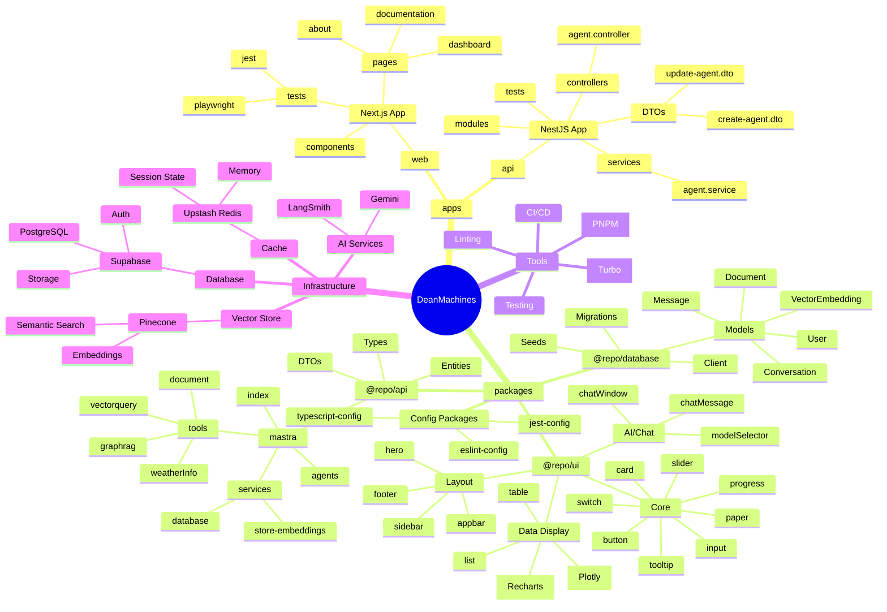
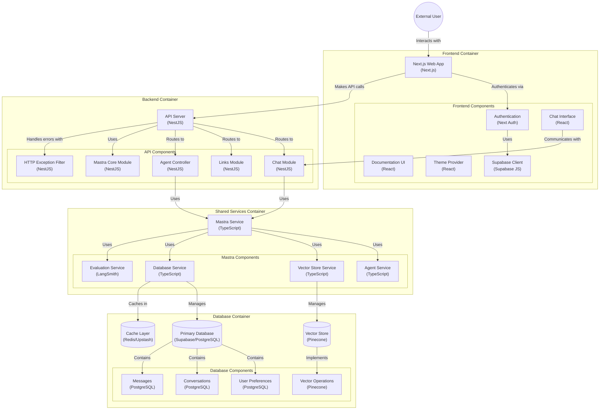

<div align="center">

# DeanMachines

### A Modern Platform for Building Intelligent AI Applications and Agents

[](https://www.typescriptlang.org/)
[](https://nextjs.org/)
[](https://nestjs.com/)
[](https://reactjs.org/)
[](https://supabase.io/)
[](https://www.pinecone.io/)
[](https://turbo.build/repo)
[](https://pnpm.io/)

Platform for building diverse AI applications, including conversational experiences, autonomous agents, and Reinforcement Learning systems, using a Next.js frontend and NestJS backend.

</div>

## 🚀 Project Overview

DeanMachines is a modern monorepo application built with Turborepo, featuring:

- **Next.js Frontend** for building user interfaces for AI applications and agent interaction/monitoring.
- **NestJS Backend** with robust API architecture for managing agents, data, and AI workflows.
- **Mastra AI Integration** for core agent capabilities, adaptable for various AI paradigms (including RL).
- **Vector Database** for semantic search, memory, and state representation.
- **Component Library** for consistent UI/UX across AI tools and dashboards.
- **Error Handling** for robust AI operations.
- **TypeScript Compliance** for improved code quality and maintainability.

## 📂 Repository Structure

### Apps and Packages

```bash
    .
    ├── apps
    │   ├── api                       # NestJS app (https://nestjs.com).
    │   └── web                       # Next.js app (https://nextjs.org).
    └── packages
        ├── @repo/api                 # Shared `NestJS` resources.
        ├── @repo/eslint-config       # `eslint` configurations (includes `prettier`)
        ├── @repo/jest-config         # `jest` configurations
        ├── @repo/typescript-config   # `tsconfig.json`s used throughout the monorepo
        ├── @repo/ui                  # Shareable stub React component library.
```

## ✨ Features

- 🤖 **Mastra AI Framework** - Core functionalities for building diverse AI agents (Conversational, RL, Autonomous).
- 🔍 **Vector Search** - Semantic capabilities via Pinecone for memory, context, and state.
- 🔐 **Authentication** - Secure auth with Supabase.
- 💾 **Database** - Type-safe database integration for agent data, logs, and configurations.
- 🎨 **UI Components** - Shared library for building agent interfaces and dashboards.
- 📱 **Responsive Design** - Works on all devices for monitoring and interaction.

## ⏱️ Project Status & Timeline

This section outlines the current development status and planned work.

**Legend:**
- ✅: Completed / Implemented
- 🚧: In Progress / Needs Work / Partially Implemented
- ⏳: Planned / Not Started

### Phase 1: Core Setup & Foundation (Complete ✅)

- ✅ Monorepo Setup (Turborepo, pnpm)
- ✅ Base TypeScript Configuration (`@repo/typescript-config`)
- ✅ Linting Configuration (`@repo/eslint-config`)
- ✅ Testing Configuration (`@repo/jest-config`)
- ✅ Remote Caching Setup (Vercel)
- ✅ Basic Next.js Frontend Structure (`apps/web`)
- ✅ Basic NestJS Backend Structure (`apps/api`)
- ✅ Global Styles & Theming (`globals.css`, `@repo/ui/ThemeProvider`)
- ✅ Core UI Layout (`@repo/ui/Appbar`, `layout.tsx`)
- ✅ Supabase Database Setup (PostgreSQL)
- ✅ Supabase Auth Setup (Basic configuration)
- ✅ Theme Persistence (`ThemeManager` with Supabase)
- ✅ Configuration Management (`@nestjs/config` in API)

### Phase 2: Feature Implementation (In Progress 🚧 / Planned ⏳)

- **Backend (`apps/api`)**
  - 🚧 Mastra Core Module Integration (`MastraCoreModule`)
  - ⏳ Agent Service & Controller Implementation
  - ⏳ Chat Module Implementation
  - ⏳ Robust API Error Handling
  - ⏳ API Testing (Unit/Integration)
- **Frontend (`apps/web`)**
  - 🚧 Client-side Authentication Integration (Supabase Auth UI/Logic)
  - 🚧 Agent Interaction/Monitoring UI Development
  - 🚧 Documentation Page Content Population
  - 🚧 End-to-End Testing Setup (Playwright)
- **Shared Packages (`@repo/ui`, `@repo/api`, `@repo/database`)**
  - 🚧 UI Component Implementation (Chat, Data Display, Core Elements)
  - 🚧 Shared API Resource Implementation (Mastra Services, Tools, Agents)
  - 🚧 Database Client Logic (`@repo/database` or within services)
  - 🚧 ORM/Client Usage Refinement (Supabase Client in services)
- **Infrastructure Integration**
  - 🚧 Pinecone Setup & Integration (Vector Store)
  - 🚧 Embedding Generation Pipeline
  - 🚧 Semantic Search Feature
  - ⏳ Upstash Redis Cache Integration
  - ⏳ Gemini & LangSmith AI Service Integration

### Phase 3: Refinement & Deployment (Planned ⏳)

- ⏳ Comprehensive Testing (Unit, Integration, E2E)
- ⏳ Documentation Finalization
- ⏳ Performance Optimization
- ⏳ Security Audit & Hardening
- ⏳ Deployment Pipeline Setup (Vercel, Docker, etc.)
- ⏳ Monitoring & Logging Implementation

---

*Detailed Status Breakdown:*

### Core Infrastructure & Setup

- ✅ Monorepo Setup (Turborepo, pnpm)
- ✅ Base TypeScript Configuration (`@repo/typescript-config`)
- ✅ Linting Configuration (`@repo/eslint-config`)
- ✅ Testing Configuration (`@repo/jest-config`)
- ✅ CI/CD Foundation (GitHub Actions suggested)
- ✅ Remote Caching Setup (Vercel)

### Backend (`apps/api`)

- ✅ NestJS Application Structure
- ✅ Basic API Controllers/Services (`AppController`, `AppService`)
- 🚧 Mastra Core Module (`MastraCoreModule`) - Integration started
  - ⏳ Agent Service (`agent.service`)
  - ⏳ Agent Controller (`agent.controller`)
  - ⏳ DTOs (`create-agent.dto`, `update-agent.dto`)
- 🚧 Chat Module (`ChatModule`) - Integration started
- ✅ Configuration Management (`@nestjs/config`)
- ⏳ Robust Error Handling (HttpExceptionFilter mentioned)
- ⏳ API Testing (Unit/Integration tests for modules)

### Frontend (`apps/web`)

- ✅ Next.js Application Structure
- ✅ Basic Pages (Dashboard, Docs, About inferred)
- ✅ Global Styles (`globals.css`) - Dark mode focus implemented
- ✅ Theme Provider (`@repo/ui/ThemeProvider`) - Integrated with Supabase persistence
- ✅ AppBar Component (`@repo/ui/Appbar`) - Integrated with ThemeProvider
- ✅ Layout Structure (`layout.tsx`)
- 🚧 Authentication Integration (Client-side Supabase/NextAuth)
- 🚧 Agent Interaction/Monitoring UI
- 🚧 Documentation Pages Content
- 🚧 End-to-End Testing (Playwright suggested)

### Shared Packages

- **`@repo/ui`**
  - ✅ Core Layout Components (AppBar)
  - ✅ Theme Implementation (ThemeProvider, light/dark themes)
  - 🚧 Chat Components (ChatWindow, ChatMessage, etc.) - Structure exists, implementation status unclear
  - 🚧 Data Display Components (Charts, Graphs, Table, List) - Structure exists, implementation status unclear
  - 🚧 Core UI Elements (Button, Card, Input, etc.) - Structure exists, implementation status unclear
  - ✅ Turborepo Export Configuration (`package.json`)
- **`@repo/api` (Shared NestJS Resources)**
  - 🚧 Mastra Services (Store Embeddings, Database)
  - 🚧 Mastra Tools (Document, GraphRAG, VectorQuery, etc.)
  - 🚧 Mastra Agents Definition
  - 🚧 Shared DTOs/Entities/Types
- **`@repo/database`** (Assumed based on diagram/description)
  - ✅ Database Schema Design (User Prefs, Convos, Messages, Embeddings, Docs)
  - 🚧 ORM Implementation (Supabase Client)
  - 🚧 Migrations & Seeding Strategy
  - 🚧 Database Client Setup

### Infrastructure Integration

- **Supabase**
  - ✅ PostgreSQL Database Setup
  - ✅ Auth Setup (Backend configuration likely needed)
  - ✅ Storage Setup (If used for documents/files)
  - ✅ RLS Policies Defined
- **Pinecone**
  - 🚧 Vector Store Setup & API Key Configuration
  - 🚧 Embedding Generation Pipeline
  - 🚧 Semantic Search Implementation
- **Upstash Redis** (Cache)
  - ⏳ Cache Implementation Strategy (Session state, memory)
  - ⏳ Integration with Backend Services
- **AI Services**
  - ⏳ Gemini Integration
  - ⏳ LangSmith Integration (Evaluation)

## 🧠 Mastra AI Backend Progress

### 🛠️ Backend Infrastructure

- ✅ **Database Schema**
  - User preferences, conversations, messages
  - Vector embeddings tracking
  - Document storage
  - Row Level Security (RLS) policies

- ✅ **ORM Implementation**
  - Type-safe interactions via Supabase Client
  - PostgreSQL integration
  - Proper relation definitions (Managed via Supabase schema/client)
  - Enum types for theme and roles



- **`apps/api`**: A [NestJS](https://nestjs.com/) application that serves as the backend API.
- **`apps/web`**: A [Next.js](https://nextjs.org/) application that serves as the frontend.
- **`packages/@repo/ui`**: A stub React component library that can be used in both the `web` and `api` applications.
- **`packages/@repo/typescript-config`**: A shared `tsconfig.json` file that can be used in all packages and applications.
- **`packages/@repo/jest-config`**: A shared `jest` configuration that can be used in all packages and applications.
- **`packages/@repo/eslint-config`**: A shared `eslint` configuration that can be used in all packages and applications.
- **`packages/@repo/api`**: A shared `NestJS` resources that can be used in all packages and applications.
- **`packages/@repo/tsconfig`**: A shared `tsconfig.json` file that can be used in all packages and applications.

#### Build

```bash
# Will build all the app & packages with the supported `build` script.
pnpm run build
```

#### ℹ️ If you plan to only build apps individually

#### Please make sure you've built the packages first

#### Develop

```bash
# Will run the development server for all the app & packages with the supported `dev` script.
pnpm run dev
```

#### Test

```bash
# Will launch a test suites for all the app & packages with the supported `test` script.
pnpm run test

# You can launch e2e testes with `test:e2e`
pnpm run test:e2e

# See `@repo/jest-config` to customize the behavior.
```

#### Lint

```bash
# Will lint all the app & packages with the supported `lint` script.
# See `@repo/eslint-config` to customize the behavior.
pnpm run lint
```

#### Format

```bash
# Will format all the supported `.ts,.js,json,.tsx,.jsx` files.
# See `@repo/eslint-config/prettier-base.js` to customize the behavior.
pnpm format
```

### Remote Caching

> [!TIP]
> Vercel Remote Cache is free for all plans. Get started today at [vercel.com](https://vercel.com/signup?/signup?utm_source=remote-cache-sdk&utm_campaign=free_remote_cache).

Turborepo can use a technique known as [Remote Caching](https://turbo.build/repo/docs/core-concepts/remote-caching) to share cache artifacts across machines, enabling you to share build caches with your team and CI/CD pipelines.

By default, Turborepo will cache locally. To enable Remote Caching you will need an account with Vercel. If you don't have an account you can [create one](https://vercel.com/signup?utm_source=turborepo-examples), then enter the following commands:

```bash
npx turbo login
```

This will authenticate the Turborepo CLI with your [Vercel account](https://vercel.com/docs/concepts/personal-accounts/overview).

Next, you can link your Turborepo to your Remote Cache by running the following command from the root of your Turborepo:

```bash
npx turbo link
```

## Useful Links

Learn more about the power of Turborepo:

- [Tasks](https://turbo.build/repo/docs/core-concepts/monorepos/running-tasks)
- [Caching](https://turbo.build/repo/docs/core-concepts/caching)
- [Remote Caching](https://turbo.build/repo/docs/core-concepts/remote-caching)
- [Filtering](https://turbo.build/repo/docs/core-concepts/monorepos/filtering)
- [Configuration Options](https://turbo.build/repo/docs/reference/configuration)
- [CLI Usage](https://turbo.build/repo/docs/reference/command-line-reference)
- [GitHub Actions](https://turbo.build/repo/docs/guides/github-actions)
- [Vercel](https://vercel.com/docs/concepts/git)
- [Vercel Remote Cache](https://vercel.com/docs/concepts/remote-cache)
- [Vercel CLI](https://vercel.com/docs/cli)
- [Vercel CLI Commands](https://vercel.com/docs/cli)
- [Vercel CLI Configuration](https://vercel.com/docs/cli/configuration)
- [Vercel CLI Environment Variables](https://vercel.com/docs/cli/environment-variables)


