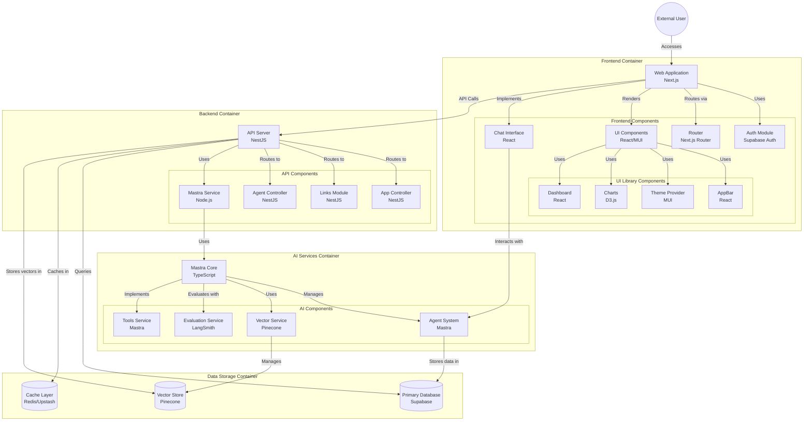

<div align="center">

# DeanMachines

### A Modern AI-Powered Application Platform

[](https://www.typescriptlang.org/)
[](https://nextjs.org/)
[](https://nestjs.com/)
[](https://reactjs.org/)
[](https://supabase.io/)
[](https://www.pinecone.io/)
[](https://turbo.build/repo)
[](https://pnpm.io/)

AI-powered application platform with Next.js frontend and NestJS backend for building intelligent, conversational experiences.

</div>

## 🚀 Project Overview

DeanMachines is a modern monorepo application built with Turborepo, featuring:

- **Next.js Frontend** with AI-powered user interfaces
- **NestJS Backend** with robust API architecture
- **Mastra AI Integration** for intelligent agent capabilities
- **Vector Database** for semantic search and embeddings
- **Component Library** for consistent UI/UX
- **Error Handling** for robust vector operations
- **TypeScript Compliance** for improved code quality

## 📂 Repository Structure

### Apps and Packages

```bash
    .
    ├── apps
    │   ├── api                       # NestJS app (https://nestjs.com).
    │   └── web                       # Next.js app (https://nextjs.org).
    └── packages
        ├── @repo/api                 # Shared `NestJS` resources.
        ├── @repo/eslint-config       # `eslint` configurations (includes `prettier`)
        ├── @repo/jest-config         # `jest` configurations
        ├── @repo/typescript-config   # `tsconfig.json`s used throughout the monorepo
        ├── @repo/ui                  # Shareable stub React component library.
        └── @repo/database              # Shareable stub React component library.
```

## ✨ Features

- 🤖 **Mastra AI Framework** - Agent-based AI capabilities
- 🔍 **Vector Search** - Semantic search using Pinecone
- 🔐 **Authentication** - Secure auth with Supabase
- 💾 **Database** - Type-safe database integration
- 🎨 **UI Components** - Shared component library
- 📱 **Responsive Design** - Works on all devices

## 🧠 Mastra AI Backend Progress

### 🛠️ Backend Infrastructure

- ✅ **Database Schema**
  - User preferences, conversations, messages
  - Vector embeddings tracking
  - Document storage
  - Row Level Security (RLS) policies

- ✅ **ORM Implementation**
  - Type-safe table definitions with Drizzle
  - PostgreSQL integration
  - Proper relation definitions
  - Enum types for theme and roles


- **`apps/api`**: A [NestJS](https://nestjs.com/) application that serves as the backend API.
- **`apps/web`**: A [Next.js](https://nextjs.org/) application that serves as the frontend.
- **`packages/@repo/ui`**: A stub React component library that can be used in both the `web` and `api` applications.
- **`packages/@repo/typescript-config`**: A shared `tsconfig.json` file that can be used in all packages and applications.
- **`packages/@repo/jest-config`**: A shared `jest` configuration that can be used in all packages and applications.
- **`packages/@repo/eslint-config`**: A shared `eslint` configuration that can be used in all packages and applications.
- **`packages/@repo/api`**: A shared `NestJS` resources that can be used in all packages and applications.
- **`packages/@repo/tsconfig`**: A shared `tsconfig.json` file that can be used in all packages and applications.

#### Build

```bash
# Will build all the app & packages with the supported `build` script.
pnpm run build
```

#### ℹ️ If you plan to only build apps individually

#### Please make sure you've built the packages first

#### Develop

```bash
# Will run the development server for all the app & packages with the supported `dev` script.
pnpm run dev
```

#### Test

```bash
# Will launch a test suites for all the app & packages with the supported `test` script.
pnpm run test

# You can launch e2e testes with `test:e2e`
pnpm run test:e2e

# See `@repo/jest-config` to customize the behavior.
```

#### Lint

```bash
# Will lint all the app & packages with the supported `lint` script.
# See `@repo/eslint-config` to customize the behavior.
pnpm run lint
```

#### Format

```bash
# Will format all the supported `.ts,.js,json,.tsx,.jsx` files.
# See `@repo/eslint-config/prettier-base.js` to customize the behavior.
pnpm format
```

### Remote Caching

> [!TIP]
> Vercel Remote Cache is free for all plans. Get started today at [vercel.com](https://vercel.com/signup?/signup?utm_source=remote-cache-sdk&utm_campaign=free_remote_cache).

Turborepo can use a technique known as [Remote Caching](https://turbo.build/repo/docs/core-concepts/remote-caching) to share cache artifacts across machines, enabling you to share build caches with your team and CI/CD pipelines.

By default, Turborepo will cache locally. To enable Remote Caching you will need an account with Vercel. If you don't have an account you can [create one](https://vercel.com/signup?utm_source=turborepo-examples), then enter the following commands:

```bash
npx turbo login
```

This will authenticate the Turborepo CLI with your [Vercel account](https://vercel.com/docs/concepts/personal-accounts/overview).

Next, you can link your Turborepo to your Remote Cache by running the following command from the root of your Turborepo:

```bash
npx turbo link
```

## Useful Links

Learn more about the power of Turborepo:

- [Tasks](https://turbo.build/repo/docs/core-concepts/monorepos/running-tasks)
- [Caching](https://turbo.build/repo/docs/core-concepts/caching)
- [Remote Caching](https://turbo.build/repo/docs/core-concepts/remote-caching)
- [Filtering](https://turbo.build/repo/docs/core-concepts/monorepos/filtering)
- [Configuration Options](https://turbo.build/repo/docs/reference/configuration)
- [CLI Usage](https://turbo.build/repo/docs/reference/command-line-reference)
- [GitHub Actions](https://turbo.build/repo/docs/guides/github-actions)
- [Vercel](https://vercel.com/docs/concepts/git)
- [Vercel Remote Cache](https://vercel.com/docs/concepts/remote-cache)
- [Vercel CLI](https://vercel.com/docs/cli)
- [Vercel CLI Commands](https://vercel.com/docs/cli)
- [Vercel CLI Configuration](https://vercel.com/docs/cli/configuration)
- [Vercel CLI Environment Variables](https://vercel.com/docs/cli/environment-variables)


