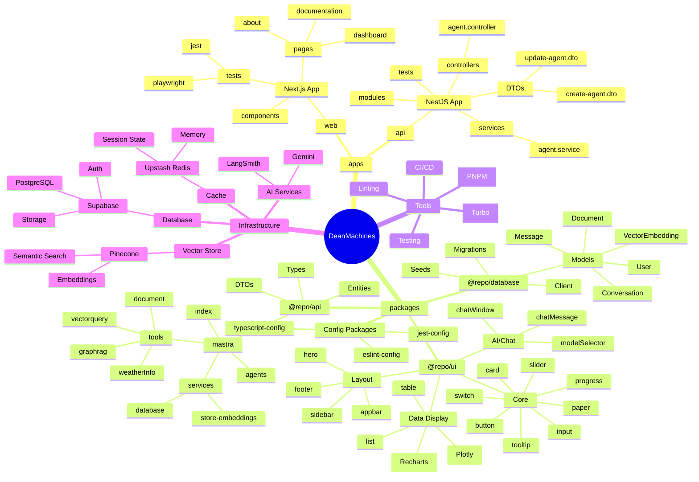
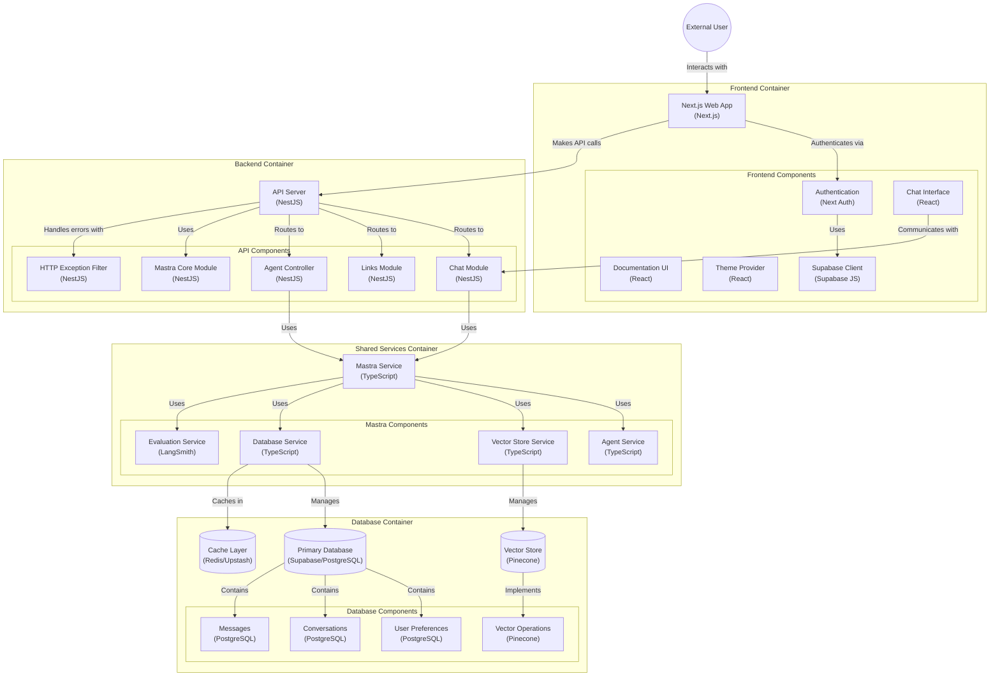

This file is a merged representation of the entire codebase, combined into a single document by Repomix.
The content has been processed where content has been formatted for parsing in markdown style, content has been compressed (code blocks are separated by ⋮---- delimiter).

# File Summary

## Purpose

This file contains a packed representation of the entire repository's contents.
It is designed to be easily consumable by AI systems for analysis, code review,
or other automated processes.

## File Format

The content is organized as follows:

1. This summary section
2. Repository information
3. Directory structure
4. Multiple file entries, each consisting of:
  a. A header with the file path (## File: path/to/file)
  b. The full contents of the file in a code block

## Usage Guidelines

- This file should be treated as read-only. Any changes should be made to the
  original repository files, not this packed version.
- When processing this file, use the file path to distinguish
  between different files in the repository.
- Be aware that this file may contain sensitive information. Handle it with
  the same level of security as you would the original repository.

## Notes

- Some files may have been excluded based on .gitignore rules and Repomix's configuration
- Binary files are not included in this packed representation. Please refer to the Repository Structure section for a complete list of file paths, including binary files
- Files matching patterns in .gitignore are excluded
- Files matching default ignore patterns are excluded
- Content has been formatted for parsing in markdown style
- Content has been compressed - code blocks are separated by ⋮---- delimiter
- Files are sorted by Git change count (files with more changes are at the bottom)

## Additional Info

# Directory Structure

```
apps/web/app/dashboard/
packages/api/src/graphql/
packages/api/src/trpc/
packages/ui/src/dashboard/
.cursor/mcp.json
.env.example
.eslintrc.js
.gitignore
.nvmrc
.prettierrc.js
.repomix/bundles.json
.todo.md
apps/api/.eslintrc.js
apps/api/.prettierrc.js
apps/api/jest.config.ts
apps/api/mastra.config.ts
apps/api/nest-cli.json
apps/api/package.json
apps/api/README.md
apps/api/src/app.controller.spec.ts
apps/api/src/app.controller.ts
apps/api/src/app.module.ts
apps/api/src/app.service.ts
apps/api/src/chat/chat.controller.ts
apps/api/src/chat/chat.module.ts
apps/api/src/chat/chat.service.ts
apps/api/src/common/filters/http-exception.filter.ts
apps/api/src/links/links.controller.spec.ts
apps/api/src/links/links.controller.ts
apps/api/src/links/links.module.ts
apps/api/src/links/links.service.spec.ts
apps/api/src/links/links.service.ts
apps/api/src/main.ts
apps/api/src/mastra-core/mastra-core.module.ts
apps/api/test/app.e2e-spec.ts
apps/api/test/jest-e2e.json
apps/api/tsconfig.build.json
apps/api/tsconfig.json
apps/web/.eslintrc.js
apps/web/.prettierrc.js
apps/web/app/about/page.tsx
apps/web/app/auth/confirm/route.ts
apps/web/app/documentation/api-reference/page.tsx
apps/web/app/documentation/architecture/page.tsx
apps/web/app/documentation/core-concepts/page.tsx
apps/web/app/documentation/DocumentationSidebarNav.tsx
apps/web/app/documentation/getting-started/page.tsx
apps/web/app/documentation/guides/page.tsx
apps/web/app/documentation/layout.tsx
apps/web/app/documentation/page.tsx
apps/web/app/error/page.tsx
apps/web/app/globals.css
apps/web/app/layout.tsx
apps/web/app/login/actions.ts
apps/web/app/login/page.tsx
apps/web/app/middleware.ts
apps/web/app/page.module.css
apps/web/app/page.module.ts
apps/web/app/page.tsx
apps/web/app/pricing/page.tsx
apps/web/app/private/page.tsx
apps/web/app/services/page.tsx
apps/web/app/utils/supabase/client.ts
apps/web/app/utils/supabase/middleware.ts
apps/web/app/utils/supabase/server.ts
apps/web/instrumentation.ts
apps/web/jest.config.ts
apps/web/mastra.config.ts
apps/web/next-env.d.ts
apps/web/next.config.js
apps/web/package.json
apps/web/playwright.config.ts
apps/web/public/circles.svg
apps/web/public/next.svg
apps/web/public/turborepo.svg
apps/web/public/vercel.svg
apps/web/README.md
apps/web/src/mastra/hooks/useAgent.ts
apps/web/src/mastra/index.ts
apps/web/test/e2e/page.e2e-spec.ts
apps/web/test/layout.spec.tsx
apps/web/test/page.spec.tsx
apps/web/tsconfig.json
package.json
packages/api/.eslintrc.js
packages/api/.prettierrc.js
packages/api/mastra.config.ts
packages/api/package.json
packages/api/README.md
packages/api/src/controllers/agents/agent.controller.ts
packages/api/src/controllers/agents/agent.service.ts
packages/api/src/database/client.ts
packages/api/src/database/index.ts
packages/api/src/database/migrations/001_initial_schema.sql
packages/api/src/database/supabase.ts
packages/api/src/database/upstash.ts
packages/api/src/index.ts
packages/api/src/links/dto/create-agent.dto.ts
packages/api/src/links/dto/create-link.dto.ts
packages/api/src/links/dto/update-agent.dto.ts
packages/api/src/links/dto/update-link.dto.ts
packages/api/src/links/entities/agent.entity.ts
packages/api/src/links/entities/link.entity.ts
packages/api/src/mastra/agents/index.ts
packages/api/src/mastra/evaluation/langsmith.ts
packages/api/src/mastra/index.ts
packages/api/src/mastra/services/database.ts
packages/api/src/mastra/services/store-embeddings.ts
packages/api/src/mastra/services/vector-store.ts
packages/api/src/mastra/tools/document.ts
packages/api/src/mastra/tools/graphrag.ts
packages/api/src/mastra/tools/index.ts
packages/api/src/mastra/tools/vectorquery.ts
packages/api/src/mastra/tools/weatherInfo.ts
packages/api/src/mastra/workflows.ts/index.ts
packages/api/src/supabase/guard.ts
packages/api/src/supabase/supabase-auth.guard.ts
packages/api/src/utils/env.ts
packages/api/tsconfig.json
packages/eslint-config/base.js
packages/eslint-config/library.js
packages/eslint-config/nest.js
packages/eslint-config/next.js
packages/eslint-config/package.json
packages/eslint-config/prettier-base.js
packages/eslint-config/react-internal.js
packages/eslint-config/README.md
packages/jest-config/base.ts
packages/jest-config/nest.ts
packages/jest-config/next.ts
packages/jest-config/package.json
packages/typescript-config/base.json
packages/typescript-config/nestjs.json
packages/typescript-config/nextjs.json
packages/typescript-config/package.json
packages/typescript-config/react-library.json
packages/ui/.eslintrc.js
packages/ui/.prettierrc.js
packages/ui/mastra.config.ts
packages/ui/notes.md
packages/ui/package.json
packages/ui/README.md
packages/ui/src/appbar.tsx
packages/ui/src/autocomplete.tsx
packages/ui/src/button.tsx
packages/ui/src/card.tsx
packages/ui/src/charts.tsx
packages/ui/src/chat/chat.tsx
packages/ui/src/chat/ChatAccordion.tsx
packages/ui/src/chat/ChatAgentPanel.tsx
packages/ui/src/chat/ChatAttachments.tsx
packages/ui/src/chat/ChatCommandInput.tsx
packages/ui/src/chat/ChatContainer.tsx
packages/ui/src/chat/ChatHeader.tsx
packages/ui/src/chat/ChatInput.tsx
packages/ui/src/chat/ChatInterface.tsx
packages/ui/src/chat/ChatMessage.tsx
packages/ui/src/chat/ChatMessageList.tsx
packages/ui/src/chat/ChatSlashCommands.tsx
packages/ui/src/chat/ChatToolsPanel.tsx
packages/ui/src/chat/ChatTypingIndicator.tsx
packages/ui/src/chat/ChatWindow.tsx
packages/ui/src/chat/ChatWorkflowPanel.tsx
packages/ui/src/chat/EmojiPicker.tsx
packages/ui/src/chat/hook.ts
packages/ui/src/chat/index.ts
packages/ui/src/chat/types.ts
packages/ui/src/code.tsx
packages/ui/src/collapsible.tsx
packages/ui/src/d3.tsx
packages/ui/src/dashboard.tsx
packages/ui/src/drawer.tsx
packages/ui/src/dropdrown.tsx
packages/ui/src/footer.tsx
packages/ui/src/form.tsx
packages/ui/src/graphs.tsx
packages/ui/src/grid.tsx
packages/ui/src/hero.tsx
packages/ui/src/input.tsx
packages/ui/src/label.tsx
packages/ui/src/list.tsx
packages/ui/src/menu.tsx
packages/ui/src/model_selector.tsx
packages/ui/src/paper.tsx
packages/ui/src/popover.tsx
packages/ui/src/progress.tsx
packages/ui/src/responsive.tsx
packages/ui/src/ScrollArea.tsx
packages/ui/src/select.tsx
packages/ui/src/sidebar.tsx
packages/ui/src/slider.tsx
packages/ui/src/switch.tsx
packages/ui/src/table.tsx
packages/ui/src/tabs.tsx
packages/ui/src/theme/index.ts
packages/ui/src/theme/ThemeProvider.tsx
packages/ui/src/tooltip.tsx
packages/ui/tsconfig.json
packages/ui/tsconfig.lint.json
packages/ui/turbo/generators/config.ts
packages/ui/turbo/generators/templates/component.hbs
pnpm-workspace.yaml
README.md
tsconfig.json
turbo.json
```

# Files

## File: packages/ui/src/chat/ChatMessage.tsx

````typescript
import {
  Box,
  Avatar,
  Typography,
  CircularProgress,
  styled,
  alpha,
  Link,
} from '@mui/material';
import { Person, SmartToy } from '@mui/icons-material';
import ReactMarkdown from 'react-markdown';
import { Prism as SyntaxHighlighter } from 'react-syntax-highlighter';
import { materialDark } from 'react-syntax-highlighter/dist/esm/styles/prism';
import type { Attachment } from './types';
⋮----
export interface ChatMessageProps {
  /**
   * Message content
   */
  content: string;

  /**
   * Message sender role
   */
  role: 'user' | 'assistant';

  /**
   * Message timestamp
   */
  timestamp: Date;

  /**
   * Model used for response (for assistant messages)
   */
  model?: string;

  /**
   * Message status
   */
  status?: 'sending' | 'sent' | 'error';

  /**
   * Optional array of attachment metadata
   */
  attachments?: Attachment[];

  /**
   * If true, enables code highlighting
   * @default true
   */
  enableCodeHighlighting?: boolean;

  /**
   * If true, enables markdown formatting
   * @default true
   */
  enableMarkdown?: boolean;
}
⋮----
/**
   * Message content
   */
⋮----
/**
   * Message sender role
   */
⋮----
/**
   * Message timestamp
   */
⋮----
/**
   * Model used for response (for assistant messages)
   */
⋮----
/**
   * Message status
   */
⋮----
/**
   * Optional array of attachment metadata
   */
⋮----
/**
   * If true, enables code highlighting
   * @default true
   */
⋮----
/**
   * If true, enables markdown formatting
   * @default true
   */
⋮----
/**
 * Renders a chat message bubble with support for markdown, code highlighting, and file attachments
 */
⋮----
// Helper to get file type icon or thumbnail for attachments
⋮----
// For image attachments with a URL, show a thumbnail
⋮----
// For other file types, show just the file name with link if URL exists
⋮----
{...rest} // Pass rest props if needed by SyntaxHighlighter, otherwise remove
⋮----
{/* Display attachments if present */}
⋮----
````

## File: packages/ui/src/chat/ChatWindow.tsx

````typescript
import {
  Box,
  Paper,
  TextField,
  IconButton,
  Typography,
  Divider,
  styled,
  alpha,
  Menu,
  MenuItem,
  Tooltip,
  CircularProgress,
  Chip,
  Dialog,
  DialogTitle,
  DialogContent,
  DialogActions,
  Button,
  List,
  ListItem,
  ListItemText,
  ListItemIcon,
} from '@mui/material';
import {
  Send,
  AttachFile,
  Settings,
  AutoAwesome,
  MoreVert,
  RestartAlt,
  Save,
  ContentCopy,
  Download,
  Upload,
  Delete,
  Storage,
  Image,
  AudioFile,
  PictureAsPdf,
} from '@mui/icons-material';
import { ChatMessage } from './ChatMessage';
import { ModelSelector } from '../model_selector';
import type { ModelOption } from '../model_selector';
⋮----
// Add new interface for chat settings
interface ChatSettings {
  temperature?: number;
  maxTokens?: number;
  topP?: number;
  frequencyPenalty?: number;
  presencePenalty?: number;
  systemPrompt?: string;
}
⋮----
// Extend ChatWindowProps
export interface ChatWindowProps {
  /**
   * Chat messages
   */
  messages: Array<{
    id: string;
    content: string;
    role: 'user' | 'assistant';
    timestamp: Date;
    model?: string;
    status?: 'sending' | 'sent' | 'error';
  }>;

  /**
   * Available models
   */
  models: ModelOption[];

  /**
   * Currently selected model
   */
  selectedModel?: string;

  /**
   * Callback when a message is sent
   */
  onSendMessage?: (content: string) => Promise<void>;

  /**
   * Callback when model is changed
   */
  onModelChange?: (modelId: string) => void;

  /**
   * Custom className
   */
  className?: string;

  /**
   * Current chat settings
   */
  settings?: ChatSettings;

  /**
   * Callback when settings are changed
   */
  onSettingsChange?: (settings: ChatSettings) => void;

  /**
   * Maximum file size in bytes
   * @default 10485760 (10MB)
   */
  maxFileSize?: number;

  /**
   * Allowed file types
   * @default ['image/*', 'application/pdf', 'audio/*']
   */
  allowedFileTypes?: string[];

  /**
   * If true, enables code highlighting
   * @default true
   */
  enableCodeHighlighting?: boolean;

  /**
   * If true, enables markdown formatting
   * @default true
   */
  enableMarkdown?: boolean;
}
⋮----
/**
   * Chat messages
   */
⋮----
/**
   * Available models
   */
⋮----
/**
   * Currently selected model
   */
⋮----
/**
   * Callback when a message is sent
   */
⋮----
/**
   * Callback when model is changed
   */
⋮----
/**
   * Custom className
   */
⋮----
/**
   * Current chat settings
   */
⋮----
/**
   * Callback when settings are changed
   */
⋮----
/**
   * Maximum file size in bytes
   * @default 10485760 (10MB)
   */
⋮----
/**
   * Allowed file types
   * @default ['image/*', 'application/pdf', 'audio/*']
   */
⋮----
/**
   * If true, enables code highlighting
   * @default true
   */
⋮----
/**
   * If true, enables markdown formatting
   * @default true
   */
⋮----
// Add new styled components
⋮----
maxFileSize = 10 * 1024 * 1024, // 10MB
⋮----
const scrollToBottom = () =>
⋮----
const handleSend = async () =>
⋮----
const handleKeyPress = (event: React.KeyboardEvent) =>
⋮----
// Handle file selection
const handleFileSelect = (event: React.ChangeEvent<HTMLInputElement>) =>
⋮----
// Add type check and provide default value
⋮----
// Handle file removal
const handleFileRemove = (index: number) =>
⋮----
// Handle menu actions
const handleMenuClick = (event: React.MouseEvent<HTMLElement>) =>
⋮----
const handleMenuClose = () =>
⋮----
const handleClearChat = () =>
⋮----
// Implement chat clearing logic
⋮----
const handleExportChat = () =>
⋮----
// Settings dialog content
const renderSettingsDialog = () => (
      <Dialog open={settingsOpen} onClose={() => setSettingsOpen(false)}>
        <DialogTitle>Chat Settings</DialogTitle>
        <DialogContent>
          {/* Add settings controls */}
        </DialogContent>
        <DialogActions>
          <Button onClick={() => setSettingsOpen(false)}>Cancel</Button>
<Button onClick=
⋮----
{/* Add settings controls */}
⋮----
// File preview list
⋮----
open=
⋮----
onChange=
⋮----
````

## File: .eslintrc.js

````javascript
// This configuration only applies to the package manager root.
/** @type {import("eslint").Linter.Config} */
````

## File: .nvmrc

````
23.10.0
````

## File: .prettierrc.js

````javascript
/** @type {import("prettier").Config} */
````

## File: .repomix/bundles.json

````json
{
  "bundles": {}
}
````

## File: .todo.md

````markdown
# Initial Setup TODOs

## Environment Setup
- [ ] Install Mastra core runtime in `apps/web`: `pnpm add @mastra/core`
- [ ] Install Mastra CLI for development: `pnpm add -D mastra-cli`
- [ ] Run Mastra initialization: `npx mastra@latest init`

## Environment Variables
- [ ] Create `.env.local` in `apps/web` for development
- [ ] Add `GEMINI_API_KEY` for Gemini 2.0 Flash
- [ ] Add `LANGSMITH_API_KEY` for observability
- [ ] Configure `DEFAULT_GEMINI_MODEL` (verify 'gemini-2.0-flash')

## Configuration Files
- [ ] Review and customize `mastra.config.ts`
- [ ] Update `turbo.json` for environment variables
- [ ] Add Mastra scripts to `apps/web/package.json`

## Type Safety & Validation
- [ ] Set up base types for Mastra integration
- [ ] Create Zod schemas for validation
- [ ] Configure TypeScript paths if needed

## Testing Setup
- [ ] Configure test environment for Mastra
- [ ] Set up mocks for Gemini API
- [ ] Create test utilities for AI responses

## Security & Authentication
- [ ] Review authentication flow with Lucia
- [ ] Set up secure environment variable handling
- [ ] Configure CORS if needed

## Database Schema
- [ ] Review existing Prisma schema
- [ ] Plan any needed schema updates for AI features
- [ ] Create migrations if needed

## Initial Structure
- [ ] Create `apps/web/src/lib/mastra` directory
- [ ] Set up `apps/web/src/lib/services` for AI services
- [ ] Create base error handling utilities

## Documentation
- [ ] Document environment variable requirements
- [ ] Create setup instructions for team
- [ ] Document testing approach

## Verification
- [ ] Verify Prisma Client generation
- [ ] Test basic Mastra integration
- [ ] Verify environment variable loading
- [ ] Check TypeScript compilation
````

## File: apps/api/.eslintrc.js

````javascript
/** @type {import("eslint").Linter.Config} */
````

## File: apps/api/.prettierrc.js

````javascript
/** @type {import("prettier").Config} */
````

## File: apps/api/jest.config.ts

````typescript
import { config } from '@repo/jest-config/nest';
````

## File: apps/api/mastra.config.ts

````typescript
import { Mastra } from '@mastra/core';
import { createLogger } from '@mastra/core';
⋮----
// ... other config
````

## File: apps/api/nest-cli.json

````json
{
  "$schema": "https://json.schemastore.org/nest-cli",
  "collection": "@nestjs/schematics",
  "sourceRoot": "src",
  "compilerOptions": {
    "deleteOutDir": true
  }
}
````

## File: apps/api/src/app.controller.spec.ts

````typescript
import { Test, TestingModule } from '@nestjs/testing';
import { describe, it, expect, beforeEach } from '@jest/globals';
import { AppController } from './app.controller';
import { AppService } from './app.service';
````

## File: apps/api/src/app.controller.ts

````typescript
import { Controller, Get } from '@nestjs/common';
import { AppService } from './app.service';
⋮----
export class AppController {
⋮----
constructor(private readonly appService: AppService)
⋮----
getHello(): string
````

## File: apps/api/src/app.service.ts

````typescript
import { Injectable } from '@nestjs/common';
⋮----
export class AppService {
⋮----
getHello(): string
````

## File: apps/api/src/chat/chat.controller.ts

````typescript
import {
  Controller,
  Post,
  Body,
  Param,
  UseGuards,
  Req,
  HttpCode,
  HttpStatus,
  Logger,
  Query,
  ValidationPipe,
  Sse,
  MessageEvent,
} from '@nestjs/common';
import { ChatService } from './chat.service';
import { SupabaseAuthGuard } from '@repo/api/supabase/supabase-auth.guard';
import { Observable, from, map, catchError, finalize, switchMap } from 'rxjs';
import { StreamTextResult } from 'ai'; // Import result type from 'ai'
⋮----
// Define DTO for request body validation
import { IsString, IsOptional, IsNotEmpty } from 'class-validator';
⋮----
export class ChatRequestDto {
⋮----
// Define a type for the request object after guard adds user
interface RequestWithUser extends Request {
  user: { id: string; [key: string]: any };
}
⋮----
@UseGuards(SupabaseAuthGuard) // Apply guard to the whole controller
export class ChatController {
⋮----
constructor(private readonly chatService: ChatService)
⋮----
// Endpoint for Single Response (Generate)
⋮----
async handleChatMessage(
    @Param('agentName') agentName: string,
    @Body(new ValidationPipe()) body: ChatRequestDto,
    @Req() req: RequestWithUser,
): Promise<any>
⋮----
userId, // resourceId
⋮----
// Endpoint for Streaming Response (Stream via SSE)
⋮----
handleChatStream(
    @Param('agentName') agentName: string,
    @Query('prompt') prompt: string,
    @Query('threadId') threadId: string | undefined,
    @Req() req: RequestWithUser,
): Observable<MessageEvent>
⋮----
// Validate that prompt is provided
⋮----
// Helper function to create the SSE Observable
private createSseObservable(
    agentName: string,
    prompt: string,
    threadId: string | undefined,
    userId: string
): Observable<MessageEvent>
⋮----
// Convert the StreamTextResult to an Observable of stream items
⋮----
return from(streamResult.textStream); // RxJS 'from' can handle async iterators
⋮----
// Map each delta to an SSE MessageEvent
````

## File: apps/api/src/chat/chat.module.ts

````typescript
import { Module } from '@nestjs/common';
import { ChatController } from './chat.controller';
import { ChatService } from './chat.service';
⋮----
export class ChatModule
````

## File: apps/api/src/chat/chat.service.ts

````typescript
import { Injectable, Inject, NotFoundException, InternalServerErrorException, Logger } from '@nestjs/common';
import { Agent } from '@mastra/core';
import { MASTRA_AGENTS_TOKEN, MASTRA_DATABASE_TOKEN } from '../mastra-core/mastra-core.module';
import { MastraDatabase } from '@repo/api/mastra/services/database';
import { GenerateTextResult, StreamTextResult } from 'ai';
⋮----
// Define a type for the injected agents object for better type safety
type MastraAgents = { [key: string]: Agent };
⋮----
export class ChatService {
⋮----
constructor(
⋮----
// Inject database service if needed for context enrichment or logging
⋮----
// Helper to get agent instance or throw NotFoundException
private getAgent(agentName: string): Agent
⋮----
// Implement method for single response generation
async processMessage(
    agentName: string,
    prompt: string,
    threadId?: string,
    resourceId?: string, // Often userId for context/memory/auth
): Promise<GenerateTextResult<any, unknown>>
⋮----
resourceId?: string, // Often userId for context/memory/auth
⋮----
// Add any post-processing or application-specific DB saving logic here
⋮----
// Implement method for initiating a streaming response
async streamMessage(
    agentName: string,
    prompt: string,
    threadId?: string,
    resourceId?: string,
): Promise<StreamTextResult<any, unknown>>
````

## File: apps/api/src/common/filters/http-exception.filter.ts

````typescript
import {
  ExceptionFilter,
  Catch,
  ArgumentsHost,
  HttpException,
  HttpStatus,
  Logger,
} from '@nestjs/common';
import { HttpAdapterHost } from '@nestjs/core';
⋮----
// Helper to check if an object is like a ServiceError
function isServiceError(error: any): error is
⋮----
// Helper to map ActionErrorCode to HttpStatus
function mapActionCodeToHttpStatus(code: string): HttpStatus
⋮----
// Add mappings for other ActionErrorCodes
⋮----
@Catch() // Catch all exceptions
export class GlobalHttpExceptionFilter implements ExceptionFilter {
⋮----
constructor(private readonly httpAdapterHost: HttpAdapterHost)
⋮----
catch(exception: unknown, host: ArgumentsHost): void
⋮----
// Ensure response is sent only once
````

## File: apps/api/src/links/links.controller.spec.ts

````typescript
import { Test, TestingModule } from '@nestjs/testing';
import { describe, it, expect, beforeEach } from '@jest/globals';
⋮----
import { LinksController } from './links.controller';
import { LinksService } from './links.service';
````

## File: apps/api/src/links/links.controller.ts

````typescript
import {
  Controller,
  Get,
  Post,
  Body,
  Patch,
  Param,
  Delete,
} from '@nestjs/common';
import { LinksService } from './links.service';
⋮----
import { CreateLinkDto } from '@repo/api/links/dto/create-link.dto';
import { UpdateLinkDto } from '@repo/api/links/dto/update-link.dto';
⋮----
export class LinksController {
⋮----
constructor(private readonly linksService: LinksService)
⋮----
create(@Body() createLinkDto: CreateLinkDto)
⋮----
findAll()
⋮----
findOne(@Param('id') id: string)
⋮----
update(@Param('id') id: string, @Body() updateLinkDto: UpdateLinkDto)
⋮----
remove(@Param('id') id: string)
````

## File: apps/api/src/links/links.module.ts

````typescript
import { Module } from '@nestjs/common';
⋮----
import { LinksService } from './links.service';
import { LinksController } from './links.controller';
⋮----
export class LinksModule
````

## File: apps/api/src/links/links.service.spec.ts

````typescript
import { Test, TestingModule } from '@nestjs/testing';
import { describe, it, expect, beforeEach } from '@jest/globals';
import { LinksService } from './links.service';
````

## File: apps/api/src/links/links.service.ts

````typescript
import { Injectable } from '@nestjs/common';
⋮----
import { Link } from '@repo/api/links/entities/link.entity';
⋮----
import { CreateLinkDto } from '@repo/api/links/dto/create-link.dto';
import { UpdateLinkDto } from '@repo/api/links/dto/update-link.dto';
⋮----
export class LinksService {
⋮----
create(createLinkDto: CreateLinkDto)
⋮----
findAll()
⋮----
findOne(id: number)
⋮----
update(id: number, updateLinkDto: UpdateLinkDto)
⋮----
remove(id: number)
````

## File: apps/api/src/mastra-core/mastra-core.module.ts

````typescript
import { Module, Global, OnModuleInit, Inject, Logger } from '@nestjs/common';
⋮----
// Import necessary components from the shared 'packages/api'
import { initializeAgents, agents as mastraAgentsObjectRef } from '@repo/api/mastra/agents/index';
import { Agent } from '@mastra/core'; // For typing
import { MastraDatabase } from '@repo/api/mastra/services/database';
import { EmbeddingStoreService, initializeGlobalEmbeddingStore } from '@repo/api/mastra/services/store-embeddings';
⋮----
// Define unique Injection Tokens
⋮----
@Global() // Make these providers available globally in the NestJS app
⋮----
// --- Provider for Mastra Agents ---
⋮----
const logger = new Logger('MastraAgentsInit'); // Create a logger instance
⋮----
// Call the initialization function with dependencies
⋮----
return mastraAgentsObjectRef; // Return the initialized agents object
⋮----
// Re-throw the error to prevent the application from starting with uninitialized agents
⋮----
inject: [MASTRA_DATABASE_TOKEN, EMBEDDING_STORE_SERVICE_TOKEN], // Inject dependencies
⋮----
// --- Provider for MastraDatabase Service ---
⋮----
inject: [EMBEDDING_STORE_SERVICE_TOKEN], // Inject EmbeddingStoreService if needed for init
⋮----
// --- Provider for EmbeddingStoreService ---
⋮----
// This uses the singleton pattern from the store-embeddings file
⋮----
], // Export tokens for injection in other modules
⋮----
export class MastraCoreModule implements OnModuleInit {
⋮----
// Inject providers to ensure factories run during bootstrap
constructor(
⋮----
onModuleInit()
````

## File: apps/api/test/app.e2e-spec.ts

````typescript
import { Test, TestingModule } from '@nestjs/testing';
import { INestApplication } from '@nestjs/common';
import { describe, it, beforeEach } from '@jest/globals';
import request from 'supertest';
import { AppModule } from './../src/app.module';
````

## File: apps/api/test/jest-e2e.json

````json
{
  "moduleFileExtensions": ["js", "json", "ts"],
  "rootDir": ".",
  "testEnvironment": "node",
  "testRegex": ".e2e-spec.ts$",
  "transform": {
    "^.+\\.(t|j)s$": "ts-jest"
  }
}
````

## File: apps/api/tsconfig.build.json

````json
{
  "extends": "./tsconfig.json",
  "exclude": ["node_modules", "test", "dist", "**/*spec.ts"]
}
````

## File: apps/web/app/auth/confirm/route.ts

````typescript
import { type EmailOtpType } from '@supabase/supabase-js';
import { cookies } from 'next/headers';
import { type NextRequest } from 'next/server';
⋮----
import { createClient } from './../../utils/supabase/server';
import { redirect } from 'next/navigation';
⋮----
export async function GET(request: NextRequest)
⋮----
// redirect user to specified redirect URL or root of app
⋮----
// redirect the user to an error page with some instructions
````

## File: apps/web/app/documentation/api-reference/page.tsx

````typescript
import type { Metadata } from 'next';
import Link from 'next/link';
import {
  Box,
  Typography,
  Stack,
  Paper,
  Link as MuiLink,
  Divider,
  alpha,
  Table,
  TableBody,
  TableCell,
  TableContainer,
  TableHead,
  TableRow,
} from '@mui/material';
import { Code } from '@repo/ui/Code';
import { Collapsible } from '@repo/ui/Collapsible';
⋮----
/**
 * Generate SEO metadata for the API reference page
 * @returns Metadata object with title and description
 */
export function generateMetadata(): Metadata
⋮----
/**
 * API Reference documentation page
 * Provides detailed technical documentation for the platform's APIs
 */
⋮----
{/* Authentication Section */}
⋮----
{/* Base URL Section */}
⋮----
{`https://api.deanmachines.ai/v1`}
⋮----
{`http://localhost:3001/v1`}
⋮----
{/* Response Format Section */}
⋮----
{/* Errors Section */}
⋮----
{/* Endpoints Section */}
⋮----
{/* Agents Endpoints */}
⋮----
{/* List Agents Endpoint */}
⋮----
"ttl": 86400 // 1 day in seconds
⋮----
"ttl": 2592000 // 30 days in seconds
⋮----
"sessionId": "session_456def", // Optional, if omitted a new session will be created
⋮----
"attachments": [] // Optional array of file IDs or base64 encoded files
⋮----
"toolCalls": [], // If the agent used any tools
⋮----
// Initialize with API key
⋮----
// Send a message to an agent
⋮----
{/* Next Steps Section */}
````

## File: apps/web/app/documentation/architecture/page.tsx

````typescript
import type { Metadata } from 'next';
import Link from 'next/link';
import {
  Box,
  Typography,
  Stack,
  Paper,
  Link as MuiLink,
  Divider,
  alpha,
} from '@mui/material';
import { Code } from '@repo/ui/Code';
⋮----
/**
 * Generate SEO metadata for the architecture page
 * @returns Metadata object with title and description
 */
export function generateMetadata(): Metadata
⋮----
/**
 * Architecture documentation page
 * Explains the technical architecture and components of the platform
 */
⋮----
{/* Architecture Overview Section */}
⋮----
{/* Frontend Architecture Section */}
⋮----
{/* Backend Architecture Section */}
⋮----
{/* Data Storage Architecture Section */}
⋮----
{/* Integration Architecture Section */}
⋮----
{/* Deployment Architecture Section */}
⋮----
{/* Next Steps Section */}
````

## File: apps/web/app/documentation/core-concepts/page.tsx

````typescript
import type { Metadata } from 'next';
import Link from 'next/link';
import {
  Box,
  Typography,
  Stack,
  Paper,
  Link as MuiLink,
  Divider,
  alpha,
} from '@mui/material';
import { Code } from '@repo/ui/Code';
⋮----
/**
 * Generate SEO metadata for the core concepts page
 * @returns Metadata object with title and description
 */
export function generateMetadata(): Metadata
⋮----
/**
 * Core Concepts documentation page
 * Explains the fundamental concepts that power the DeanMachines AI platform
 */
⋮----
{/* Agents Section */}
⋮----
{/* Memory Section */}
⋮----
{/* RAG (Retrieval-Augmented Generation) Section */}
⋮----
{/* Tools Section */}
⋮----
{/* Evaluation Section */}
⋮----
{/* Next Steps Section */}
````

## File: apps/web/app/documentation/DocumentationSidebarNav.tsx

````typescript
import React from 'react';
import Link from 'next/link';
import { usePathname } from 'next/navigation';
import {
  Box,
  List,
  ListItemButton,
  ListItemText,
  Paper,
  Typography,
  useMediaQuery,
  useTheme,
  alpha,
} from '@mui/material';
⋮----
/**
 * Navigation items for the documentation sidebar
 */
⋮----
/**
 * Sidebar navigation for the documentation section
 * Implements responsive behavior and accessibility features
 */
⋮----
// On mobile, we hide the sidebar completely
````

## File: apps/web/app/documentation/getting-started/page.tsx

````typescript
import type { Metadata } from 'next';
import Link from 'next/link';
import {
  Box,
  Typography,
  Stack,
  Paper,
  Table,
  TableBody,
  TableCell,
  TableContainer,
  TableHead,
  TableRow,
  Link as MuiLink,
  Divider,
  Alert,
  alpha,
} from '@mui/material';
import { Code } from '@repo/ui/Code';
⋮----
/**
 * Generate SEO metadata for the getting started page
 * @returns Metadata object with title and description
 */
export function generateMetadata(): Metadata
⋮----
/**
 * Getting Started documentation page
 * Provides step-by-step instructions for setting up and configuring DeanMachines AI
 */
⋮----
{/* Prerequisites Section */}
⋮----
{/* Installation Section */}
⋮----
{/* Environment Configuration Section */}
⋮----
<TableCell>URL for the API server (default: http://localhost:3001)</TableCell>
⋮----
{/* Running the Application Section */}
⋮----
The web application will be available at <Box component="span" sx={{ bgcolor: alpha('#1F2937', 0.1), px: 0.5, borderRadius: 0.5 }}><Code variant="inline">http://localhost:3000</Code></Box> and
the API at <Box component="span" sx={{ bgcolor: alpha('#1F2937', 0.1), px: 0.5, borderRadius: 0.5 }}><Code variant="inline">http://localhost:3001</Code></Box>.
⋮----
{/* Creating Your First Agent Section */}
⋮----
{/* Next Steps Section */}
````

## File: apps/web/app/documentation/guides/page.tsx

````typescript
import type { Metadata } from 'next';
import Link from 'next/link';
import {
  Box,
  Typography,
  Stack,
  Paper,
  Link as MuiLink,
  Divider,
  List,
  ListItem,
  ListItemText,
  alpha,
} from '@mui/material';
import { Code } from '@repo/ui/Code';
import { Collapsible } from '@repo/ui/Collapsible';
⋮----
/**
 * Generate SEO metadata for the guides page
 * @returns Metadata object with title and description
 */
export function generateMetadata(): Metadata
⋮----
/**
 * Guides documentation page
 * Provides step-by-step tutorials on implementing various platform features
 */
⋮----
{/* Guide Categories */}
⋮----
{/* Agent Creation Guide */}
⋮----
{/* Memory Integration Guide */}
⋮----
{/* RAG Implementation Guide */}
⋮----
{/* Custom Tools Guide */}
⋮----
{/* Next Steps */}
````

## File: apps/web/app/documentation/layout.tsx

````typescript
import { PropsWithChildren } from 'react';
import { Box, Container } from '@mui/material';
import { DocumentationSidebarNav } from './DocumentationSidebarNav';
⋮----
/**
 * Documentation section layout that provides a consistent structure for all documentation pages
 * Uses semantic HTML with article element for the main content area
 */
````

## File: apps/web/app/documentation/page.tsx

````typescript
import type { Metadata } from 'next';
import {
  Box,
  Typography,
  Stack,
  Divider,
  Link as MuiLink,
  alpha,
} from '@mui/material';
import Link from 'next/link';
⋮----
/**
 * Generate metadata for documentation overview page
 */
export function generateMetadata(): Metadata
⋮----
/**
 * Documentation overview page
 * Provides introduction and navigation to key documentation sections
 */
````

## File: apps/web/app/error/page.tsx

````typescript
export default function ErrorPage()
````

## File: apps/web/app/globals.css

````css
:root {
⋮----
* {
⋮----
html,
⋮----
body {
⋮----
a {
````

## File: apps/web/app/login/actions.ts

````typescript
import { revalidatePath } from 'next/cache'
import { redirect } from 'next/navigation'
⋮----
import { createClient } from './../utils/supabase/server';
import { cookies } from 'next/headers';
⋮----
export async function login(formData: FormData)
⋮----
// type-casting here for convenience
// in practice, you should validate your inputs
⋮----
export async function signup(formData: FormData)
⋮----
// type-casting here for convenience
// in practice, you should validate your inputs
// in practice, you should validate your inputs
````

## File: apps/web/app/login/page.tsx

````typescript
import { login, signup } from './actions'
⋮----
export default function LoginPage()
````

## File: apps/web/app/middleware.ts

````typescript
import { type NextRequest } from 'next/server';
import { updateSession } from './utils/supabase/middleware';
⋮----
export async function middleware(request: NextRequest)
⋮----
/*
     * Match all request paths except for the ones starting with:
     * - _next/static (static files)
     * - _next/image (image optimization files)
     * - favicon.ico (favicon file)
     * Feel free to modify this pattern to include more paths.
     */
````

## File: apps/web/app/page.module.css

````css
.main {
⋮----
.vercelLogo {
⋮----
.description {
⋮----
.description a {
⋮----
.description p {
⋮----
.code {
⋮----
.hero {
⋮----
.heroContent {
⋮----
.logos {
⋮----
.grid {
⋮----
.card {
⋮----
.card span {
⋮----
.card h2 {
⋮----
.card p {
⋮----
.card:hover span {
⋮----
/* Mobile */
⋮----
.content {
⋮----
.center {
⋮----
.center::before {
⋮----
.description p,
⋮----
.description div {
⋮----
/* Enable hover only on non-touch devices */
⋮----
.card:hover {
⋮----
.circles {
⋮----
.logo {
⋮----
.logoGradientContainer {
⋮----
.turborepoWordmarkContainer {
⋮----
.turborepoWordmark {
⋮----
/* Tablet and Smaller Desktop */
⋮----
/* Gradients */
.gradient {
⋮----
.gradientSmall {
⋮----
.gradientLarge {
⋮----
.glowConic {
⋮----
.logoGradient {
⋮----
.backgroundGradient {
⋮----
.buttonWrapper {
⋮----
.button,
⋮----
.button:hover,
````

## File: apps/web/app/private/page.tsx

````typescript
import { cookies } from 'next/headers'
import { redirect } from 'next/navigation'
⋮----
import { createClient } from './../utils/supabase/server'
⋮----
export default async function PrivatePage()
````

## File: apps/web/app/utils/supabase/client.ts

````typescript
// This file is responsible for creating a Supabase client that can be used in server components.
// It uses the `createServerClient` function from the `@supabase/ssr` package to create a client that can be used in server components.
import { createServerClient, type CookieOptions } from '@supabase/ssr';
import { type NextRequest, NextResponse } from 'next/server';
⋮----
export const createClient = (request: NextRequest) =>
⋮----
// Create an unmodified response
⋮----
getAll()
setAll(cookiesToSet)
````

## File: apps/web/app/utils/supabase/server.ts

````typescript
import { createServerClient, type CookieOptions } from '@supabase/ssr';
import { cookies } from 'next/headers';
⋮----
export const createClient = (cookieStore: ReturnType<typeof cookies>) =>
⋮----
async getAll()
setAll(cookiesToSet)
⋮----
// The `setAll` method was called from a Server Component.
// This can be ignored if you have middleware refreshing
// user sessions.
````

## File: apps/web/instrumentation.ts

````typescript
import { registerOTel } from '@vercel/otel';
⋮----
export function register()
````

## File: apps/web/jest.config.ts

````typescript
import config from '@repo/jest-config/next';
````

## File: apps/web/mastra.config.ts

````typescript
import { Mastra } from '@mastra/core';
import { createLogger } from '@mastra/core/logger';
⋮----
// ... other config
````

## File: apps/web/next.config.js

````javascript
/** @type {import('next').NextConfig} */
````

## File: apps/web/playwright.config.ts

````typescript
import { defineConfig, devices } from '@playwright/test';
⋮----
/**
 * Read environment variables from file.
 * https://github.com/motdotla/dotenv
 */
// dotenv support
// require('dotenv').config();
⋮----
/**
 * See https://playwright.dev/docs/test-configuration.
 */
⋮----
/* Run tests in files in parallel */
⋮----
/* Fail the build on CI if you accidentally left test.only in the source code. */
// forbidOnly: !!process.env.CI,
⋮----
/* Retry on CI only */
// retries: process.env.CI ? 2 : 0,
⋮----
/* Opt out of parallel tests on CI. */
// workers: process.env.CI ? 1 : undefined,
⋮----
/* Reporter to use. See https://playwright.dev/docs/test-reporters */
⋮----
/* Shared settings for all the projects below. See https://playwright.dev/docs/api/class-testoptions. */
⋮----
/* Base URL to use in actions like `await page.goto('/')`. */
⋮----
/* Collect trace when retrying the failed test. See https://playwright.dev/docs/trace-viewer */
⋮----
/* Configure projects for major browsers */
⋮----
/* Test against branded browsers. */
// {
//   name: 'Microsoft Edge',
//   use: { ...devices['Desktop Edge'], channel: 'msedge' },
// },
⋮----
// {
//   name: 'chromium',
//   use: { ...devices['Desktop Chrome'] },
// },
// {
//   name: 'firefox',
//   use: { ...devices['Desktop Firefox'] },
// },
// {
//   name: 'webkit',
//   use: { ...devices['Desktop Safari'] },
// },
⋮----
/* Test against mobile viewports. */
// {
//   name: 'Mobile Chrome',
//   use: { ...devices['Pixel 5'] },
// },
// {
//   name: 'Mobile Safari',
//   use: { ...devices['iPhone 12'] },
// },
⋮----
/* Run your local dev server before starting the tests */
````

## File: apps/web/public/circles.svg

````
<?xml version="1.0" encoding="UTF-8"?>
<svg id="Layer_1" xmlns="http://www.w3.org/2000/svg" xmlns:xlink="http://www.w3.org/1999/xlink" viewBox="0 0 100 100" width="614" height="614">
  <defs xmlns="http://www.w3.org/2000/svg">
  <radialGradient id="radial" gradientUnits="userSpaceOnUse">
   <stop offset="0" stop-color="#fff"></stop>
   <stop offset="60%" stop-color="#fff" stop-opacity="0"></stop>
  </radialGradient>
 </defs>
 <circle cx="50" cy="50" r="25" stroke-width=".2" style="fill:none; stroke:rgba(255,255,255,.1);">
  <animate attributeName="opacity" values="1;0.1;0.1;1" dur="3s" begin="0.2s" repeatCount="indefinite"></animate>
 </circle>
  <circle cx="50" cy="50" r="25" stroke-width=".2" style="fill:url(#radial); fill-opacity:.1;">
  <animate attributeName="opacity" values="1;0.5;0.5;1" dur="3s" repeatCount="indefinite"></animate>
 </circle><circle cx="50" cy="50" r="45" stroke-width=".2" style="fill:none; stroke:rgba(255,255,255,.1);">
  <animate attributeName="opacity" values="1;0.1;0.1;1" dur="3s" begin="0.4s" repeatCount="indefinite"></animate>
 </circle>
</svg>
````

## File: apps/web/public/next.svg

````
<svg xmlns="http://www.w3.org/2000/svg" fill="none" viewBox="0 0 394 80"><path fill="#000" d="M262 0h68.5v12.7h-27.2v66.6h-13.6V12.7H262V0ZM149 0v12.7H94v20.4h44.3v12.6H94v21h55v12.6H80.5V0h68.7zm34.3 0h-17.8l63.8 79.4h17.9l-32-39.7 32-39.6h-17.9l-23 28.6-23-28.6zm18.3 56.7-9-11-27.1 33.7h17.8l18.3-22.7z"/><path fill="#000" d="M81 79.3 17 0H0v79.3h13.6V17l50.2 62.3H81Zm252.6-.4c-1 0-1.8-.4-2.5-1s-1.1-1.6-1.1-2.6.3-1.8 1-2.5 1.6-1 2.6-1 1.8.3 2.5 1a3.4 3.4 0 0 1 .6 4.3 3.7 3.7 0 0 1-3 1.8zm23.2-33.5h6v23.3c0 2.1-.4 4-1.3 5.5a9.1 9.1 0 0 1-3.8 3.5c-1.6.8-3.5 1.3-5.7 1.3-2 0-3.7-.4-5.3-1s-2.8-1.8-3.7-3.2c-.9-1.3-1.4-3-1.4-5h6c.1.8.3 1.6.7 2.2s1 1.2 1.6 1.5c.7.4 1.5.5 2.4.5 1 0 1.8-.2 2.4-.6a4 4 0 0 0 1.6-1.8c.3-.8.5-1.8.5-3V45.5zm30.9 9.1a4.4 4.4 0 0 0-2-3.3 7.5 7.5 0 0 0-4.3-1.1c-1.3 0-2.4.2-3.3.5-.9.4-1.6 1-2 1.6a3.5 3.5 0 0 0-.3 4c.3.5.7.9 1.3 1.2l1.8 1 2 .5 3.2.8c1.3.3 2.5.7 3.7 1.2a13 13 0 0 1 3.2 1.8 8.1 8.1 0 0 1 3 6.5c0 2-.5 3.7-1.5 5.1a10 10 0 0 1-4.4 3.5c-1.8.8-4.1 1.2-6.8 1.2-2.6 0-4.9-.4-6.8-1.2-2-.8-3.4-2-4.5-3.5a10 10 0 0 1-1.7-5.6h6a5 5 0 0 0 3.5 4.6c1 .4 2.2.6 3.4.6 1.3 0 2.5-.2 3.5-.6 1-.4 1.8-1 2.4-1.7a4 4 0 0 0 .8-2.4c0-.9-.2-1.6-.7-2.2a11 11 0 0 0-2.1-1.4l-3.2-1-3.8-1c-2.8-.7-5-1.7-6.6-3.2a7.2 7.2 0 0 1-2.4-5.7 8 8 0 0 1 1.7-5 10 10 0 0 1 4.3-3.5c2-.8 4-1.2 6.4-1.2 2.3 0 4.4.4 6.2 1.2 1.8.8 3.2 2 4.3 3.4 1 1.4 1.5 3 1.5 5h-5.8z"/></svg>
````

## File: apps/web/public/turborepo.svg

````
<svg width="104" height="104" viewBox="0 0 104 104" fill="none" xmlns="http://www.w3.org/2000/svg">
<g clip-path="url(#clip0_1_17)">
<path d="M26.0192 7C42.0962 -2.28203 61.9038 -2.28203 77.9808 7C94.0577 16.282 103.962 33.4359 103.962 52C103.962 70.5641 94.0577 87.718 77.9808 97C61.9038 106.282 42.0962 106.282 26.0192 97C9.94229 87.718 0.038475 70.5641 0.038475 52C0.038475 33.4359 9.94229 16.282 26.0192 7Z" fill="black" fill-opacity="0.64"/>
<path d="M26.0192 7C42.0962 -2.28203 61.9038 -2.28203 77.9808 7C94.0577 16.282 103.962 33.4359 103.962 52C103.962 70.5641 94.0577 87.718 77.9808 97C61.9038 106.282 42.0962 106.282 26.0192 97C9.94229 87.718 0.038475 70.5641 0.038475 52C0.038475 33.4359 9.94229 16.282 26.0192 7Z" fill="url(#paint0_linear_1_17)" fill-opacity="0.15"/>
<path d="M26.0192 7C42.0962 -2.28203 61.9038 -2.28203 77.9808 7C94.0577 16.282 103.962 33.4359 103.962 52C103.962 70.5641 94.0577 87.718 77.9808 97C61.9038 106.282 42.0962 106.282 26.0192 97C9.94229 87.718 0.038475 70.5641 0.038475 52C0.038475 33.4359 9.94229 16.282 26.0192 7Z" fill="black" fill-opacity="0.5"/>
<path d="M0.538475 52C0.538475 33.6146 10.347 16.6257 26.2692 7.43301C42.1915 -1.7597 61.8085 -1.7597 77.7308 7.43301C93.653 16.6257 103.462 33.6146 103.462 52C103.462 70.3854 93.653 87.3743 77.7308 96.567C61.8085 105.76 42.1915 105.76 26.2692 96.567C10.347 87.3743 0.538475 70.3854 0.538475 52Z" stroke="url(#paint1_radial_1_17)" stroke-opacity="0.15"/>
<path d="M0.538475 52C0.538475 33.6146 10.347 16.6257 26.2692 7.43301C42.1915 -1.7597 61.8085 -1.7597 77.7308 7.43301C93.653 16.6257 103.462 33.6146 103.462 52C103.462 70.3854 93.653 87.3743 77.7308 96.567C61.8085 105.76 42.1915 105.76 26.2692 96.567C10.347 87.3743 0.538475 70.3854 0.538475 52Z" stroke="url(#paint2_linear_1_17)" stroke-opacity="0.5"/>
<path d="M51.8878 37.9262C44.1892 37.9262 37.9258 44.1896 37.9258 51.8882C37.9258 59.5868 44.1892 65.8502 51.8878 65.8502C59.5864 65.8502 65.8498 59.5868 65.8498 51.8882C65.8498 44.1896 59.5864 37.9262 51.8878 37.9262ZM51.8878 59.1136C47.8968 59.1136 44.6624 55.8792 44.6624 51.8882C44.6624 47.8972 47.8968 44.6628 51.8878 44.6628C55.8788 44.6628 59.1132 47.8972 59.1132 51.8882C59.1132 55.8792 55.8788 59.1136 51.8878 59.1136Z" fill="white"/>
<path fill-rule="evenodd" clip-rule="evenodd" d="M53.0581 35.633V30.42C64.3889 31.0258 73.3901 40.4066 73.3901 51.8882C73.3901 63.3698 64.3889 72.748 53.0581 73.3564V68.1434C61.5029 67.5402 68.1901 60.4838 68.1901 51.8882C68.1901 43.2926 61.5029 36.2362 53.0581 35.633ZM39.5745 62.5482C37.3359 59.9638 35.8929 56.6722 35.6355 53.0582H30.4199C30.6903 58.1152 32.7131 62.7042 35.8825 66.2376L39.5719 62.5482H39.5745ZM50.7182 73.3564V68.1434C47.1016 67.886 43.81 66.4456 41.2256 64.2044L37.5362 67.8938C41.0722 71.0658 45.6612 73.086 50.7156 73.3564H50.7182Z" fill="url(#paint3_linear_1_17)"/>
</g>
<defs>
<linearGradient id="paint0_linear_1_17" x1="52" y1="-8" x2="52" y2="112" gradientUnits="userSpaceOnUse">
<stop stop-color="#3286F1"/>
<stop offset="1" stop-color="#C43AC4"/>
</linearGradient>
<radialGradient id="paint1_radial_1_17" cx="0" cy="0" r="1" gradientUnits="userSpaceOnUse" gradientTransform="translate(52 -7.99999) rotate(90) scale(154.286 154.286)">
<stop stop-color="white"/>
<stop offset="1" stop-color="white"/>
</radialGradient>
<linearGradient id="paint2_linear_1_17" x1="-8" y1="-8" x2="18.25" y2="40.75" gradientUnits="userSpaceOnUse">
<stop stop-color="white"/>
<stop offset="1" stop-color="white" stop-opacity="0"/>
</linearGradient>
<linearGradient id="paint3_linear_1_17" x1="53.9007" y1="33.4389" x2="32.7679" y2="54.5717" gradientUnits="userSpaceOnUse">
<stop stop-color="#0096FF"/>
<stop offset="1" stop-color="#FF1E56"/>
</linearGradient>
<clipPath id="clip0_1_17">
<rect width="104" height="104" fill="white"/>
</clipPath>
</defs>
</svg>
````

## File: apps/web/public/vercel.svg

````
<svg xmlns="http://www.w3.org/2000/svg" fill="none" viewBox="0 0 283 64"><path fill="black" d="M141 16c-11 0-19 7-19 18s9 18 20 18c7 0 13-3 16-7l-7-5c-2 3-6 4-9 4-5 0-9-3-10-7h28v-3c0-11-8-18-19-18zm-9 15c1-4 4-7 9-7s8 3 9 7h-18zm117-15c-11 0-19 7-19 18s9 18 20 18c6 0 12-3 16-7l-8-5c-2 3-5 4-8 4-5 0-9-3-11-7h28l1-3c0-11-8-18-19-18zm-10 15c2-4 5-7 10-7s8 3 9 7h-19zm-39 3c0 6 4 10 10 10 4 0 7-2 9-5l8 5c-3 5-9 8-17 8-11 0-19-7-19-18s8-18 19-18c8 0 14 3 17 8l-8 5c-2-3-5-5-9-5-6 0-10 4-10 10zm83-29v46h-9V5h9zM37 0l37 64H0L37 0zm92 5-27 48L74 5h10l18 30 17-30h10zm59 12v10l-3-1c-6 0-10 4-10 10v15h-9V17h9v9c0-5 6-9 13-9z"/></svg>
````

## File: apps/web/src/mastra/hooks/useAgent.ts

````typescript
/**
 * React hook for interacting with Mastra agents through the API.
 * Provides messaging functionality with streaming response support.
 *
 * @module apps/web/src/mastra/hooks/useAgent
 */
⋮----
import { useState, useCallback, useEffect, useRef } from 'react';
⋮----
/**
 * Message structure for agent communication
 */
export interface Message {
  role: 'user' | 'assistant' | 'system';
  content: string;
}
⋮----
/**
 * Agent response structure
 */
interface AgentResponse {
  text: string;
  threadId: string;
}
⋮----
/**
 * Hook configuration options
 */
interface UseAgentOptions {
  /**
   * Initial messages to load into the conversation
   */
  initialMessages?: Message[];

  /**
   * Initial thread ID for continuing a conversation
   */
  initialThreadId?: string;

  /**
   * Whether to use streaming responses (default: true)
   */
  streaming?: boolean;

  /**
   * Optional API base URL override
   */
  apiBaseUrl?: string;
}
⋮----
/**
   * Initial messages to load into the conversation
   */
⋮----
/**
   * Initial thread ID for continuing a conversation
   */
⋮----
/**
   * Whether to use streaming responses (default: true)
   */
⋮----
/**
   * Optional API base URL override
   */
⋮----
/**
 * Hook return values
 */
interface UseAgentReturn {
  /** Messages in the current conversation */
  messages: Message[];

  /** Whether a request is currently in progress */
  isLoading: boolean;

  /** Any error that occurred during the last request */
  error: Error | null;

  /** Function to send a message to the agent */
  sendMessage: (content: string) => Promise<void>;

  /** Current thread ID for the conversation */
  threadId: string | null;

  /** Function to reset the conversation */
  reset: () => void;
}
⋮----
/** Messages in the current conversation */
⋮----
/** Whether a request is currently in progress */
⋮----
/** Any error that occurred during the last request */
⋮----
/** Function to send a message to the agent */
⋮----
/** Current thread ID for the conversation */
⋮----
/** Function to reset the conversation */
⋮----
/**
 * React hook for interacting with Mastra agents
 *
 * @param agentName - The name of the agent to interact with
 * @param options - Configuration options for the hook
 * @returns Object containing messages, loading state, and functions to interact with the agent
 */
export function useAgent(
  agentName: string,
  options: UseAgentOptions = {}
): UseAgentReturn
⋮----
// Reference to the EventSource for streaming responses
⋮----
// Cleanup function for the EventSource
⋮----
/**
   * Reset the conversation
   */
⋮----
/**
   * Send a message to the agent
   *
   * @param content - The message content to send
   */
⋮----
// Add user message to state immediately
⋮----
// Close any existing EventSource
⋮----
// Handle streaming response
⋮----
// Add placeholder assistant message
⋮----
// Prepare the request URL with the threadId if available
⋮----
// Create a new EventSource for server-sent events
⋮----
// Process streaming response chunks
⋮----
// Store threadId if provided
⋮----
// Update assistant message with new content
⋮----
// Ensure lastMessage exists and is an assistant message before updating
⋮----
// Handle errors
⋮----
// Handle non-streaming response
⋮----
// Store threadId if provided
⋮----
// Add assistant response to messages
````

## File: apps/web/test/e2e/page.e2e-spec.ts

````typescript
import { test, expect } from '@playwright/test';
````

## File: apps/web/test/layout.spec.tsx

````typescript
import { metadata } from '../app/layout';
import { describe, it, expect } from '@jest/globals';
````

## File: apps/web/test/page.spec.tsx

````typescript
import { render } from '@testing-library/react';
import { describe, it, expect, jest, afterAll } from '@jest/globals';
⋮----
import RootPage from '../app/page';
````

## File: apps/web/tsconfig.json

````json
{
  "extends": "@repo/typescript-config/nextjs.json",
  "compilerOptions": {
    "plugins": [
      {
        "name": "next"
      }
    ]
  },
  "include": [
    "next-env.d.ts",
    "next.config.js",
    "**/*.ts",
    "**/*.tsx",
    ".next/types/**/*.ts"
  ],
  "exclude": ["node_modules"]
}
````

## File: packages/api/.eslintrc.js

````javascript
/** @type {import("eslint").Linter.Config} */
````

## File: packages/api/.prettierrc.js

````javascript
/** @type {import("prettier").Config} */
````

## File: packages/api/src/controllers/agents/agent.service.ts

````typescript
import { Injectable, NotFoundException } from '@nestjs/common';
import { Mastra } from '@mastra/core'; // Assuming Mastra is configured and injectable
import { Agent } from '@mastra/core';
⋮----
// filepath: c:/Users/dm/Documents/Deanmachines/packages/api/src/controllers/agents/agent.service.ts
// Define DTOs later if needed
// import { CreateAgentDto } from './dto/create-agent.dto';
// import { UpdateAgentDto } from './dto/update-agent.dto';
⋮----
// Placeholder for where agent configurations might be stored or managed
interface AgentConfig {
  id: number;
  name: string; // This name should correspond to the agent registered in Mastra
  description?: string;
  // Add other configuration details as needed
}
⋮----
name: string; // This name should correspond to the agent registered in Mastra
⋮----
// Add other configuration details as needed
⋮----
/**
 * Service for managing and interacting with AI agents.
 */
⋮----
export class AgentService {
⋮----
// Placeholder for agent configurations (replace with database/store)
⋮----
// Add other pre-configured agents here
⋮----
// Inject the Mastra instance (assuming it's provided through NestJS DI)
// constructor(private readonly mastra: Mastra) {}
// Using a placeholder Mastra instance for now
private readonly mastra: Mastra = new Mastra({ agents: {} }); // Replace with actual injected Mastra instance
⋮----
/**
   * Creates a new agent configuration.
   * Note: This manages the configuration, not the runtime Mastra agent instance directly.
   * @param createAgentDto - Data for creating the agent configuration.
   * @returns The newly created agent configuration.
   * @throws Error if agent name is missing.
   */
create(createAgentDto: /* CreateAgentDto */ { name: string; description?: string }): AgentConfig {
⋮----
// In a real app, ensure the agent 'name' corresponds to a Mastra agent definition
⋮----
/**
   * Retrieves all agent configurations.
   * @returns A list of all agent configurations.
   */
findAll(): AgentConfig[]
⋮----
/**
   * Retrieves a specific agent configuration by its ID.
   * @param id - The ID of the agent configuration to retrieve.
   * @returns The agent configuration.
   * @throws {NotFoundException} If the agent configuration with the given ID is not found.
   */
findOne(id: number): AgentConfig
⋮----
/**
   * Updates an existing agent configuration.
   * @param id - The ID of the agent configuration to update.
   * @param updateAgentDto - Data for updating the agent configuration.
   * @returns The updated agent configuration.
   * @throws {NotFoundException} If the agent configuration with the given ID is not found.
   */
update(id: number, updateAgentDto: /* UpdateAgentDto */ Partial<AgentConfig>): AgentConfig {
const agentConfig = this.findOne(id); // Reuse findOne to handle not found case
⋮----
/**
   * Deletes an agent configuration.
   * @param id - The ID of the agent configuration to delete.
   * @throws {NotFoundException} If the agent configuration with the given ID is not found.
   */
remove(id: number): void
⋮----
const agentConfig = this.findOne(id); // Reuse findOne to handle not found case
⋮----
/**
   * Generates a response from a specific agent.
   * @param agentId - The ID of the agent configuration.
   * @param prompt - The prompt to send to the agent.
   * @returns The agent's response.
   * @throws {NotFoundException} If the agent configuration is not found.
   * @throws {Error} If the corresponding Mastra agent is not found or generation fails.
   */
async generateResponse(agentId: number, prompt: string): Promise<string>
⋮----
const agentConfig = this.findOne(agentId); // Find the config first
⋮----
// Retrieve the actual Mastra agent instance using the name from the config
⋮----
// Use the agent's generate method
⋮----
// Rethrow or handle specific Mastra errors as needed
⋮----
// Add other methods for interacting with agents (e.g., streaming) if needed
````

## File: packages/api/src/database/client.ts

````typescript
/**
 * Type-safe database client that combines Supabase and Upstash operations
 */
import { createClient } from '@supabase/supabase-js';
import { Redis } from '@upstash/redis';
import { Index } from '@upstash/vector';
import { DatabaseError, handleDatabaseError } from './index';
import { getEnvVar } from '../utils/env';
import type { Database } from './supabase';
import type { VectorDocument } from './upstash';
⋮----
export class DatabaseClient
⋮----
constructor()
⋮----
// Initialize Supabase
⋮----
// Initialize Redis
⋮----
// Initialize Vector store
⋮----
/**
   * Get user preferences
   */
async getUserPreferences(userId: string)
⋮----
/**
   * Get user conversations
   */
async getUserConversations(userId: string, limit = 10)
⋮----
/**
   * Create a new conversation
   */
async createConversation(userId: string, agentId: string, title: string)
⋮----
/**
   * Add a message to a conversation
   */
async addMessage(
    conversationId: string,
    role: 'user' | 'assistant' | 'system',
    content: string,
)
⋮----
// Update conversation last_message_at
⋮----
/**
   * Store vector embeddings
   */
async storeVectors(documents: VectorDocument[])
⋮----
/**
   * Query similar vectors
   */
async querySimilar(vector: number[], topK = 5)
⋮----
/**
   * Set a Redis key with optional expiry
   */
async setCache<T>(key: string, value: T, expirySeconds?: number)
⋮----
/**
   * Get a Redis key
   */
async getCache<T>(key: string): Promise<T | null>
⋮----
/**
   * Delete a Redis key
   */
async deleteCache(key: string)
````

## File: packages/api/src/database/index.ts

````typescript
/**
 * Database exports for the API package.
 * Provides centralized access to all database functionality.
 */
⋮----
// Export Supabase client and types
⋮----
// Export Upstash clients and operations
⋮----
// Export database client
⋮----
// Create and export singleton database client instance
import { DatabaseClient } from './client';
import { redis, vectorStore } from './upstash';
⋮----
// Re-export common database types and utilities
export interface DatabaseError extends Error {
  code?: string;
  details?: unknown;
}
⋮----
/**
 * Common error handler for database operations
 */
export const handleDatabaseError = (error: unknown): DatabaseError =>
⋮----
/**
 * Database health check utility
 */
export const checkDatabaseConnections = async () =>
⋮----
// Check Supabase connection
⋮----
// Check Redis connection
⋮----
// Check Vector store connection
````

## File: packages/api/src/database/migrations/001_initial_schema.sql

````sql
-- Create tables for user preferences, conversations, and messages
CREATE TABLE IF NOT EXISTS user_preferences (
  id UUID PRIMARY KEY DEFAULT uuid_generate_v4(),
  user_id UUID NOT NULL,
  theme TEXT NOT NULL DEFAULT 'system' CHECK (theme IN ('light', 'dark', 'system')),
  language TEXT NOT NULL DEFAULT 'en',
  created_at TIMESTAMP WITH TIME ZONE DEFAULT TIMEZONE('utc', NOW()),
  updated_at TIMESTAMP WITH TIME ZONE DEFAULT TIMEZONE('utc', NOW())
);

CREATE TABLE IF NOT EXISTS conversations (
  id UUID PRIMARY KEY DEFAULT uuid_generate_v4(),
  user_id UUID NOT NULL,
  agent_id TEXT NOT NULL,
  title TEXT NOT NULL,
  created_at TIMESTAMP WITH TIME ZONE DEFAULT TIMEZONE('utc', NOW()),
  updated_at TIMESTAMP WITH TIME ZONE DEFAULT TIMEZONE('utc', NOW()),
  last_message_at TIMESTAMP WITH TIME ZONE DEFAULT TIMEZONE('utc', NOW()),
  metadata JSONB DEFAULT '{}'::jsonb
);

CREATE TABLE IF NOT EXISTS messages (
  id UUID PRIMARY KEY DEFAULT uuid_generate_v4(),
  conversation_id UUID NOT NULL REFERENCES conversations(id) ON DELETE CASCADE,
  role TEXT NOT NULL CHECK (role IN ('user', 'assistant', 'system')),
  content TEXT NOT NULL,
  created_at TIMESTAMP WITH TIME ZONE DEFAULT TIMEZONE('utc', NOW()),
  metadata JSONB DEFAULT '{}'::jsonb
);

-- Create indexes for performance
CREATE INDEX IF NOT EXISTS idx_user_preferences_user_id ON user_preferences(user_id);
CREATE INDEX IF NOT EXISTS idx_conversations_user_id ON conversations(user_id);
CREATE INDEX IF NOT EXISTS idx_conversations_last_message ON conversations(last_message_at DESC);
CREATE INDEX IF NOT EXISTS idx_messages_conversation ON messages(conversation_id, created_at DESC);

-- Set up Row Level Security (RLS)
ALTER TABLE user_preferences ENABLE ROW LEVEL SECURITY;
ALTER TABLE conversations ENABLE ROW LEVEL SECURITY;
ALTER TABLE messages ENABLE ROW LEVEL SECURITY;

-- Create policies
CREATE POLICY "Users can read their own preferences"
  ON user_preferences FOR SELECT
  USING (auth.uid() = user_id);

CREATE POLICY "Users can update their own preferences"
  ON user_preferences FOR UPDATE
  USING (auth.uid() = user_id);

CREATE POLICY "Users can insert their own preferences"
  ON user_preferences FOR INSERT
  WITH CHECK (auth.uid() = user_id);

CREATE POLICY "Users can read their own conversations"
  ON conversations FOR SELECT
  USING (auth.uid() = user_id);

CREATE POLICY "Users can create their own conversations"
  ON conversations FOR INSERT
  WITH CHECK (auth.uid() = user_id);

CREATE POLICY "Users can update their own conversations"
  ON conversations FOR UPDATE
  USING (auth.uid() = user_id);

CREATE POLICY "Users can read messages in their conversations"
  ON messages FOR SELECT
  USING (EXISTS (
    SELECT 1 FROM conversations
    WHERE conversations.id = messages.conversation_id
    AND conversations.user_id = auth.uid()
  ));

CREATE POLICY "Users can insert messages in their conversations"
  ON messages FOR INSERT
  WITH CHECK (EXISTS (
    SELECT 1 FROM conversations
    WHERE conversations.id = conversation_id
    AND conversations.user_id = auth.uid()
  ));
````

## File: packages/api/src/database/supabase.ts

````typescript
/**
 * Supabase client configuration for the API package.
 * Provides database access and authentication services.
 */
import { createClient } from '@supabase/supabase-js';
import { getEnvVar } from '../utils/env';
⋮----
// Initialize Supabase client with environment variables
⋮----
// Create and export the Supabase client
⋮----
persistSession: false, // We don't need to persist session in the API
⋮----
// Export typed helpers for database access
export type Database = {
  public: {
    Tables: {
      user_preferences: {
        Row: {
          id: string;
          user_id: string;
          theme: 'light' | 'dark' | 'system';
          language: string;
          created_at: string;
          updated_at: string;
        };
        Insert: Omit<
          Database['public']['Tables']['user_preferences']['Row'],
          'created_at' | 'updated_at'
        >;
        Update: Partial<
          Database['public']['Tables']['user_preferences']['Insert']
        >;
      };
      conversations: {
        Row: {
          id: string;
          user_id: string;
          agent_id: string;
          title: string;
          created_at: string;
          updated_at: string;
          last_message_at: string;
          metadata: Record<string, unknown>;
        };
        Insert: Omit<
          Database['public']['Tables']['conversations']['Row'],
          'created_at' | 'updated_at' | 'last_message_at'
        >;
        Update: Partial<
          Database['public']['Tables']['conversations']['Insert']
        >;
      };
      messages: {
        Row: {
          id: string;
          conversation_id: string;
          role: 'user' | 'assistant' | 'system';
          content: string;
          created_at: string;
          metadata: Record<string, unknown>;
        };
        Insert: Omit<
          Database['public']['Tables']['messages']['Row'],
          'created_at'
        >;
        Update: Partial<Database['public']['Tables']['messages']['Insert']>;
      };
    };
    Views: {
      [_ in never]: never;
    };
    Functions: {
      [_ in never]: never;
    };
    Enums: {
      [_ in never]: never;
    };
  };
};
````

## File: packages/api/src/database/upstash.ts

````typescript
/**
 * Upstash configuration for Redis and Vector storage.
 * Provides memory and vector search capabilities for Mastra.
 */
import { Redis } from '@upstash/redis';
import { Index } from '@upstash/vector';
import { getEnvVar } from '../utils/env';
⋮----
// Initialize Redis client
⋮----
// Initialize Vector store client
⋮----
// Export typed helpers for vector operations
export interface VectorMetadata {
  documentId: string;
  title: string;
  source: string;
  type: 'document' | 'conversation' | 'memory';
  userId?: string;
  createdAt: string;
  [key: string]: unknown;
}
⋮----
export interface VectorDocument {
  id: string;
  vector: number[];
  metadata: VectorMetadata;
}
⋮----
// Helper functions for vector operations
⋮----
/**
   * Upsert vectors into the store
   */
async upsert(documents: VectorDocument[])
⋮----
/**
   * Query vectors by similarity
   */
async query(
    vector: number[],
    options: {
      topK?: number;
      filter?: string; // Upstash Vector expects a string filter query
    } = {},
)
⋮----
filter?: string; // Upstash Vector expects a string filter query
⋮----
/**
   * Delete vectors by ID
   */
async delete(ids: string[])
⋮----
// Helper functions for Redis operations
⋮----
/**
   * Set a key with optional expiry
   */
async set<T>(key: string, value: T, expirySeconds?: number)
⋮----
/**
   * Get a value by key
   */
async get<T>(key: string)
⋮----
/**
   * Delete a key
   */
async delete(key: string)
⋮----
/**
   * Set multiple hash fields
   */
async hmset(key: string, values: Record<string, unknown>)
⋮----
/**
   * Get multiple hash fields
   */
async hmget<T extends Record<string, unknown>>(
    key: string,
    fields: string[],
)
````

## File: packages/api/src/links/dto/create-agent.dto.ts

````typescript
import { IsString, IsOptional, IsNotEmpty } from 'class-validator';
⋮----
/**
 * Data transfer object for creating a new AI agent.
 * Defines the structure and validation rules for agent creation requests.
 */
export class CreateAgentDto {
⋮----
/**
   * The name of the agent. Must be a non-empty string.
   * @example 'Customer Support Agent'
   */
⋮----
/**
   * A description of the agent's purpose or capabilities. Optional.
   * @example 'An agent designed to answer customer support queries.'
   */
⋮----
/**
   * The identifier of the AI model the agent will use. Must be a non-empty string.
   * @example 'openai:gpt-4o'
   */
⋮----
model: string; // Consider adding specific validation if model IDs follow a pattern
⋮----
/**
   * The system instructions or prompt for the agent. Must be a non-empty string.
   * @example 'You are a helpful assistant. Answer questions concisely.'
   */
⋮----
// Add other relevant properties like tool configurations, memory settings, etc.
// For example:
// @IsOptional()
// @IsArray()
// tools?: string[]; // Array of tool IDs or configurations
````

## File: packages/api/src/links/dto/create-link.dto.ts

````typescript
export class CreateLinkDto
````

## File: packages/api/src/links/dto/update-agent.dto.ts

````typescript
import { PartialType } from '@nestjs/mapped-types';
import { CreateAgentDto } from './create-agent.dto';
⋮----
/**
 * Data transfer object for updating an existing AI agent.
 * Extends CreateAgentDto, making all properties optional.
 * Defines the structure and validation rules for agent update requests.
 */
export class UpdateAgentDto extends PartialType(CreateAgentDto)
````

## File: packages/api/src/links/dto/update-link.dto.ts

````typescript
import { PartialType } from '@nestjs/mapped-types';
⋮----
import { CreateLinkDto } from './create-link.dto';
⋮----
export class UpdateLinkDto extends PartialType(CreateLinkDto)
````

## File: packages/api/src/links/entities/agent.entity.ts

````typescript
import {
  Column,
  CreateDateColumn,
  Entity,
  PrimaryGeneratedColumn,
  UpdateDateColumn,
} from 'typeorm';
⋮----
/**
 * Entity representing an AI agent in the system.
 * This class defines the structure of an agent as stored in the database.
 */
⋮----
export class Agent {
⋮----
/**
   * Unique identifier for the agent.
   */
⋮----
/**
   * Name of the agent. Used as a reference when registering with Mastra.
   * @example 'customerSupportAgent'
   */
⋮----
/**
   * Optional description of the agent's purpose or capabilities.
   * @example 'An agent designed to answer customer support queries.'
   */
⋮----
/**
   * The identifier of the AI model the agent uses.
   * @example 'openai:gpt-4o'
   */
⋮----
/**
   * System instructions or prompt for the agent.
   * @example 'You are a helpful assistant. Answer questions concisely.'
   */
⋮----
/**
   * Timestamp when the agent was created.
   */
⋮----
/**
   * Timestamp when the agent was last updated.
   */
⋮----
/**
   * Optional configuration for tools the agent can use.
   * Stored as a JSON object in the database.
   */
````

## File: packages/api/src/links/entities/link.entity.ts

````typescript
export class Link {
````

## File: packages/api/src/mastra/tools/document.ts

````typescript
import { embedMany } from 'ai';
import { google } from '@ai-sdk/google';
import { PineconeVector } from '@mastra/pinecone';
import { PINECONE_PROMPT } from "@mastra/rag";
import { MDocument } from '@mastra/rag';
import { vectorStore } from 'database';
⋮----
// Initialize document
⋮----
// Create chunks
⋮----
// Generate embeddings with OpenAI
⋮----
// Store embeddings in your vector database (using OpenAI embeddings as an example)
⋮----
id: `chunk-${i}`, // Generate an ID based on the index
⋮----
metadata: chunks[i].metadata, // Assuming chunks have metadata
⋮----
// Retrieve similar documents from the vector database
// Retrieve similar documents from the vector database
⋮----
vector: openAIEmbeddings[0], // Example: Use the embedding of the first chunk for the query
````

## File: packages/api/src/mastra/tools/weatherInfo.ts

````typescript
import { createTool } from '@mastra/core';
import { z } from 'zod';
⋮----
const getWeatherInfo = async (city: string) =>
⋮----
// Replace with an actual API call to a weather service
````

## File: packages/api/src/supabase/guard.ts

````typescript
/**
 * Supabase auth guard for NestJS
 * Integrates with frontend Supabase SSR auth
 */
import {
  CanActivate,
  ExecutionContext,
  Injectable,
  UnauthorizedException,
} from '@nestjs/common';
import { createClient } from '@supabase/supabase-js';
import { getEnvVar } from '../utils/env';
⋮----
export class SupabaseAuthGuard implements CanActivate
⋮----
constructor()
⋮----
async canActivate(context: ExecutionContext): Promise<boolean>
⋮----
// Attach the user to the request for use in controllers
⋮----
private extractTokenFromHeader(request: any): string | undefined
````

## File: packages/api/src/supabase/supabase-auth.guard.ts

````typescript
/**
 * Supabase auth guard for NestJS
 * Integrates with frontend Supabase SSR auth
 */
import {
  CanActivate,
  ExecutionContext,
  Injectable,
  UnauthorizedException,
} from '@nestjs/common';
import { createClient } from '@supabase/supabase-js';
⋮----
export class SupabaseAuthGuard implements CanActivate
⋮----
constructor()
⋮----
async canActivate(context: ExecutionContext): Promise<boolean>
⋮----
// Attach the user to the request for use in controllers
⋮----
private extractTokenFromHeader(request: any): string | undefined
````

## File: packages/api/src/utils/env.ts

````typescript
/**
 * Environment variable utilities
 * Provides type-safe access to environment variables
 */
⋮----
/**
 * Get an environment variable with optional default value
 */
export const getEnvVar = (key: string, defaultValue: string = ''): string =>
⋮----
/**
 * Get a boolean environment variable
 */
export const getBooleanEnvVar = (
  key: string,
  defaultValue = false,
): boolean =>
⋮----
/**
 * Get a number environment variable
 */
export const getNumberEnvVar = (key: string, defaultValue: number): number =>
````

## File: packages/eslint-config/base.js

````javascript
/** @type {import("eslint").Linter.Config} */
````

## File: packages/eslint-config/library.js

````javascript
const project = resolve(process.cwd(), 'tsconfig.json');
⋮----
/** @type {import("eslint").Linter.Config} */
````

## File: packages/eslint-config/nest.js

````javascript
/** @type {import("eslint").Linter.Config} */
````

## File: packages/eslint-config/next.js

````javascript
const project = resolve(process.cwd(), 'tsconfig.json');
⋮----
/** @type {import("eslint").Linter.Config} */
⋮----
extends: ['./base.js', require.resolve('@vercel/style-guide/eslint/next')],
````

## File: packages/eslint-config/react-internal.js

````javascript
const project = resolve(process.cwd(), 'tsconfig.json');
⋮----
/**
 * This is a custom ESLint configuration for use with
 * internal (bundled by their consumer) libraries
 * that utilize React.
 *
 * This config extends the Vercel Engineering Style Guide.
 * For more information, see https://github.com/vercel/style-guide
 *
 * @type {import("eslint").Linter.Config}
 */
````

## File: packages/eslint-config/README.md

````markdown
# `@turbo/eslint-config`

Collection of internal eslint configurations.
````

## File: packages/jest-config/base.ts

````typescript
import type { Config } from 'jest';
````

## File: packages/jest-config/nest.ts

````typescript
import type { Config } from 'jest';
import { config as baseConfig } from './base';
````

## File: packages/jest-config/next.ts

````typescript
import type { Config } from 'jest';
// unfortunately, need to disambiguate the `Config` namespace @jest/types uses (via next/jest) and the `Config` type we want for typing our config here
import type { Config as ConfigNamespace } from '@jest/types';
import nextJest from 'next/jest';
import { config as baseConfig } from './base';
````

## File: packages/typescript-config/nestjs.json

````json
{
  "$schema": "https://json.schemastore.org/tsconfig",
  "extends": "./base.json",
  "compilerOptions": {
    "allowSyntheticDefaultImports": true,
    "emitDecoratorMetadata": true,
    "experimentalDecorators": true,
    "forceConsistentCasingInFileNames": false,
    "incremental": true,
    "module": "commonjs",
    "moduleResolution": "Node10",
    "noFallthroughCasesInSwitch": false,
    "noImplicitAny": false,
    "removeComments": true,
    "skipLibCheck": true,
    "sourceMap": true,
    "strictNullChecks": false,
    "strictBindCallApply": false
  }
}
````

## File: packages/typescript-config/nextjs.json

````json
{
  "$schema": "https://json.schemastore.org/tsconfig",
  "extends": "./base.json",
  "compilerOptions": {
    "plugins": [{ "name": "next" }],
    "module": "ESNext",
    "moduleResolution": "Bundler",
    "allowJs": true,
    "jsx": "preserve",
    "noEmit": true
  }
}
````

## File: packages/typescript-config/react-library.json

````json
{
  "$schema": "https://json.schemastore.org/tsconfig",
  "extends": "./base.json",
  "compilerOptions": {
    "jsx": "react-jsx"
  }
}
````

## File: packages/ui/.eslintrc.js

````javascript
/** @type {import("eslint").Linter.Config} */
````

## File: packages/ui/.prettierrc.js

````javascript
/** @type {import("prettier").Config} */
````

## File: packages/ui/src/chat/chat.tsx

````typescript
import {
  Box,
  Paper,
  TextField,
  IconButton,
  Typography,
  Avatar,
  CircularProgress,
  styled,
  alpha,
  useTheme,
} from '@mui/material';
import {
  Send,
  AttachFile,
  MoreVert,
  AutoAwesome,
  Person,
  SmartToy,
} from '@mui/icons-material';
⋮----
export interface Message {
  id: string;
  content: string;
  role: 'user' | 'assistant';
  timestamp: Date;
  model?: string;
  status?: 'sending' | 'sent' | 'error';
}
⋮----
export interface ChatProps {
  /**
   * Array of messages
   */
  messages: Message[];

  /**
   * Currently selected model
   */
  model?: string;

  /**
   * If true, shows typing indicator
   */
  isTyping?: boolean;

  /**
   * Callback when a message is sent
   */
  onSendMessage?: (content: string) => Promise<void>;

  /**
   * Callback when file is uploaded
   */
  onFileUpload?: (file: File) => Promise<void>;

  /**
   * Custom className
   */
  className?: string;
}
⋮----
/**
   * Array of messages
   */
⋮----
/**
   * Currently selected model
   */
⋮----
/**
   * If true, shows typing indicator
   */
⋮----
/**
   * Callback when a message is sent
   */
⋮----
/**
   * Callback when file is uploaded
   */
⋮----
/**
   * Custom className
   */
⋮----
const scrollToBottom = () =>
⋮----
const handleSend = async () =>
⋮----
const handleKeyPress = (event: React.KeyboardEvent) =>
⋮----
const handleFileUpload = async (
      event: React.ChangeEvent<HTMLInputElement>,
) =>
⋮----
{/* Header */}
⋮----
{/* Messages */}
⋮----
{/* Input */}
⋮----
onChange=
````

## File: packages/ui/src/chat/ChatAccordion.tsx

````typescript
import {
  Accordion,
  AccordionSummary,
  AccordionDetails,
  Box,
  Typography,
  Divider,
  Tabs,
  Tab,
  Chip,
  FormGroup,
  FormControlLabel,
  Switch,
  Slider,
  TextField,
  Select,
  MenuItem,
  InputLabel,
  FormControl,
  Button,
  IconButton,
  Tooltip,
  styled,
  alpha,
  Alert,
  Grid,
  Paper,
  OutlinedInput,
  InputAdornment,
} from '@mui/material';
import {
  ExpandMore,
  Settings,
  Code,
  AutoAwesome,
  Storage,
  Thermostat,
  Search,
  AddCircleOutline,
  LinkOff,
  Link,
  Delete,
  AttachFile,
  CloudUpload,
  Tungsten,
  ApiOutlined,
  Info,
  Speed,
  Psychology,
  ModelTraining as ModelIcon,
  DataObject,
  BubbleChart,
} from '@mui/icons-material';
⋮----
// Define types for model providers and models
export interface ModelOption {
  id: string;
  name: string;
  provider: string;
  description?: string;
  contextSize?: number;
  releaseDate?: string;
  capabilities?: {
    vision?: boolean;
    function?: boolean;
    code?: boolean;
    retrieval?: boolean;
    rag?: boolean;
    audio?: boolean;
  };
  price?: {
    input?: number;
    output?: number;
    unit?: 'token' | 'character';
    currency?: string;
  };
}
⋮----
export interface ModelProviderOption {
  id: string;
  name: string;
  logo?: string;
  apiKeyRequired?: boolean;
  models: ModelOption[];
  endpointUrl?: string;
}
⋮----
export interface ChatGroundingSource {
  id: string;
  name: string;
  type: 'file' | 'website' | 'database' | 'api' | 'vector-store';
  connected: boolean;
  size?: number;
  lastUpdated?: Date;
  metadata?: Record<string, any>;
}
⋮----
export interface ChatAccordionProps {
  /**
   * Available model providers
   */
  providers: ModelProviderOption[];

  /**
   * Currently selected model ID
   */
  selectedModelId?: string;

  /**
   * Callback when model is changed
   */
  onModelChange?: (modelId: string) => void;

  /**
   * Current temperature setting
   */
  temperature?: number;

  /**
   * Callback when temperature is changed
   */
  onTemperatureChange?: (value: number) => void;

  /**
   * Current system prompt
   */
  systemPrompt?: string;

  /**
   * Callback when system prompt is changed
   */
  onSystemPromptChange?: (value: string) => void;

  /**
   * If true, enables code execution
   */
  enableCodeExecution?: boolean;

  /**
   * Callback when code execution setting is changed
   */
  onCodeExecutionChange?: (enabled: boolean) => void;

  /**
   * Available grounding sources
   */
  groundingSources?: ChatGroundingSource[];

  /**
   * Callback when a grounding source is toggled
   */
  onGroundingSourceToggle?: (sourceId: string, enabled: boolean) => void;

  /**
   * Callback when a grounding source is added
   */
  onGroundingSourceAdd?: (source: Omit<ChatGroundingSource, 'id'>) => void;

  /**
   * Callback when a grounding source is removed
   */
  onGroundingSourceRemove?: (sourceId: string) => void;

  /**
   * Current max tokens setting
   */
  maxTokens?: number;

  /**
   * Callback when max tokens is changed
   */
  onMaxTokensChange?: (value: number) => void;

  /**
   * If true, enables web search capability
   */
  enableWebSearch?: boolean;

  /**
   * Callback when web search setting is changed
   */
  onWebSearchChange?: (enabled: boolean) => void;

  /**
   * Current API key for selected provider
   */
  apiKey?: string;

  /**
   * Callback when API key is changed
   */
  onApiKeyChange?: (provider: string, key: string) => void;

  /**
   * Key-value pairs for additional model parameters
   */
  additionalParams?: Record<string, any>;

  /**
   * Callback when additional parameters are changed
   */
  onAdditionalParamsChange?: (params: Record<string, any>) => void;

  /**
   * Callback when accordion is expanded/collapsed
   */
  onAccordionChange?: (expanded: boolean) => void;
}
⋮----
/**
   * Available model providers
   */
⋮----
/**
   * Currently selected model ID
   */
⋮----
/**
   * Callback when model is changed
   */
⋮----
/**
   * Current temperature setting
   */
⋮----
/**
   * Callback when temperature is changed
   */
⋮----
/**
   * Current system prompt
   */
⋮----
/**
   * Callback when system prompt is changed
   */
⋮----
/**
   * If true, enables code execution
   */
⋮----
/**
   * Callback when code execution setting is changed
   */
⋮----
/**
   * Available grounding sources
   */
⋮----
/**
   * Callback when a grounding source is toggled
   */
⋮----
/**
   * Callback when a grounding source is added
   */
⋮----
/**
   * Callback when a grounding source is removed
   */
⋮----
/**
   * Current max tokens setting
   */
⋮----
/**
   * Callback when max tokens is changed
   */
⋮----
/**
   * If true, enables web search capability
   */
⋮----
/**
   * Callback when web search setting is changed
   */
⋮----
/**
   * Current API key for selected provider
   */
⋮----
/**
   * Callback when API key is changed
   */
⋮----
/**
   * Key-value pairs for additional model parameters
   */
⋮----
/**
   * Callback when additional parameters are changed
   */
⋮----
/**
   * Callback when accordion is expanded/collapsed
   */
⋮----
// Define the source type union for better type checking
type SourceType = 'file' | 'website' | 'database' | 'api' | 'vector-store';
⋮----
// Define the new source state type
interface NewSourceState {
  name: string;
  type: SourceType;
  url: string;
  file: File | null;
}
⋮----
// Styled components
⋮----
/**
 * Formats bytes into a human-readable string with appropriate unit
 */
const formatBytes = (bytes: number): string =>
⋮----
/**
 * ChatAccordion component for advanced chat settings and model selection
 *
 * A comprehensive accordion component for chat settings including model selection,
 * temperature adjustment, system prompt configuration, and knowledge source management.
 *
 * @example
 * ```tsx
 * <ChatAccordion
 *   providers={modelProviders}
 *   selectedModelId="gpt-4o"
 *   onModelChange={handleModelChange}
 *   temperature={0.7}
 *   onTemperatureChange={handleTemperatureChange}
 * />
 * ```
 */
⋮----
// State for active tab
⋮----
// State for selected provider
⋮----
// Find the currently selected model
⋮----
// State for new source form
⋮----
// State for accordion expansion
⋮----
// Handle accordion expansion
const handleAccordionChange = (
    _event: React.SyntheticEvent,
    isExpanded: boolean
) =>
⋮----
// Handle tab change
const handleTabChange = (_event: React.SyntheticEvent, newValue: number) =>
⋮----
// Handle provider change
const handleProviderChange = (providerId: string) =>
⋮----
// Optionally auto-select first model of new provider
⋮----
// Check provider, models array, first model, and callback existence
⋮----
// Handle model change
const handleModelChange = (modelId: string) =>
⋮----
// Handle temperature change
const handleTemperatureChange = (_event: Event, value: number | number[]) =>
⋮----
// Handle system prompt change
const handleSystemPromptChange = (event: React.ChangeEvent<HTMLInputElement>) =>
⋮----
// Handle code execution toggle
const handleCodeExecutionToggle = (event: React.ChangeEvent<HTMLInputElement>) =>
⋮----
// Handle web search toggle
const handleWebSearchToggle = (event: React.ChangeEvent<HTMLInputElement>) =>
⋮----
// Handle max tokens change
const handleMaxTokensChange = (_event: Event, value: number | number[]) =>
⋮----
// Handle source toggle
const handleSourceToggle = (sourceId: string, enabled: boolean) =>
⋮----
// Handle new source form change
const handleNewSourceChange = (field: keyof NewSourceState, value: any) =>
⋮----
// Handle file upload
const handleFileChange = (event: React.ChangeEvent<HTMLInputElement>) =>
⋮----
// Explicitly type the updater function and its return value to ensure compatibility
⋮----
file: currentFile ?? null, // Assign File or null
name: currentFile ? currentFile.name : prev.name, // Update name only if file exists
⋮----
// Handle case where no file is selected or files are cleared
⋮----
name: '', // Reset name if file is removed
⋮----
// Handle source add
const handleSourceAdd = () =>
⋮----
// Reset form
⋮----
// Handle API key change
const handleApiKeyChange = (event: React.ChangeEvent<HTMLInputElement>) =>
⋮----
{/* Provider buttons */}
⋮----
{/* Show API key field if required */}
⋮----
{/* Models grid */}
⋮----
// Main render
````

## File: packages/ui/src/chat/ChatAgentPanel.tsx

````typescript
import {
  Box,
  Typography,
  Paper,
  Tabs,
  Tab,
  List,
  ListItem,
  ListItemIcon,
  ListItemText,
  ListItemButton,
  Dialog,
  DialogTitle,
  DialogContent,
  DialogActions,
  Button,
  TextField,
  IconButton,
  Tooltip,
  styled,
  alpha,
  Collapse,
  Avatar,
  Chip,
  Badge,
  Rating,
  Divider,
  CircularProgress,
  useTheme
} from '@mui/material';
import {
  Search as SearchIcon,
  Settings as SettingsIcon,
  Close as CloseIcon,
  ExpandMore as ExpandMoreIcon,
  ChevronRight as ChevronRightIcon,
  Star as StarIcon,
  Info as InfoIcon,
  History as HistoryIcon,
  SmartToy as AgentIcon,
  Edit as EditIcon,
  Add as AddIcon,
  Check as CheckIcon,
  Psychology as PsychologyIcon,
  Code as CodeIcon,
  Storage as DatabaseIcon,
  Cloud as CloudIcon,
  Language as LanguageIcon,
  FilterList as FilterIcon
} from '@mui/icons-material';
⋮----
/**
 * Interface for agent configuration
 */
export interface Agent {
  /** Unique identifier for the agent */
  id: string;

  /** Display name for the agent */
  name: string;

  /** Description of agent capabilities and purpose */
  description?: string;

  /** Category for grouping agents */
  category?: string;

  /** URL to agent avatar/icon */
  avatar?: string;

  /** Whether the agent is currently active/selected */
  active?: boolean;

  /** Agent status (online, offline, busy) */
  status?: 'online' | 'offline' | 'busy';

  /** Agent capabilities */
  capabilities?: {
    /** Can process code */
    code?: boolean;

    /** Can handle data/database tasks */
    data?: boolean;

    /** Can search the web */
    web?: boolean;

    /** Can process images */
    vision?: boolean;

    /** Can process or generate audio */
    audio?: boolean;

    /** Has specialized knowledge in certain domains */
    specialized?: boolean;
  };

  /** User rating of the agent (1-5) */
  rating?: number;

  /** Last used timestamp */
  lastUsed?: Date;

  /** Model used by the agent */
  model?: string;

  /** Provider of the agent (e.g., OpenAI, Anthropic) */
  provider?: string;

  /** Additional agent metadata */
  metadata?: Record<string, unknown>;
}
⋮----
/** Unique identifier for the agent */
⋮----
/** Display name for the agent */
⋮----
/** Description of agent capabilities and purpose */
⋮----
/** Category for grouping agents */
⋮----
/** URL to agent avatar/icon */
⋮----
/** Whether the agent is currently active/selected */
⋮----
/** Agent status (online, offline, busy) */
⋮----
/** Agent capabilities */
⋮----
/** Can process code */
⋮----
/** Can handle data/database tasks */
⋮----
/** Can search the web */
⋮----
/** Can process images */
⋮----
/** Can process or generate audio */
⋮----
/** Has specialized knowledge in certain domains */
⋮----
/** User rating of the agent (1-5) */
⋮----
/** Last used timestamp */
⋮----
/** Model used by the agent */
⋮----
/** Provider of the agent (e.g., OpenAI, Anthropic) */
⋮----
/** Additional agent metadata */
⋮----
/**
 * Props for the ChatAgentPanel component
 */
export interface ChatAgentPanelProps {
  /**
   * Whether the panel is currently open
   */
  open: boolean;

  /**
   * Handler for when the panel is closed
   */
  onClose: () => void;

  /**
   * Available agents
   */
  agents: Agent[];

  /**
   * Currently selected agent ID
   */
  selectedAgentId?: string;

  /**
   * Handler for when an agent is selected
   */
  onAgentSelect?: (agent: Agent) => void;

  /**
   * Handler for when an agent is configured/settings changed
   */
  onAgentConfigure?: (agent: Agent, settings: Record<string, unknown>) => void;

  /**
   * Position of the panel
   * @default 'right'
   */
  position?: 'right' | 'left';

  /**
   * Width of the panel
   * @default 320
   */
  width?: number;

  /**
   * Title for the panel
   * @default 'Agents'
   */
  title?: string;

  /**
   * Whether to show a loading state
   * @default false
   */
  loading?: boolean;

  /**
   * Whether agents can be added/created
   * @default false
   */
  canAddAgents?: boolean;

  /**
   * Handler for creating a new agent
   */
  onAgentCreate?: () => void;

  /**
   * Custom class name
   */
  className?: string;
}
⋮----
/**
   * Whether the panel is currently open
   */
⋮----
/**
   * Handler for when the panel is closed
   */
⋮----
/**
   * Available agents
   */
⋮----
/**
   * Currently selected agent ID
   */
⋮----
/**
   * Handler for when an agent is selected
   */
⋮----
/**
   * Handler for when an agent is configured/settings changed
   */
⋮----
/**
   * Position of the panel
   * @default 'right'
   */
⋮----
/**
   * Width of the panel
   * @default 320
   */
⋮----
/**
   * Title for the panel
   * @default 'Agents'
   */
⋮----
/**
   * Whether to show a loading state
   * @default false
   */
⋮----
/**
   * Whether agents can be added/created
   * @default false
   */
⋮----
/**
   * Handler for creating a new agent
   */
⋮----
/**
   * Custom class name
   */
⋮----
// Styled components
⋮----
/**
 * ChatAgentPanel provides a sidebar panel for browsing and selecting AI agents
 *
 * @component
 */
⋮----
// Filter and group agents
⋮----
// Filter by search and tab
⋮----
// Search filter
⋮----
// Tab filter
if (activeTab === 0) return matchesSearch; // All agents
if (activeTab === 1) return matchesSearch && agent.active; // Active agents
⋮----
// Recent agents - within last 7 days
⋮----
// Group by category
⋮----
// Find agent for configuration dialog
⋮----
// Find agent for detailed view
⋮----
// Handle agent configuration form state
⋮----
// Initialize expanded categories
⋮----
initialExpandedState[category] = true; // Default to expanded
⋮----
// Reset config values when agent changes
⋮----
// Handle agent selection
const handleAgentSelect = (agent: Agent) =>
⋮----
// Handle agent configuration
const handleAgentConfigure = (agent: Agent) =>
⋮----
// Handle saving agent configuration
const handleSaveConfig = () =>
⋮----
// Handle showing agent details
const handleShowAgentDetail = (agent: Agent) =>
⋮----
// Toggle category expansion
const toggleCategory = (category: string) =>
⋮----
// Get badge color based on status
const getBadgeColor = (status?: 'online' | 'offline' | 'busy') =>
⋮----
// Render capability chips
⋮----
// Configuration dialog
⋮----
// Agent detail dialog
⋮----
boxShadow: `0 0 0 2px ${theme.palette.background.paper}`, // Keep shadow if needed
⋮----

⋮----
Last used:
⋮----
// Tabs for agent views
⋮----
// If not open, don't render
⋮----
onChange=
⋮----
boxShadow: `0 0 0 2px ${theme.palette.background.paper}`, // Keep shadow if needed
````

## File: packages/ui/src/chat/ChatCommandInput.tsx

````typescript
import {
  Box,
  TextField,
  Paper,
  Typography,
  List,
  ListItem,
  ListItemButton,
  ListItemText,
  ListItemIcon,
  Popper,
  ClickAwayListener,
  Grow,
  IconButton,
  InputAdornment,
  Tooltip,
  styled,
  alpha,
  useTheme,
} from '@mui/material';
import {
  Send as SendIcon,
  AttachFile as AttachFileIcon,
  EmojiEmotions as EmojiIcon,
  Mic as MicIcon,
} from '@mui/icons-material';
⋮----
/**
 * Types of commands supported in the chat input
 */
export type CommandType = 'slash' | 'mention' | 'hashtag';
⋮----
/**
 * Interface for a command option
 */
export interface CommandOption {
  /** Unique identifier for the command */
  id: string;

  /** Display name for the command */
  name: string;

  /** Command type (slash, mention, hashtag) */
  type: CommandType;

  /** Description of what the command does */
  description?: string;

  /** Icon to display with the command */
  icon?: React.ReactNode;

  /** Prefix to use when displaying the command (defaults based on type) */
  prefix?: string;

  /** Additional parameters the command accepts */
  parameters?: Array<{
    name: string;
    description?: string;
    required?: boolean;
    type?: 'string' | 'number' | 'boolean';
    defaultValue?: string | number | boolean;
  }>;

  /** Whether the command is disabled */
  disabled?: boolean;

  /** Category for grouping commands */
  category?: string;

  /** Keywords for improved search */
  keywords?: string[];
}
⋮----
/** Unique identifier for the command */
⋮----
/** Display name for the command */
⋮----
/** Command type (slash, mention, hashtag) */
⋮----
/** Description of what the command does */
⋮----
/** Icon to display with the command */
⋮----
/** Prefix to use when displaying the command (defaults based on type) */
⋮----
/** Additional parameters the command accepts */
⋮----
/** Whether the command is disabled */
⋮----
/** Category for grouping commands */
⋮----
/** Keywords for improved search */
⋮----
/**
 * Props for the ChatCommandInput component
 */
export interface ChatCommandInputProps {
  /**
   * Current value of the input
   */
  value: string;

  /**
   * Handler for when the input value changes
   */
  onChange: (value: string) => void;

  /**
   * Handler for when a message is sent
   */
  onSend: (message: string) => void;

  /**
   * Handler for when a command is selected
   */
  onCommandSelect?: (command: CommandOption, params?: string) => void;

  /**
   * Handler for when a file is uploaded
   */
  onFileUpload?: (files: FileList) => void;

  /**
   * Available slash commands
   */
  slashCommands?: CommandOption[];

  /**
   * Available mentions
   */
  mentions?: CommandOption[];

  /**
   * Available hashtags
   */
  hashtags?: CommandOption[];

  /**
   * Placeholder text for the input
   */
  placeholder?: string;

  /**
   * Whether the input is disabled
   */
  disabled?: boolean;

  /**
   * Whether the input is loading
   */
  isLoading?: boolean;

  /**
   * Whether to show the file upload button
   * @default true
   */
  showFileUpload?: boolean;

  /**
   * Whether to show the emoji button
   * @default true
   */
  showEmojiPicker?: boolean;

  /**
   * Whether to show the voice input button
   * @default false
   */
  showVoiceInput?: boolean;

  /**
   * Whether to auto-focus the input on mount
   * @default false
   */
  autoFocus?: boolean;

  /**
   * Maximum length of the input
   */
  maxLength?: number;

  /**
   * Custom class name
   */
  className?: string;
}
⋮----
/**
   * Current value of the input
   */
⋮----
/**
   * Handler for when the input value changes
   */
⋮----
/**
   * Handler for when a message is sent
   */
⋮----
/**
   * Handler for when a command is selected
   */
⋮----
/**
   * Handler for when a file is uploaded
   */
⋮----
/**
   * Available slash commands
   */
⋮----
/**
   * Available mentions
   */
⋮----
/**
   * Available hashtags
   */
⋮----
/**
   * Placeholder text for the input
   */
⋮----
/**
   * Whether the input is disabled
   */
⋮----
/**
   * Whether the input is loading
   */
⋮----
/**
   * Whether to show the file upload button
   * @default true
   */
⋮----
/**
   * Whether to show the emoji button
   * @default true
   */
⋮----
/**
   * Whether to show the voice input button
   * @default false
   */
⋮----
/**
   * Whether to auto-focus the input on mount
   * @default false
   */
⋮----
/**
   * Maximum length of the input
   */
⋮----
/**
   * Custom class name
   */
⋮----
// Styled components
⋮----
/**
 * Helper function to get command prefix
 *
 * @param type - Type of command
 * @returns The prefix character
 */
const getCommandPrefix = (type: CommandType): string =>
⋮----
/**
 * Parsing utility to extract command tokens from input
 *
 * @param input - The input string to parse
 * @returns An object with the current token being typed and its details
 */
export const parseCommandInput = (
  input: string
):
⋮----
// If no input, not typing a command
⋮----
// Look for command patterns: /(slash), @(mention), #(hashtag)
⋮----
// Find which one matched
⋮----
// No command found
⋮----
/**
 * ChatCommandInput provides a text input with support for slash commands, mentions, and hashtags
 *
 * @component
 */
⋮----
// Parse the current input for commands
⋮----
// Filter commands based on input
⋮----
// Check name
⋮----
// Check keywords
⋮----
// Check description
⋮----
// Reset selected command when filtered commands change
⋮----
// Show/hide command menu based on typing state
⋮----
// Handle sending a message
const handleSend = (): void =>
⋮----
// Handle selecting a command
const handleCommandSelect = (command: CommandOption): void =>
⋮----
// Replace the command in the input
⋮----
// Determine what to insert based on command type
⋮----
// For slash commands, usually we just execute them
⋮----
// For mentions, insert the mention and a space
⋮----
// For hashtags, insert the hashtag and a space
⋮----
// Close the command menu
⋮----
// Handle key navigation for the command menu
const handleKeyDown = (event: React.KeyboardEvent): void =>
⋮----
// Ensure the command exists at the index before selecting
⋮----
// Handle file upload
const handleFileUpload = (): void =>
⋮----
const handleFileInputChange = (event: React.ChangeEvent<HTMLInputElement>): void =>
⋮----
// Reset the input
⋮----
// Render command list item
⋮----
{/* Hidden file input */}
⋮----
onChange=
⋮----
{/* Command menu */}
````

## File: packages/ui/src/chat/ChatContainer.tsx

````typescript
import { Box, Paper, styled, alpha, useTheme } from '@mui/material';
import type { ChatSettings, Message } from './types';
import { ChatHeader } from './ChatHeader';
import { ChatMessageList } from './ChatMessageList';
import { ChatInput } from './ChatInput';
⋮----
/**
 * Props for the ChatContainer component
 */
export interface ChatContainerProps {
  /**
   * Array of chat messages
   */
  messages: Message[];

  /**
   * Current AI model being used
   */
  model?: string;

  /**
   * Available models for selection
   */
  availableModels?: Array<{
    id: string;
    name: string;
    description?: string;
    provider?: string;
  }>;

  /**
   * If true, shows typing indicator
   */
  isTyping?: boolean;

  /**
   * Callback when a message is sent
   */
  onSendMessage?: (content: string, attachments?: File[]) => Promise<void>;

  /**
   * Callback when model is changed
   */
  onModelChange?: (modelId: string) => void;

  /**
   * Callback when a file is uploaded
   */
  onFileUpload?: (files: File[]) => Promise<void>;

  /**
   * Current chat settings
   */
  settings?: {
    temperature?: number;
    maxTokens?: number;
    topP?: number;
    frequencyPenalty?: number;
    presencePenalty?: number;
    systemPrompt?: string;
  };

  /**
   * Callback when settings are changed
   */
  onSettingsChange?: (settings: ChatSettings) => void;

  /**
   * Custom className
   */
  className?: string;

  /**
   * Maximum file size in bytes
   * @default 10485760 (10MB)
   */
  maxFileSize?: number;

  /**
   * Allowed file types
   * @default ['image/*', 'application/pdf', 'audio/*']
   */
  allowedFileTypes?: string[];

  /**
   * If true, enables code highlighting
   * @default true
   */
  enableCodeHighlighting?: boolean;

  /**
   * If true, enables markdown formatting
   * @default true
   */
  enableMarkdown?: boolean;

  /**
   * Custom header title
   * @default "AI Chat"
   */
  title?: string;
}
⋮----
/**
   * Array of chat messages
   */
⋮----
/**
   * Current AI model being used
   */
⋮----
/**
   * Available models for selection
   */
⋮----
/**
   * If true, shows typing indicator
   */
⋮----
/**
   * Callback when a message is sent
   */
⋮----
/**
   * Callback when model is changed
   */
⋮----
/**
   * Callback when a file is uploaded
   */
⋮----
/**
   * Current chat settings
   */
⋮----
/**
   * Callback when settings are changed
   */
⋮----
/**
   * Custom className
   */
⋮----
/**
   * Maximum file size in bytes
   * @default 10485760 (10MB)
   */
⋮----
/**
   * Allowed file types
   * @default ['image/*', 'application/pdf', 'audio/*']
   */
⋮----
/**
   * If true, enables code highlighting
   * @default true
   */
⋮----
/**
   * If true, enables markdown formatting
   * @default true
   */
⋮----
/**
   * Custom header title
   * @default "AI Chat"
   */
⋮----
/**
 * ChatContainer is the main wrapper component for the modular chat interface.
 * It composes smaller components to create a complete chat experience.
 */
⋮----
maxFileSize = 10 * 1024 * 1024, // 10MB
⋮----
// Handle file selection
const handleFileSelect = (files: File[]) =>
⋮----
// Handle message sending with potential file attachments
const handleSendMessage = async (content: string) =>
⋮----
// Handle removing a selected file
const handleFileRemove = (index: number) =>
````

## File: packages/ui/src/chat/ChatHeader.tsx

````typescript
import {
  Box,
  Typography,
  IconButton,
  Tooltip,
  Menu,
  MenuItem,
  ListItemIcon,
  ListItemText,
  Dialog,
  DialogTitle,
  DialogContent,
  DialogActions,
  Button,
  Slider,
  TextField,
  FormControl,
  FormLabel,
  Select,
  SelectChangeEvent,
  InputLabel,
  alpha,
  styled,
  Divider,
} from '@mui/material';
import {
  Settings,
  MoreVert,
  AutoAwesome,
  RestartAlt,
  Download,
  ContentCopy,
  History,
  Save,
  Thermostat,
  Storage,
} from '@mui/icons-material';
import type { ChatSettings, ModelOption } from './types';
⋮----
export interface ChatHeaderProps {
  /**
   * Chat title
   */
  title?: string;

  /**
   * Current model being used
   */
  model?: string;

  /**
   * Available models for selection
   */
  availableModels?: ModelOption[];

  /**
   * Current settings
   */
  settings?: ChatSettings;

  /**
   * Callback when model is changed
   */
  onModelChange?: (modelId: string) => void;

  /**
   * Callback when settings are changed
   */
  onSettingsChange?: (settings: ChatSettings) => void;

  /**
   * Callback for clearing chat history
   */
  onClearChat?: () => void;

  /**
   * Callback for exporting chat
   */
  onExportChat?: () => void;

  /**
   * Callback for copying chat content
   */
  onCopyChat?: () => void;
}
⋮----
/**
   * Chat title
   */
⋮----
/**
   * Current model being used
   */
⋮----
/**
   * Available models for selection
   */
⋮----
/**
   * Current settings
   */
⋮----
/**
   * Callback when model is changed
   */
⋮----
/**
   * Callback when settings are changed
   */
⋮----
/**
   * Callback for clearing chat history
   */
⋮----
/**
   * Callback for exporting chat
   */
⋮----
/**
   * Callback for copying chat content
   */
⋮----
/**
 * ChatHeader displays the title, model selector and action buttons
 */
⋮----
// Update local settings when props change
⋮----
const handleMenuClick = (event: React.MouseEvent<HTMLElement>) =>
⋮----
const handleMenuClose = () =>
⋮----
const handleClearChat = () =>
⋮----
const handleExportChat = () =>
⋮----
const handleCopyChat = () =>
⋮----
const handleModelChange = (event: SelectChangeEvent<unknown>) =>
⋮----
// The value from SelectChangeEvent is unknown, cast it to string
⋮----
const handleSettingChange = <K extends keyof ChatSettings>(
    setting: K,
    value: ChatSettings[K]
) =>
⋮----
const handleSaveSettings = () =>
⋮----
open=
⋮----
````

## File: packages/ui/src/chat/ChatInput.tsx

````typescript
import {
  Box,
  TextField,
  IconButton,
  Paper,
  Tooltip,
  styled,
  alpha,
  CircularProgress,
  Collapse,
} from '@mui/material';
import {
  Send,
  Mic,
  AttachFile,
  EmojiEmotions,
  Close,
  Article,
  Image,
  AudioFile,
  PictureAsPdf,
} from '@mui/icons-material';
⋮----
/**
 * Props for the ChatInput component
 */
export interface ChatInputProps {
  /**
   * Callback when a message is sent
   */
  onSendMessage?: (content: string) => Promise<void> | void;

  /**
   * Callback when files are selected
   */
  onFileSelect?: (files: File[]) => File[];

  /**
   * Currently selected files
   */
  selectedFiles?: File[];

  /**
   * Callback when a file is removed
   */
  onFileRemove?: (index: number) => void;

  /**
   * Maximum character limit for messages
   * @default 4000
   */
  maxLength?: number;

  /**
   * If true, the input is disabled
   */
  disabled?: boolean;

  /**
   * Custom placeholder text
   * @default "Type a message..."
   */
  placeholder?: string;

  /**
   * Allowed file types for attachments
   * @default ['image/*', 'application/pdf', 'audio/*']
   */
  allowedFileTypes?: string[];

  /**
   * Maximum file size in bytes
   * @default 10485760 (10MB)
   */
  maxFileSize?: number;

  /**
   * If true, enables voice input
   * @default true
   */
  enableVoiceInput?: boolean;

  /**
   * If true, enables emoji picker
   * @default true
   */
  enableEmojiPicker?: boolean;
}
⋮----
/**
   * Callback when a message is sent
   */
⋮----
/**
   * Callback when files are selected
   */
⋮----
/**
   * Currently selected files
   */
⋮----
/**
   * Callback when a file is removed
   */
⋮----
/**
   * Maximum character limit for messages
   * @default 4000
   */
⋮----
/**
   * If true, the input is disabled
   */
⋮----
/**
   * Custom placeholder text
   * @default "Type a message..."
   */
⋮----
/**
   * Allowed file types for attachments
   * @default ['image/*', 'application/pdf', 'audio/*']
   */
⋮----
/**
   * Maximum file size in bytes
   * @default 10485760 (10MB)
   */
⋮----
/**
   * If true, enables voice input
   * @default true
   */
⋮----
/**
   * If true, enables emoji picker
   * @default true
   */
⋮----
/**
 * Returns appropriate icon based on file type
 * @param fileType MIME type of the file
 * @returns React component for the file type icon
 */
const getFileIcon = (fileType: string) =>
⋮----
/**
 * Format file size for display
 * @param bytes File size in bytes
 * @returns Formatted file size string (KB, MB)
 */
const formatFileSize = (bytes: number): string =>
⋮----
/**
 * ChatInput component for entering messages and uploading files
 */
⋮----
maxFileSize = 10 * 1024 * 1024, // 10MB
⋮----
// Handle text input change
const handleInputChange = (e: React.ChangeEvent<HTMLInputElement>) =>
⋮----
// Handle key press (Enter to send)
const handleKeyPress = (e: React.KeyboardEvent) =>
⋮----
// Handle file selection
const handleFileSelect = (e: React.ChangeEvent<HTMLInputElement>) =>
⋮----
// Reset the input to allow selecting the same file again
⋮----
// Trigger file input click
const handleAttachClick = () =>
⋮----
// Handle send message
const handleSendMessage = async () =>
⋮----
// Toggle voice recording
const handleVoiceToggle = () =>
⋮----
// Voice recording logic would go here
// This would typically use the Web Speech API or a similar library
⋮----
// Handle emoji selection
const handleEmojiSelect = (emoji: string) =>
⋮----
{/* File attachments preview */}
⋮----
{/* Main input area */}
⋮----
{/* Emoji picker button */}
⋮----
{/* File attachment button */}
⋮----
accept=
⋮----
{/* Text input */}
⋮----
{/* Voice input button */}
⋮----
{/* Send button */}
⋮----
{/* Emoji picker would be implemented here */}
{/* This would typically use a library like emoji-mart */}
⋮----
// The actual emoji picker would be rendered here
// using a library component
⋮----
{/* Emoji picker placeholder */}
⋮----
{/* Character count indicator */}
````

## File: packages/ui/src/chat/ChatInterface.tsx

````typescript
import { useTheme } from '@mui/material/styles';
import {
  Box,
  Paper,
  CircularProgress,
  Typography,
  IconButton,
  Container,
  styled,
  alpha,
} from '@mui/material';
import {
  Menu as MenuIcon,
  Settings as SettingsIcon,
  SmartToy as SmartToyIcon,
  Construction as ToolsIcon,
} from '@mui/icons-material';
⋮----
// Import our chat components
import { ChatMessageList } from './ChatMessageList';
import { ChatCommandInput } from './ChatCommandInput';
import { ChatAgentPanel } from './ChatAgentPanel';
import { ChatToolsPanel } from './ChatToolsPanel';
import { ChatSlashCommands } from './ChatSlashCommands';
import { type Agent } from './ChatAgentPanel';
import { type Tool } from './ChatToolsPanel';
import { type CommandOption } from './ChatCommandInput';
import { type Attachment, type Message } from './types';
⋮----
/**
 * Props for the ChatInterface component
 */
export interface ChatInterfaceProps {
  /**
   * Array of messages to display
   */
  messages: Message[];

  /**
   * Handler for sending a new message
   */
  onSendMessage: (message: string, attachments?: Attachment[]) => void | Promise<void>;

  /**
   * Handler for executing a command
   */
  onCommandExecute?: (command: string, params?: string) => void | Promise<void>;

  /**
   * Whether the interface is currently loading or processing a message
   * @default false
   */
  isLoading?: boolean;

  /**
   * Currently selected agent
   */
  selectedAgent?: Agent;

  /**
   * List of available AI agents
   */
  availableAgents?: Agent[];

  /**
   * Handler for selecting an agent
   */
  onAgentSelect?: (agent: Agent) => void;

  /**
   * List of available tools
   */
  availableTools?: Tool[];

  /**
   * Handler for toggling a tool
   */
  onToolToggle?: (tool: Tool, enabled: boolean) => void;

  /**
   * Available models for model selection
   */
  availableModels?: Array<{
    id: string;
    name: string;
    provider?: string;
  }>;

  /**
   * Whether to show the agent panel toggle button
   * @default true
   */
  showAgentPanel?: boolean;

  /**
   * Whether to show the tools panel toggle button
   * @default true
   */
  showToolsPanel?: boolean;

  /**
   * Whether to show the settings button
   * @default true
   */
  showSettings?: boolean;

  /**
   * Custom class name
   */
  className?: string;

  /**
   * Handler for when settings are opened
   */
  onOpenSettings?: () => void;

  /**
   * Handler for file uploads
   */
  onFileUpload?: (files: FileList) => Promise<Attachment[]>;

  /**
   * Custom slash commands
   */
  customSlashCommands?: CommandOption[];

  /**
   * Custom mentions
   */
  customMentions?: CommandOption[];

  /**
   * Custom hashtags
   */
  customHashtags?: CommandOption[];

  /**
   * Whether to enable code highlighting in messages
   * @default true
   */
  enableCodeHighlighting?: boolean;

  /**
   * Whether to enable markdown formatting in messages
   * @default true
   */
  enableMarkdown?: boolean;

  /**
   * Whether to show the file upload button
   * @default true
   */
  showFileUpload?: boolean;

  /**
   * Whether to show the emoji picker button
   * @default true
   */
  showEmojiPicker?: boolean;

  /**
   * Whether to show the voice input button
   * @default false
   */
  showVoiceInput?: boolean;

  /**
   * Maximum message length
   */
  maxMessageLength?: number;

  /**
   * Custom empty state message
   */
  emptyStateMessage?: string;

  /**
   * Container width
   * @default '100%'
   */
  width?: string | number;

  /**
   * Container height
   * @default '600px'
   */
  height?: string | number;
}
⋮----
/**
   * Array of messages to display
   */
⋮----
/**
   * Handler for sending a new message
   */
⋮----
/**
   * Handler for executing a command
   */
⋮----
/**
   * Whether the interface is currently loading or processing a message
   * @default false
   */
⋮----
/**
   * Currently selected agent
   */
⋮----
/**
   * List of available AI agents
   */
⋮----
/**
   * Handler for selecting an agent
   */
⋮----
/**
   * List of available tools
   */
⋮----
/**
   * Handler for toggling a tool
   */
⋮----
/**
   * Available models for model selection
   */
⋮----
/**
   * Whether to show the agent panel toggle button
   * @default true
   */
⋮----
/**
   * Whether to show the tools panel toggle button
   * @default true
   */
⋮----
/**
   * Whether to show the settings button
   * @default true
   */
⋮----
/**
   * Custom class name
   */
⋮----
/**
   * Handler for when settings are opened
   */
⋮----
/**
   * Handler for file uploads
   */
⋮----
/**
   * Custom slash commands
   */
⋮----
/**
   * Custom mentions
   */
⋮----
/**
   * Custom hashtags
   */
⋮----
/**
   * Whether to enable code highlighting in messages
   * @default true
   */
⋮----
/**
   * Whether to enable markdown formatting in messages
   * @default true
   */
⋮----
/**
   * Whether to show the file upload button
   * @default true
   */
⋮----
/**
   * Whether to show the emoji picker button
   * @default true
   */
⋮----
/**
   * Whether to show the voice input button
   * @default false
   */
⋮----
/**
   * Maximum message length
   */
⋮----
/**
   * Custom empty state message
   */
⋮----
/**
   * Container width
   * @default '100%'
   */
⋮----
/**
   * Container height
   * @default '600px'
   */
⋮----
// Styled components
⋮----
/**
 * ChatInterface provides a complete chat interface with message history, input,
 * and optional panels for agent selection and tools
 *
 * @component
 */
⋮----
// Handler for sending a message
const handleSendMessage = async (message: string): Promise<void> =>
⋮----
// Clear pending attachments after sending
⋮----
// Handler for executing commands
const handleCommandExecute = (command: CommandOption, params?: string): void =>
⋮----
// Handler for file uploads
const handleFileUpload = async (files: FileList): Promise<void> =>
⋮----
// Generate temporary local attachments with upload progress
⋮----
// Add them to pending attachments
⋮----
// Upload files and get real attachments
⋮----
// Replace temp attachments with real ones
⋮----
// Remove temp attachments on error
⋮----
// Handler for removing an attachment
const handleRemoveAttachment = (attachmentId: string): void =>
⋮----
// Toggle agent panel
const toggleAgentPanel = (): void =>
⋮----
// Toggle tools panel
const toggleToolsPanel = (): void =>
⋮----
// Generate combined slash commands
⋮----
// Include default commands (can be extended)
⋮----
{/* Render pending attachments if any */}
⋮----
{/* Use ChatAttachments component here */}
{/* This is just a placeholder for the structure */}
⋮----
{/* Agent Selection Panel */}
⋮----
{/* Tools Panel */}
````

## File: packages/ui/src/chat/ChatSlashCommands.tsx

````typescript
import { useTheme } from '@mui/material';
import {
  SmartToy as SmartToyIcon,
  Psychology as PsychologyIcon,
  SettingsSuggest as SettingsSuggestIcon,
  Search as SearchIcon,
  Upload as UploadIcon,
  Refresh as RefreshIcon,
  Clear as ClearIcon,
  MenuBook as MenuBookIcon,
  InsertDriveFile as FileIcon,
  Code as CodeIcon,
  Cloud as CloudIcon,
  AddCircleOutline as AddIcon
} from '@mui/icons-material';
import type { CommandOption, CommandType } from './ChatCommandInput';
⋮----
/**
 * Props for the ChatSlashCommands component
 */
export interface ChatSlashCommandsProps {
  /**
   * Handler for when a command is executed
   */
  onCommandExecute?: (command: string, params?: string) => void | Promise<void>;

  /**
   * Available models for the model command
   */
  availableModels?: Array<{
    id: string;
    name: string;
    provider?: string;
  }>;

  /**
   * Available tools that can be used with the tools command
   */
  availableTools?: Array<{
    id: string;
    name: string;
    description?: string;
  }>;

  /**
   * Default tools to include
   * @default true
   */
  includeDefaultTools?: boolean;

  /**
   * Whether to include model-related commands
   * @default true
   */
  includeModelCommands?: boolean;

  /**
   * Whether to include memory-related commands
   * @default true
   */
  includeMemoryCommands?: boolean;

  /**
   * Custom commands to include
   */
  customCommands?: CommandOption[];
}
⋮----
/**
   * Handler for when a command is executed
   */
⋮----
/**
   * Available models for the model command
   */
⋮----
/**
   * Available tools that can be used with the tools command
   */
⋮----
/**
   * Default tools to include
   * @default true
   */
⋮----
/**
   * Whether to include model-related commands
   * @default true
   */
⋮----
/**
   * Whether to include memory-related commands
   * @default true
   */
⋮----
/**
   * Custom commands to include
   */
⋮----
/**
 * Manages slash command definitions for chat interactions
 *
 * @function
 */
export const ChatSlashCommands = ({
  onCommandExecute,
  availableModels = [],
  availableTools = [],
  includeDefaultTools = true,
  includeModelCommands = true,
  includeMemoryCommands = true,
  customCommands = [],
}: ChatSlashCommandsProps) =>
⋮----
// Define base commands
⋮----
], []); // onCommandExecute is not needed here as action is removed
⋮----
// Define model commands
⋮----
name: `model ${model.name}`, // Consider if just model.name is better
⋮----
// Parameters might be needed here if the command takes arguments
// parameters: [{ name: 'modelId', type: 'string', required: true, defaultValue: model.id }]
⋮----
// parameters: [{ name: 'value', type: 'number', required: true }]
⋮----
), [includeModelCommands, availableModels]); // onCommandExecute removed
⋮----
// Define tool commands
⋮----
name: `tool ${tool.name}`, // Consider if just tool.name is better
⋮----
icon: <SettingsSuggestIcon />, // Consider using tool-specific icons if available
⋮----
// parameters: [{ name: 'query', type: 'string', required: true }]
⋮----
// parameters: [{ name: 'language', type: 'string' }, { name: 'description', type: 'string' }]
⋮----
), [includeDefaultTools, availableTools]); // onCommandExecute removed
⋮----
// Define memory commands
⋮----
), [includeMemoryCommands]); // onCommandExecute removed
⋮----
// Combine all commands
⋮----
...customCommands, // Assuming customCommands already conform to CommandOption
````

## File: packages/ui/src/chat/ChatToolsPanel.tsx

````typescript
import {
  Box,
  Typography,
  Paper,
  Tabs,
  Tab,
  List,
  ListItem,
  ListItemIcon,
  ListItemText,
  ListItemButton,
  Dialog,
  DialogTitle,
  DialogContent,
  DialogActions,
  Button,
  TextField,
  IconButton,
  Tooltip,
  styled,
  alpha,
  Collapse,
  FormControlLabel,
  Switch,
  Divider,
  useTheme
} from '@mui/material';
import {
  Search as SearchIcon,
  SettingsSuggest as SettingsSuggestIcon,
  InsertDriveFile as FileIcon,
  Code as CodeIcon,
  Close as CloseIcon,
  ExpandMore as ExpandMoreIcon,
  ChevronRight as ChevronRightIcon,
  Check as CheckIcon,
  AddCircleOutline as AddIcon,
  Delete as DeleteIcon,
  MiscellaneousServices as ServicesIcon,
  MoreVert as MoreIcon
} from '@mui/icons-material';
⋮----
/**
 * Interface for tool configuration
 */
export interface Tool {
  /** Unique identifier for the tool */
  id: string;

  /** Display name for the tool */
  name: string;

  /** Description of what the tool does */
  description?: string;

  /** Category for grouping tools */
  category?: string;

  /** Icon to represent the tool */
  icon?: React.ReactNode;

  /** Whether the tool is currently enabled */
  enabled?: boolean;

  /** Whether the tool requires authentication */
  requiresAuth?: boolean;

  /** Any configuration parameters for the tool */
  parameters?: Record<string, unknown>;

  /** Custom metadata for the tool */
  metadata?: Record<string, unknown>;
}
⋮----
/** Unique identifier for the tool */
⋮----
/** Display name for the tool */
⋮----
/** Description of what the tool does */
⋮----
/** Category for grouping tools */
⋮----
/** Icon to represent the tool */
⋮----
/** Whether the tool is currently enabled */
⋮----
/** Whether the tool requires authentication */
⋮----
/** Any configuration parameters for the tool */
⋮----
/** Custom metadata for the tool */
⋮----
/**
 * Props for the ChatToolsPanel component
 */
export interface ChatToolsPanelProps {
  /**
   * Whether the panel is currently open
   */
  open: boolean;

  /**
   * Handler for when the panel is closed
   */
  onClose: () => void;

  /**
   * Available tools
   */
  tools: Tool[];

  /**
   * Handler for when a tool is toggled
   */
  onToolToggle?: (tool: Tool, enabled: boolean) => void;

  /**
   * Handler for when a tool is configured
   */
  onToolConfigure?: (tool: Tool, config: Record<string, unknown>) => void;

  /**
   * Handler for when a tool is selected for use
   */
  onToolSelect?: (tool: Tool) => void;

  /**
   * Position of the panel
   * @default 'right'
   */
  position?: 'right' | 'left' | 'bottom';

  /**
   * Width of the panel when in right/left position
   * @default 320
   */
  width?: number;

  /**
   * Height of the panel when in bottom position
   * @default 300
   */
  height?: number;

  /**
   * Title for the panel
   * @default 'Tools'
   */
  title?: string;

  /**
   * Custom class name
   */
  className?: string;
}
⋮----
/**
   * Whether the panel is currently open
   */
⋮----
/**
   * Handler for when the panel is closed
   */
⋮----
/**
   * Available tools
   */
⋮----
/**
   * Handler for when a tool is toggled
   */
⋮----
/**
   * Handler for when a tool is configured
   */
⋮----
/**
   * Handler for when a tool is selected for use
   */
⋮----
/**
   * Position of the panel
   * @default 'right'
   */
⋮----
/**
   * Width of the panel when in right/left position
   * @default 320
   */
⋮----
/**
   * Height of the panel when in bottom position
   * @default 300
   */
⋮----
/**
   * Title for the panel
   * @default 'Tools'
   */
⋮----
/**
   * Custom class name
   */
⋮----
// Styled components
⋮----
/**
 * ChatToolsPanel provides a sidebar or panel to manage and access AI tools
 *
 * @component
 */
⋮----
// Group tools by category
⋮----
// Filter tools by search query if present
⋮----
// Group by category
⋮----
// Find the tool being configured
⋮----
// Handle tool configuration form state
⋮----
// Reset config values when tool changes
⋮----
// Handle tool toggle
const handleToolToggle = (tool: Tool) =>
⋮----
// Handle tool configuration
const handleToolConfigure = (tool: Tool) =>
⋮----
// Handle saving tool configuration
const handleSaveConfig = () =>
⋮----
// Handle tool selection
const handleToolSelect = (tool: Tool) =>
⋮----
// Toggle category expansion
const toggleCategory = (category: string) =>
⋮----
// Initialize expanded state for all categories
⋮----
initialExpandedState[category] = true; // Default to expanded
⋮----
// Render configuration dialog
⋮----
// Tabs for different tool views
⋮----
// If not open, don't render
⋮----
onChange=
⋮----
e.stopPropagation();
handleToolToggle(tool);
⋮----
onClick=
⋮----
handleToolConfigure(tool);
````

## File: packages/ui/src/chat/ChatTypingIndicator.tsx

````typescript
import { Box, Avatar, keyframes, styled, alpha } from '@mui/material';
import { SmartToy } from '@mui/icons-material';
⋮----
export interface ChatTypingIndicatorProps {
  /**
   * The name of the entity that is typing
   */
  name?: string;
}
⋮----
/**
   * The name of the entity that is typing
   */
⋮----
/**
 * ChatTypingIndicator displays an animated indicator when someone is typing
 */
````

## File: packages/ui/src/chat/ChatWorkflowPanel.tsx

````typescript
import {
  Box,
  Typography,
  Paper,
  List,
  ListItem,
  ListItemText,
  ListItemIcon,
  Collapse,
  IconButton,
  Divider,
  Tooltip,
  Chip,
  CircularProgress,
  styled,
  alpha,
} from '@mui/material';
import {
  ExpandMore as ExpandMoreIcon,
  ExpandLess as ExpandLessIcon,
  Done as DoneIcon,
  Error as ErrorIcon,
  Pending as PendingIcon,
  PlayArrow as PlayArrowIcon,
  Refresh as RefreshIcon,
  Code as CodeIcon,
  RocketLaunch as AgentIcon,
  Build as ToolIcon,
  Troubleshoot as ProcessingIcon,
  CallSplit as WorkflowIcon,
} from '@mui/icons-material';
⋮----
/**
 * Status types for workflow steps
 */
export type StepStatus = 'idle' | 'running' | 'completed' | 'failed';
⋮----
/**
 * Type of workflow step
 */
export type StepType = 'agent' | 'tool' | 'process' | 'workflow';
⋮----
/**
 * Interface for a workflow step
 */
export interface WorkflowStep {
  /**
   * Unique identifier for the step
   */
  id: string;

  /**
   * Display name of the step
   */
  name: string;

  /**
   * Type of step (agent, tool, process, or workflow)
   */
  type: StepType;

  /**
   * Current status of the step
   */
  status: StepStatus;

  /**
   * Optional description of what the step does
   */
  description?: string;

  /**
   * Optional output or result of the step
   */
  output?: string;

  /**
   * Optional input parameters for the step
   */
  inputs?: Record<string, any>;

  /**
   * Optional error message if step failed
   */
  error?: string;

  /**
   * Optional execution time in ms
   */
  executionTime?: number;

  /**
   * Optional sub-steps for nested workflows
   */
  steps?: WorkflowStep[];

  /**
   * Optional metadata for the step
   */
  metadata?: Record<string, any>;
}
⋮----
/**
   * Unique identifier for the step
   */
⋮----
/**
   * Display name of the step
   */
⋮----
/**
   * Type of step (agent, tool, process, or workflow)
   */
⋮----
/**
   * Current status of the step
   */
⋮----
/**
   * Optional description of what the step does
   */
⋮----
/**
   * Optional output or result of the step
   */
⋮----
/**
   * Optional input parameters for the step
   */
⋮----
/**
   * Optional error message if step failed
   */
⋮----
/**
   * Optional execution time in ms
   */
⋮----
/**
   * Optional sub-steps for nested workflows
   */
⋮----
/**
   * Optional metadata for the step
   */
⋮----
/**
 * Props for the ChatWorkflowPanel component
 */
export interface ChatWorkflowPanelProps {
  /**
   * Array of workflow steps to display
   */
  steps: WorkflowStep[];

  /**
   * Optional callback when a step is clicked
   */
  onStepClick?: (step: WorkflowStep) => void;

  /**
   * Optional callback to retry a failed step
   */
  onRetryStep?: (stepId: string) => void;

  /**
   * Optional callback to run a step manually
   */
  onRunStep?: (stepId: string) => void;

  /**
   * If true, all step details are expanded by default
   * @default false
   */
  defaultExpanded?: boolean;

  /**
   * Optional title for the panel
   * @default "Workflow"
   */
  title?: string;

  /**
   * Optional CSS class name
   */
  className?: string;

  /**
   * If true, the panel is collapsed to show minimal information
   * @default false
   */
  collapsed?: boolean;

  /**
   * Optional callback when panel is toggled between collapsed and expanded
   */
  onToggleCollapse?: (collapsed: boolean) => void;
}
⋮----
/**
   * Array of workflow steps to display
   */
⋮----
/**
   * Optional callback when a step is clicked
   */
⋮----
/**
   * Optional callback to retry a failed step
   */
⋮----
/**
   * Optional callback to run a step manually
   */
⋮----
/**
   * If true, all step details are expanded by default
   * @default false
   */
⋮----
/**
   * Optional title for the panel
   * @default "Workflow"
   */
⋮----
/**
   * Optional CSS class name
   */
⋮----
/**
   * If true, the panel is collapsed to show minimal information
   * @default false
   */
⋮----
/**
   * Optional callback when panel is toggled between collapsed and expanded
   */
⋮----
/**
 * Component that renders workflow steps including agents and tools
 */
⋮----
// Set initial expanded state based on defaultExpanded prop
⋮----
const setAllExpanded = (workflowSteps: WorkflowStep[]) =>
⋮----
// Update when collapsed prop changes
⋮----
/**
   * Toggle the expanded state of a step
   *
   * @param stepId - ID of the step to toggle
   */
const toggleStepExpand = (stepId: string) =>
⋮----
/**
   * Toggle the collapsed state of the panel
   */
const togglePanelCollapse = () =>
⋮----
/**
   * Get the appropriate icon based on step type
   *
   * @param type - Type of the workflow step
   * @returns React element with the appropriate icon
   */
const getStepTypeIcon = (type: StepType) =>
⋮----
/**
   * Get the appropriate icon and color based on step status
   *
   * @param status - Status of the workflow step
   * @returns Object with icon and color information
   */
const getStatusInfo = (status: StepStatus) =>
⋮----
/**
   * Format execution time in a human-readable format
   *
   * @param ms - Time in milliseconds
   * @returns Formatted time string
   */
const formatExecutionTime = (ms?: number): string =>
⋮----
/**
   * Renders a single workflow step and its children recursively
   *
   * @param step - The workflow step to render
   * @param depth - Depth level for indentation
   * @returns React element representing the step
   */
⋮----
{/* Step details */}
⋮----
{/* Child steps */}
````

## File: packages/ui/src/chat/EmojiPicker.tsx

````typescript
import {
  Box,
  Paper,
  Typography,
  IconButton,
  TextField,
  InputAdornment,
  Tabs,
  Tab,
  styled,
  alpha,
  Popper,
  ClickAwayListener,
  Fade,
} from '@mui/material';
import {
  Search,
  Close,
  EmojiEmotions,
  Favorite,
  AccessTime,
  SentimentSatisfiedAlt,
  EmojiObjects,
  EmojiNature,
  EmojiEvents,
  EmojiFlags,
  EmojiSymbols,
  EmojiTransportation,
  EmojiFoodBeverage,
} from '@mui/icons-material';
⋮----
/**
 * Categories available in the emoji picker
 */
export type EmojiCategory =
  | 'recent'
  | 'smileys'
  | 'people'
  | 'animals'
  | 'food'
  | 'travel'
  | 'activities'
  | 'objects'
  | 'symbols'
  | 'flags';
⋮----
/**
 * Props for EmojiPicker component
 */
export interface EmojiPickerProps {
  /**
   * Callback fired when an emoji is selected
   */
  onEmojiSelect?: (emoji: string) => void;

  /**
   * Anchor element for the popper
   */
  anchorEl: HTMLElement | null;

  /**
   * Whether the picker is open or not
   */
  open: boolean;

  /**
   * Callback when the picker should close
   */
  onClose?: () => void;

  /**
   * Maximum number of recent emojis to store
   * @default 36
   */
  recentEmojisLimit?: number;
}
⋮----
/**
   * Callback fired when an emoji is selected
   */
⋮----
/**
   * Anchor element for the popper
   */
⋮----
/**
   * Whether the picker is open or not
   */
⋮----
/**
   * Callback when the picker should close
   */
⋮----
/**
   * Maximum number of recent emojis to store
   * @default 36
   */
⋮----
/**
 * Dummy emoji mapping for the categories
 * In a real implementation, you'd use a proper emoji library like emoji-mart
 */
⋮----
recent: [], // This will be populated from localStorage
⋮----
// Keep track of the recent emojis (normally would be stored in localStorage)
⋮----
// Styled components
⋮----
/**
 * EmojiPicker component for selecting emojis in chat interfaces
 */
⋮----
// Load recent emojis from localStorage on mount
⋮----
// Handle category change
const handleCategoryChange = (_event: React.SyntheticEvent, newValue: EmojiCategory) =>
⋮----
// Handle emoji selection
const handleEmojiSelect = (emoji: string) =>
⋮----
// Call the callback
⋮----
// Update recent emojis
⋮----
// Save to localStorage
⋮----
// Close the picker
⋮----
// Handle search term change
const handleSearchChange = (event: React.ChangeEvent<HTMLInputElement>) =>
⋮----
// Filter emojis based on search term
const filterEmojis = (emojis: string[]) =>
⋮----
// Get emojis for the selected category
const getEmojisForCategory = () =>
⋮----
// If searching, show results from all categories
⋮----
// Render category tabs
⋮----
// Render emojis grid
⋮----
const emojis = getEmojisForCategory();
````

## File: packages/ui/src/collapsible.tsx

````typescript
import {
  Box,
  Collapse,
  IconButton,
  Typography,
  styled,
  alpha,
  useTheme,
} from '@mui/material';
import {
  ExpandMore as ExpandMoreIcon,
  ChevronRight as ChevronRightIcon,
} from '@mui/icons-material';
⋮----
/**
 * Props interface for the Collapsible component
 *
 * @interface CollapsibleProps
 */
export interface CollapsibleProps {
  /**
   * The header content for the collapsible component
   */
  header: React.ReactNode;

  /**
   * The content to be shown when the collapsible is expanded
   */
  children: React.ReactNode;

  /**
   * Whether the collapsible is initially open
   * @default false
   */
  defaultOpen?: boolean;

  /**
   * Controls the open state (controlled component)
   */
  open?: boolean;

  /**
   * Callback fired when the open state changes
   * @param open - The new open state
   */
  onOpenChange?: (open: boolean) => void;

  /**
   * Custom icon to use when the collapsible is open
   */
  openIcon?: React.ReactNode;

  /**
   * Custom icon to use when the collapsible is closed
   */
  closedIcon?: React.ReactNode;

  /**
   * Whether the header should include a border
   * @default true
   */
  headerBorder?: boolean;

  /**
   * Whether the content should be padded
   * @default true
   */
  contentPadding?: boolean;

  /**
   * Disable the collapsible
   * @default false
   */
  disabled?: boolean;

  /**
   * Additional CSS class for the component
   */
  className?: string;

  /**
   * Transition duration in milliseconds
   * @default 300
   */
  transitionDuration?: number;

  /**
   * Variant of the collapsible
   * @default 'default'
   */
  variant?: 'default' | 'card' | 'outlined';
}
⋮----
/**
   * The header content for the collapsible component
   */
⋮----
/**
   * The content to be shown when the collapsible is expanded
   */
⋮----
/**
   * Whether the collapsible is initially open
   * @default false
   */
⋮----
/**
   * Controls the open state (controlled component)
   */
⋮----
/**
   * Callback fired when the open state changes
   * @param open - The new open state
   */
⋮----
/**
   * Custom icon to use when the collapsible is open
   */
⋮----
/**
   * Custom icon to use when the collapsible is closed
   */
⋮----
/**
   * Whether the header should include a border
   * @default true
   */
⋮----
/**
   * Whether the content should be padded
   * @default true
   */
⋮----
/**
   * Disable the collapsible
   * @default false
   */
⋮----
/**
   * Additional CSS class for the component
   */
⋮----
/**
   * Transition duration in milliseconds
   * @default 300
   */
⋮----
/**
   * Variant of the collapsible
   * @default 'default'
   */
⋮----
// Styled components
⋮----
/**
 * A collapsible component that allows toggling between expanded and collapsed states
 * Built using Radix UI Collapsible primitive with Material UI styling
 *
 * @component
 * @example
 * ```tsx
 * // Basic usage
 * <Collapsible header="Section Title">
 *   <Typography>Collapsible content goes here</Typography>
 * </Collapsible>
 *
 * // With custom styling
 * <Collapsible
 *   header={<Typography variant="h6">Advanced Settings</Typography>}
 *   variant="outlined"
 *   defaultOpen={true}
 * >
 *   <Box sx={{ display: 'flex', flexDirection: 'column', gap: 2 }}>
 *     <TextField label="Setting 1" />
 *     <TextField label="Setting 2" />
 *   </Box>
 * </Collapsible>
 *
 * // Controlled component
 * const [open, setOpen] = React.useState(false);
 *
 * <Collapsible
 *   header="Controlled Section"
 *   open={open}
 *   onOpenChange={setOpen}
 * >
 *   <Typography>This section is controlled externally</Typography>
 * </Collapsible>
 * ```
 */
⋮----
// Determine if the component is controlled or uncontrolled
⋮----
// Handle open state changes
const handleOpenChange = (newOpen: boolean): void =>
````

## File: packages/ui/src/dropdrown.tsx

````typescript
import {
  styled,
  alpha,
  useTheme,
  Box,
  Typography,
} from '@mui/material';
import {
  KeyboardArrowDown,
  CheckCircle,
} from '@mui/icons-material';
⋮----
/**
 * Type definition for dropdown menu items
 * @interface DropdownItem
 */
export interface DropdownItem {
  /**
   * Unique identifier for the item
   */
  id: string;

  /**
   * Label text to display
   */
  label: string;

  /**
   * Optional icon to display next to the label
   */
  icon?: React.ReactNode;

  /**
   * Whether the item is currently disabled
   */
  disabled?: boolean;

  /**
   * Whether the item is a separator
   */
  isSeparator?: boolean;

  /**
   * Whether the item has a checkbox
   */
  isCheckbox?: boolean;

  /**
   * Whether the checkbox is checked (only applies if isCheckbox is true)
   */
  checked?: boolean;

  /**
   * Additional description text to display below the label
   */
  description?: string;

  /**
   * For nested dropdown items
   */
  items?: DropdownItem[];
}
⋮----
/**
   * Unique identifier for the item
   */
⋮----
/**
   * Label text to display
   */
⋮----
/**
   * Optional icon to display next to the label
   */
⋮----
/**
   * Whether the item is currently disabled
   */
⋮----
/**
   * Whether the item is a separator
   */
⋮----
/**
   * Whether the item has a checkbox
   */
⋮----
/**
   * Whether the checkbox is checked (only applies if isCheckbox is true)
   */
⋮----
/**
   * Additional description text to display below the label
   */
⋮----
/**
   * For nested dropdown items
   */
⋮----
/**
 * Props for the Dropdown component
 * @interface DropdownProps
 */
export interface DropdownProps {
  /**
   * The trigger element that opens the dropdown
   */
  trigger: React.ReactNode;

  /**
   * Array of dropdown items to display
   */
  items: DropdownItem[];

  /**
   * Callback function when an item is selected
   * @param item The selected item
   */
  onItemSelect?: (item: DropdownItem) => void;

  /**
   * Callback for checkbox state changes
   * @param item The item whose checkbox changed
   * @param checked The new checked state
   */
  onCheckboxChange?: (item: DropdownItem, checked: boolean) => void;

  /**
   * Width of the dropdown menu
   * @default 220
   */
  width?: number;

  /**
   * Alignment of the dropdown relative to trigger
   * @default 'end'
   */
  align?: 'start' | 'center' | 'end';

  /**
   * Side of the trigger where the dropdown appears
   * @default 'bottom'
   */
  side?: 'top' | 'right' | 'bottom' | 'left';

  /**
   * Whether the dropdown menu has a subtle animation
   * @default true
   */
  animated?: boolean;

  /**
   * Whether to close the dropdown when an item is clicked
   * @default true
   */
  closeOnItemClick?: boolean;

  /**
   * Custom CSS class for the dropdown
   */
  className?: string;

  /**
   * Whether to show check icons for selected items
   * @default true
   */
  showCheckIcons?: boolean;
}
⋮----
/**
   * The trigger element that opens the dropdown
   */
⋮----
/**
   * Array of dropdown items to display
   */
⋮----
/**
   * Callback function when an item is selected
   * @param item The selected item
   */
⋮----
/**
   * Callback for checkbox state changes
   * @param item The item whose checkbox changed
   * @param checked The new checked state
   */
⋮----
/**
   * Width of the dropdown menu
   * @default 220
   */
⋮----
/**
   * Alignment of the dropdown relative to trigger
   * @default 'end'
   */
⋮----
/**
   * Side of the trigger where the dropdown appears
   * @default 'bottom'
   */
⋮----
/**
   * Whether the dropdown menu has a subtle animation
   * @default true
   */
⋮----
/**
   * Whether to close the dropdown when an item is clicked
   * @default true
   */
⋮----
/**
   * Custom CSS class for the dropdown
   */
⋮----
/**
   * Whether to show check icons for selected items
   * @default true
   */
⋮----
// Styled components for the dropdown
⋮----
/**
 * Dropdown component for displaying a dropdown menu with various item types
 * Built using Radix UI DropdownMenu primitive with Material UI styling
 *
 * @component
 * @example
 * ```tsx
 * const items = [
 *   { id: 'edit', label: 'Edit', icon: <EditIcon /> },
 *   { id: 'duplicate', label: 'Duplicate' },
 *   { id: 'separator-1', isSeparator: true },
 *   { id: 'archive', label: 'Archive', disabled: true },
 *   { id: 'settings', label: 'Settings', items: [
 *     { id: 'general', label: 'General' },
 *     { id: 'advanced', label: 'Advanced' },
 *   ]},
 *   { id: 'dark-mode', label: 'Dark Mode', isCheckbox: true, checked: true },
 * ];
 *
 * const handleSelect = (item) => {
 *   console.log(`Selected: ${item.label}`);
 * };
 *
 * return (
 *   <Dropdown
 *     trigger={<Button>Options</Button>}
 *     items={items}
 *     onItemSelect={handleSelect}
 *   />
 * );
 * ```
 */
⋮----
const handleItemClick = (item: DropdownItem) =>
⋮----
const handleCheckboxChange = (item: DropdownItem, checked: boolean) =>
⋮----
// Recursive function to render dropdown items and nested submenus
````

## File: packages/ui/src/form.tsx

````typescript
import {
  Box,
  Button,
  styled,
  alpha,
  Paper,
  CircularProgress,
  Typography,
  Alert,
  Stack,
  useTheme,
} from '@mui/material';
import {
  useForm,
  FormProvider,
  SubmitHandler,
  FieldValues,
  UseFormReturn,
  SubmitErrorHandler,
  Path,
} from 'react-hook-form';
⋮----
/**
 * Form field configuration interface
 * @interface FormField
 * @template TFieldValues - The type of the form values.
 */
export interface FormField<TFieldValues extends FieldValues = FieldValues> {
  /**
   * Unique name/id of the field, typed as a path of the form values.
   */
  name: Path<TFieldValues>;

  /**
   * Label text for the field
   */
  label: string;

  /**
   * Type of form field
   */
  type: 'text' | 'email' | 'password' | 'number' | 'date' | 'checkbox' | 'radio' | 'select' | 'textarea' | 'custom';

  /**
   * Optional helper text for the field
   */
  helperText?: string;

  /**
   * Default value for the field
   */
  defaultValue?: any;

  /**
   * Whether the field is required
   */
  required?: boolean;

  /**
   * Whether the field is disabled
   */
  disabled?: boolean;

  /**
   * Whether the field is read-only
   */
  readOnly?: boolean;

  /**
   * Custom placeholder text
   */
  placeholder?: string;

  /**
   * Custom validation rules
   */
  validation?: Record<string, any>;

  /**
   * Options for select/radio fields
   */
  options?: Array<{
    value: string | number;
    label: string;
    disabled?: boolean;
  }>;

  /**
   * Custom render function for the field
   */
  render?: (fieldProps: {
    field: any;
    formState: any;
    formMethods: UseFormReturn<TFieldValues>;
  }) => React.ReactNode;

  /**
   * Width of the field as a fraction of the container
   * @example 1/2 for half width, 1/3 for one-third, 1 for full width
   * @default 1
   */
  width?: number;

  /**
   * Additional CSS class names
   */
  className?: string;

  /**
   * Additional props to pass to the field component
   */
  fieldProps?: Record<string, any>;
}
⋮----
/**
   * Unique name/id of the field, typed as a path of the form values.
   */
⋮----
/**
   * Label text for the field
   */
⋮----
/**
   * Type of form field
   */
⋮----
/**
   * Optional helper text for the field
   */
⋮----
/**
   * Default value for the field
   */
⋮----
/**
   * Whether the field is required
   */
⋮----
/**
   * Whether the field is disabled
   */
⋮----
/**
   * Whether the field is read-only
   */
⋮----
/**
   * Custom placeholder text
   */
⋮----
/**
   * Custom validation rules
   */
⋮----
/**
   * Options for select/radio fields
   */
⋮----
/**
   * Custom render function for the field
   */
⋮----
/**
   * Width of the field as a fraction of the container
   * @example 1/2 for half width, 1/3 for one-third, 1 for full width
   * @default 1
   */
⋮----
/**
   * Additional CSS class names
   */
⋮----
/**
   * Additional props to pass to the field component
   */
⋮----
/**
 * Form component props interface
 * @interface FormProps
 */
export interface FormProps<TFieldValues extends FieldValues = FieldValues> {
  /**
   * Children components to render within the form.
   * Can be standard React nodes or a function accepting form methods (render prop).
   */
  children?: React.ReactNode | ((formMethods: UseFormReturn<TFieldValues>) => React.ReactNode);

  /**
   * Form fields configuration
   */
  fields?: FormField<TFieldValues>[];

  /**
   * Handler for form submission success
   */
  onSubmit: SubmitHandler<TFieldValues>;

  /**
   * Handler for form submission error
   */
  onError?: SubmitErrorHandler<TFieldValues>;

  /**
   * Default values for form fields
   */
  defaultValues?: Record<string, any>;

  /**
   * Whether to render a form reset button
   * @default false
   */
  showReset?: boolean;

  /**
   * Label text for the submit button
   * @default "Submit"
   */
  submitLabel?: string;

  /**
   * Label text for the reset button
   * @default "Reset"
   */
  resetLabel?: string;

  /**
   * Whether form is currently submitting
   * @default false
   */
  isSubmitting?: boolean;

  /**
   * Form layout direction
   * @default "column"
   */
  direction?: 'row' | 'column';

  /**
   * Gap between form fields
   * @default 3
   */
  gap?: number;

  /**
   * Whether to use a container with elevation
   * @default false
   */
  withContainer?: boolean;

  /**
   * Container elevation level (1-24)
   * @default 2
   */
  elevation?: number;

  /**
   * Custom form title
   */
  title?: string;

  /**
   * Custom form description
   */
  description?: string;

  /**
   * Error message to display at the form level
   */
  error?: string;

  /**
   * Success message to display after submission
   */
  successMessage?: string;

  /**
   * Whether to display form buttons at the top
   * @default false
   */
  buttonsAtTop?: boolean;

  /**
   * Custom class name for the form
   */
  className?: string;

  /**
   * Additional props to pass to the form element
   */
  formProps?: React.ComponentProps<'form'>;

  /**
   * Custom React Hook Form options
   */
  formOptions?: Record<string, any>;

  /**
   * Custom validation resolver
   */
  resolver?: any;

  /**
   * Custom render function for form buttons
   */
  renderButtons?: (formMethods: UseFormReturn<TFieldValues>) => React.ReactNode;
}
⋮----
/**
   * Children components to render within the form.
   * Can be standard React nodes or a function accepting form methods (render prop).
   */
⋮----
/**
   * Form fields configuration
   */
⋮----
/**
   * Handler for form submission success
   */
⋮----
/**
   * Handler for form submission error
   */
⋮----
/**
   * Default values for form fields
   */
⋮----
/**
   * Whether to render a form reset button
   * @default false
   */
⋮----
/**
   * Label text for the submit button
   * @default "Submit"
   */
⋮----
/**
   * Label text for the reset button
   * @default "Reset"
   */
⋮----
/**
   * Whether form is currently submitting
   * @default false
   */
⋮----
/**
   * Form layout direction
   * @default "column"
   */
⋮----
/**
   * Gap between form fields
   * @default 3
   */
⋮----
/**
   * Whether to use a container with elevation
   * @default false
   */
⋮----
/**
   * Container elevation level (1-24)
   * @default 2
   */
⋮----
/**
   * Custom form title
   */
⋮----
/**
   * Custom form description
   */
⋮----
/**
   * Error message to display at the form level
   */
⋮----
/**
   * Success message to display after submission
   */
⋮----
/**
   * Whether to display form buttons at the top
   * @default false
   */
⋮----
/**
   * Custom class name for the form
   */
⋮----
/**
   * Additional props to pass to the form element
   */
⋮----
/**
   * Custom React Hook Form options
   */
⋮----
/**
   * Custom validation resolver
   */
⋮----
/**
   * Custom render function for form buttons
   */
⋮----
// Styled components for the form
⋮----
/**
 * Form component that provides a standardized way to create forms
 * Built with React Hook Form and MUI components with Radix UI primitives
 *
 * @component
 * @example
 * ```tsx
 * // Basic form with fields array
 * const fields = [
 *   {
 *     name: 'email',
 *     label: 'Email Address',
 *     type: 'email',
 *     required: true,
 *     validation: { pattern: /^[A-Z0-9._%+-]+@[A-Z0-9.-]+\.[A-Z]{2,}$/i },
 *     helperText: 'Enter your email address',
 *   },
 *   {
 *     name: 'password',
 *     label: 'Password',
 *     type: 'password',
 *     required: true,
 *     helperText: 'Enter your password',
 *   },
 *   {
 *     name: 'role',
 *     label: 'Role',
 *     type: 'select',
 *     options: [
 *       { value: 'user', label: 'User' },
 *       { value: 'admin', label: 'Admin' },
 *       { value: 'manager', label: 'Manager' },
 *     ],
 *   },
 * ];
 *
 * return (
 *   <Form
 *     fields={fields}
 *     onSubmit={(data) => console.log(data)}
 *     title="User Registration"
 *     description="Create a new account to get started"
 *     withContainer
 *     submitLabel="Register"
 *   />
 * );
 *
 * // Custom form with children
 * return (
 *   <Form
 *     onSubmit={handleSubmit}
 *     onError={handleError}
 *     defaultValues={{ name: 'John Doe' }}
 *   >
 *     {(formMethods) => (
 *       <>
 *         <TextField
 *           label="Name"
 *           {...formMethods.register('name', { required: true })}
 *           error={!!formMethods.formState.errors.name}
 *         />
 *         <TextField
 *           label="Email"
 *           {...formMethods.register('email', { required: true })}
 *           error={!!formMethods.formState.errors.email}
 *         />
 *       </>
 *     )}
 *   </Form>
 * );
 * ```
 */
⋮----
// Initialize React Hook Form
⋮----
// Get the object of all form field methods
⋮----
// Handle form submission with success and error cases
const handleFormSubmit = (data: TFieldValues) =>
⋮----
// Handle form errors
const handleFormError = (errors: any) =>
⋮----
{/* Form title and description */}
⋮----
{/* Form error message */}
⋮----
{/* Form success message */}
⋮----
{/* Form buttons at top if enabled */}
⋮----
{/* Form fields from fields prop */}
⋮----
{/* Render custom field components - this would be expanded based on other components created */}
{/* The placeholder implementation demonstrates the pattern but would be expanded with actual field renders */}
⋮----
{/* The actual field would be rendered here */}
{/* For now we have this placeholder */}
⋮----
{/* Custom form children allowing complete customization */}
⋮----
{/* Form buttons at bottom (default) */}
⋮----
onSubmit=
````

## File: packages/ui/src/label.tsx

````typescript
import { styled, alpha } from '@mui/material/styles';
import { Typography, TypographyProps, Box } from '@mui/material';
import { ErrorOutline } from '@mui/icons-material';
⋮----
export interface LabelProps extends Omit<LabelPrimitive.LabelProps, 'asChild'> {
  /**
   * The label text content
   */
  children: React.ReactNode;

  /**
   * Optional hint text to be displayed below the label
   */
  helperText?: string;

  /**
   * Whether the associated form control is required
   */
  required?: boolean;

  /**
   * Whether the label should indicate an error state
   */
  error?: boolean;

  /**
   * Error message to display when error is true
   */
  errorText?: string;

  /**
   * Whether the label should be disabled
   */
  disabled?: boolean;

  /**
   * Optional HTML for attribute to associate the label with a form control
   */
  htmlFor?: string;

  /**
   * Typography variant for the label
   * @default body2
   */
  variant?: TypographyProps['variant'];

  /**
   * Additional CSS classes
   */
  className?: string;
}
⋮----
/**
   * The label text content
   */
⋮----
/**
   * Optional hint text to be displayed below the label
   */
⋮----
/**
   * Whether the associated form control is required
   */
⋮----
/**
   * Whether the label should indicate an error state
   */
⋮----
/**
   * Error message to display when error is true
   */
⋮----
/**
   * Whether the label should be disabled
   */
⋮----
/**
   * Optional HTML for attribute to associate the label with a form control
   */
⋮----
/**
   * Typography variant for the label
   * @default body2
   */
⋮----
/**
   * Additional CSS classes
   */
⋮----
/**
 * Label component for form controls with support for helper text and error states
 *
 * @component
 * @example
 * ```tsx
 * <Label htmlFor="email" required>Email Address</Label>
 * <Input id="email" type="email" />
 *
 * <Label error errorText="Invalid phone number">Phone</Label>
 * <Input error />
 *
 * <Label helperText="We'll never share your email">Email</Label>
 * ```
 */
````

## File: packages/ui/src/popover.tsx

````typescript
import {
  Popover as MuiPopover,
  PopoverProps as MuiPopoverProps,
  styled,
  alpha,
  Box,
  useTheme,
} from '@mui/material';
⋮----
/**
 * Extended props for the Popover component
 * @interface PopoverProps
 * @extends {Omit<MuiPopoverProps, 'children'>}
 */
export interface PopoverProps extends Omit<MuiPopoverProps, 'children'> {
  /**
   * The content of the popover
   */
  children: React.ReactNode;

  /**
   * The anchor element to attach the popover to
   */
  anchorEl: HTMLElement | null;

  /**
   * If true, the popover is visible
   */
  open: boolean;

  /**
   * Callback fired when the component requests to be closed
   */
  onClose: () => void;

  /**
   * The width of the popover
   * @default 'auto'
   */
  width?: number | string;

  /**
   * The maximum height of the popover
   * @default 'auto'
   */
  maxHeight?: number | string;

  /**
   * If true, the popover has an arrow
   * @default false
   */
  arrow?: boolean;

  /**
   * Custom CSS class for the popover
   */
  className?: string;

  /**
   * Animation duration in milliseconds
   * @default 225
   */
  transitionDuration?: number;

  /**
   * The elevation of the popover
   * @default 8
   */
  elevation?: number;

  /**
   * The position of the popover
   * @default 'bottom'
   */
  position?: 'top' | 'bottom' | 'left' | 'right';
}
⋮----
/**
   * The content of the popover
   */
⋮----
/**
   * The anchor element to attach the popover to
   */
⋮----
/**
   * If true, the popover is visible
   */
⋮----
/**
   * Callback fired when the component requests to be closed
   */
⋮----
/**
   * The width of the popover
   * @default 'auto'
   */
⋮----
/**
   * The maximum height of the popover
   * @default 'auto'
   */
⋮----
/**
   * If true, the popover has an arrow
   * @default false
   */
⋮----
/**
   * Custom CSS class for the popover
   */
⋮----
/**
   * Animation duration in milliseconds
   * @default 225
   */
⋮----
/**
   * The elevation of the popover
   * @default 8
   */
⋮----
/**
   * The position of the popover
   * @default 'bottom'
   */
⋮----
/**
 * Styled arrow element for the popover
 */
⋮----
/**
 * Styled popover container
 */
⋮----
/**
 * Enhanced Popover component built on MUI's Popover with additional functionality
 *
 * @component
 * @example
 * ```tsx
 * const [anchorEl, setAnchorEl] = React.useState<HTMLElement | null>(null);
 *
 * const handleClick = (event: React.MouseEvent<HTMLElement>) => {
 *   setAnchorEl(event.currentTarget);
 * };
 *
 * const handleClose = () => {
 *   setAnchorEl(null);
 * };
 *
 * return (
 *   <>
 *     <Button onClick={handleClick}>Open Popover</Button>
 *     <Popover
 *       open={Boolean(anchorEl)}
 *       anchorEl={anchorEl}
 *       onClose={handleClose}
 *       arrow
 *       width={300}
 *     >
 *       <Typography>Popover content goes here</Typography>
 *     </Popover>
 *   </>
 * );
 * ```
 */
⋮----
// Determine anchor origin and transform origin based on position prop
const getPositionProps = () =>
⋮----
// Get arrow placement based on position
const getArrowPlacement = () =>
⋮----
// Get position props based on position prop
````

## File: packages/ui/src/responsive.tsx

````typescript
import { useMediaQuery, useTheme as useMuiTheme } from '@mui/material';
import { JSX, useEffect, useState } from 'react';
⋮----
/**
 * Breakpoint type supported by the useResponsive hook
 */
export type Breakpoint = 'xs' | 'sm' | 'md' | 'lg' | 'xl';
⋮----
/**
 * Responsive utilities return object
 */
export interface ResponsiveUtils {
  /**
   * Current breakpoint (xs, sm, md, lg, xl)
   */
  breakpoint: Breakpoint;

  /**
   * True if the current viewport is smaller than or equal to the 'sm' breakpoint
   */
  isMobile: boolean;

  /**
   * True if the current viewport is larger than 'sm' and smaller than or equal to 'md'
   */
  isTablet: boolean;

  /**
   * True if the current viewport is larger than 'md' and smaller than or equal to 'lg'
   */
  isDesktop: boolean;

  /**
   * True if the current viewport is larger than 'lg'
   */
  isLargeScreen: boolean;

  /**
   * Utility function to check if the current viewport is up to (inclusive) the specified breakpoint
   * @param breakpoint - The breakpoint to check against
   */
  down: (breakpoint: Breakpoint) => boolean;

  /**
   * Utility function to check if the current viewport is at least (inclusive) the specified breakpoint
   * @param breakpoint - The breakpoint to check against
   */
  up: (breakpoint: Breakpoint) => boolean;

  /**
   * Utility function to check if the current viewport is between the specified breakpoints (inclusive)
   * @param start - The starting breakpoint
   * @param end - The ending breakpoint
   */
  between: (start: Breakpoint, end: Breakpoint) => boolean;

  /**
   * Utility function to check if the current viewport matches exactly the specified breakpoint
   * @param breakpoint - The breakpoint to check against
   */
  only: (breakpoint: Breakpoint) => boolean;
}
⋮----
/**
   * Current breakpoint (xs, sm, md, lg, xl)
   */
⋮----
/**
   * True if the current viewport is smaller than or equal to the 'sm' breakpoint
   */
⋮----
/**
   * True if the current viewport is larger than 'sm' and smaller than or equal to 'md'
   */
⋮----
/**
   * True if the current viewport is larger than 'md' and smaller than or equal to 'lg'
   */
⋮----
/**
   * True if the current viewport is larger than 'lg'
   */
⋮----
/**
   * Utility function to check if the current viewport is up to (inclusive) the specified breakpoint
   * @param breakpoint - The breakpoint to check against
   */
⋮----
/**
   * Utility function to check if the current viewport is at least (inclusive) the specified breakpoint
   * @param breakpoint - The breakpoint to check against
   */
⋮----
/**
   * Utility function to check if the current viewport is between the specified breakpoints (inclusive)
   * @param start - The starting breakpoint
   * @param end - The ending breakpoint
   */
⋮----
/**
   * Utility function to check if the current viewport matches exactly the specified breakpoint
   * @param breakpoint - The breakpoint to check against
   */
⋮----
/**
 * Hook that provides responsive design utilities based on Material UI's useMediaQuery
 *
 * @returns Object with various responsive utility functions and properties
 *
 * @example
 * ```tsx
 * function ResponsiveComponent() {
 *   const { isMobile, isTablet, isDesktop, up, down } = useResponsive();
 *
 *   return (
 *     <div>
 *       {isMobile && <MobileView />}
 *       {isTablet && <TabletView />}
 *       {isDesktop && <DesktopView />}
 *       {up('md') && <ShowOnMediumAndUp />}
 *       {down('sm') && <ShowOnSmallAndDown />}
 *     </div>
 *   );
 * }
 * ```
 */
export function useResponsive(): ResponsiveUtils
⋮----
// These will only be used on the client side
⋮----
// Determine current breakpoint
let breakpoint: Breakpoint = 'md'; // Default for SSR
⋮----
// Helper functions
const down = (bp: Breakpoint): boolean =>
⋮----
const up = (bp: Breakpoint): boolean =>
⋮----
const between = (start: Breakpoint, end: Breakpoint): boolean =>
⋮----
const only = (bp: Breakpoint): boolean =>
⋮----
// Handle mounting state to avoid hydration mismatch issues
⋮----
/**
 * Responsive layout component that renders different content based on the current breakpoint
 */
export interface ResponsiveProps {
  /**
   * Content to show only on mobile devices (xs, sm)
   */
  mobile?: React.ReactNode;

  /**
   * Content to show only on tablet devices (md)
   */
  tablet?: React.ReactNode;

  /**
   * Content to show only on desktop devices (lg, xl)
   */
  desktop?: React.ReactNode;

  /**
   * Content to show on screens larger than or equal to the specified breakpoint
   */
  from?: {
    breakpoint: Breakpoint;
    content: React.ReactNode;
  };

  /**
   * Content to show on screens smaller than or equal to the specified breakpoint
   */
  to?: {
    breakpoint: Breakpoint;
    content: React.ReactNode;
  };
}
⋮----
/**
   * Content to show only on mobile devices (xs, sm)
   */
⋮----
/**
   * Content to show only on tablet devices (md)
   */
⋮----
/**
   * Content to show only on desktop devices (lg, xl)
   */
⋮----
/**
   * Content to show on screens larger than or equal to the specified breakpoint
   */
⋮----
/**
   * Content to show on screens smaller than or equal to the specified breakpoint
   */
⋮----
/**
 * Component that conditionally renders content based on the current screen size
 *
 * @example
 * ```tsx
 * <Responsive
 *   mobile={<MobileView />}
 *   tablet={<TabletView />}
 *   desktop={<DesktopView />}
 * />
 *
 * // Or using from/to
 * <Responsive
 *   from={{ breakpoint: 'md', content: <TabletAndUp /> }}
 *   to={{ breakpoint: 'sm', content: <MobileOnly /> }}
 * />
 * ```
 */
export function Responsive(
⋮----
// Handle mounting state to avoid hydration mismatch issues
⋮----
// Return null on server to avoid hydration mismatch
⋮----
// Handle from/to props
⋮----
// Handle device-specific props
````

## File: packages/ui/src/ScrollArea.tsx

````typescript
import { styled, alpha, useTheme } from '@mui/material';
import { Box, BoxProps } from '@mui/material';
⋮----
/**
 * Interface for ScrollArea component props
 * @interface ScrollAreaProps
 * @extends {BoxProps}
 */
export interface ScrollAreaProps extends BoxProps {
  /**
   * The content to be scrolled
   */
  children: React.ReactNode;

  /**
   * Maximum height of the scroll area
   * @default undefined
   */
  maxHeight?: string | number;

  /**
   * Maximum width of the scroll area
   * @default undefined
   */
  maxWidth?: string | number;

  /**
   * If true, the scrollbars will be visible even when not scrolling
   * @default false
   */
  alwaysShowScrollbar?: boolean;

  /**
   * Scrollbar size in pixels
   * @default 8
   */
  scrollbarSize?: number;

  /**
   * Type of scrolling (both axes, vertical only, or horizontal only)
   * @default 'vertical'
   */
  type?: 'auto' | 'always' | 'scroll' | 'hover' | 'never';

  /**
   * Orientation of the scrollbar
   * @default 'vertical'
   */
  orientation?: 'vertical' | 'horizontal' | 'both';

  /**
   * Time in ms until scrollbars auto-hide (only when type is 'auto')
   * @default 600
   */
  scrollHideDelay?: number;

  /**
   * Custom CSS class
   */
  className?: string;
}
⋮----
/**
   * The content to be scrolled
   */
⋮----
/**
   * Maximum height of the scroll area
   * @default undefined
   */
⋮----
/**
   * Maximum width of the scroll area
   * @default undefined
   */
⋮----
/**
   * If true, the scrollbars will be visible even when not scrolling
   * @default false
   */
⋮----
/**
   * Scrollbar size in pixels
   * @default 8
   */
⋮----
/**
   * Type of scrolling (both axes, vertical only, or horizontal only)
   * @default 'vertical'
   */
⋮----
/**
   * Orientation of the scrollbar
   * @default 'vertical'
   */
⋮----
/**
   * Time in ms until scrollbars auto-hide (only when type is 'auto')
   * @default 600
   */
⋮----
/**
   * Custom CSS class
   */
⋮----
// Root component that contains the viewport and scrollbars
⋮----
// Viewport component that contains the content
⋮----
// Scrollbar component
⋮----
// Thumb component (the draggable part of the scrollbar)
⋮----
// Increase target size for touch devices
⋮----
// Corner component (where vertical and horizontal scrollbars meet)
⋮----
/**
 * ScrollArea component for creating stylized scrollable content areas
 * Built using Radix UI ScrollArea primitive with Material UI styling
 *
 * @component
 * @example
 * ```tsx
 * <ScrollArea maxHeight="400px">
 *   <Typography>
 *     This is a long text that will scroll...
 *   </Typography>
 * </ScrollArea>
 *
 * // With custom scrollbar size
 * <ScrollArea maxHeight="400px" scrollbarSize={12} type="hover">
 *   <Typography>
 *     Content with larger scrollbars that show on hover
 *   </Typography>
 * </ScrollArea>
 *
 * // With horizontal scrolling
 * <ScrollArea orientation="horizontal" maxWidth="500px">
 *   <Box sx={{ width: '1000px' }}>
 *     Horizontally scrollable content
 *   </Box>
 * </ScrollArea>
 * ```
 */
⋮----
// Map component type prop to Radix ScrollArea type prop
const getRadixScrollType = (): 'auto' | 'always' | 'scroll' | 'hover' =>
⋮----
// Radix doesn't have 'hidden'. We handle this by not rendering scrollbars below.
// Return 'auto' for the Root component's type prop.
````

## File: packages/ui/src/select.tsx

````typescript
import InputLabel from '@mui/material/InputLabel';
import MenuItem from '@mui/material/MenuItem';
import FormControl from '@mui/material/FormControl';
import Select, { SelectChangeEvent } from '@mui/material/Select';
⋮----
const handleChange = (event: SelectChangeEvent) =>
````

## File: packages/ui/tsconfig.lint.json

````json
{
  "extends": "@repo/typescript-config/react-library.json",
  "compilerOptions": {
    "outDir": "dist"
  },
  "include": ["src", "turbo"],
  "exclude": ["node_modules", "dist"]
}
````

## File: packages/ui/turbo/generators/config.ts

````typescript
import type { PlopTypes } from '@turbo/gen';
⋮----
// Learn more about Turborepo Generators at https://turbo.build/repo/docs/core-concepts/monorepos/code-generation
⋮----
export default function generator(plop: PlopTypes.NodePlopAPI): void
⋮----
// A simple generator to add a new React component to the internal UI library
````

## File: packages/ui/turbo/generators/templates/component.hbs

````
export const {{ pascalCase name }} = ({ children }: { children: React.ReactNode }) => {
  return (
    <div>
      <h1>{{ pascalCase name }} Component</h1>
      {children}
    </div>
  );
};
````

## File: pnpm-workspace.yaml

````yaml
packages:
  - "apps/*"
  - "packages/*"
````

## File: .cursor/mcp.json

````json
{
  "mcpServers": {
    "mastra": {
      "command": "cmd",
      "args": [
        "/c",
        "npx",
        "-y",
        "@mastra/mcp-docs-server@latest"
      ]
    },
      "MCP_DOCKER": {
        "command": "docker",
        "args": [
          "run",
        "--rm",
        "alpine/socat",
        "STDIO",
        "TCP:host.docker.internal:8811"
      ]
    }
  }
}
````

## File: apps/api/README.md

````markdown
# Mastra API - NestJS Backend

## Overview

This NestJS application serves as the backend API layer for the Mastra project, exposing AI functionality from the shared `packages/api` library. It provides both regular response endpoints and streaming endpoints using Server-Sent Events (SSE).

## Features

- **AI Chat Integration**: Connect with pre-defined Mastra agents through REST endpoints
- **Real-time Streaming**: Support for SSE streaming responses from AI agents
- **Authentication**: Security using Supabase authentication
- **Error Handling**: Global exception filter for consistent error responses
- **Type Safety**: Strong typing and request validation

## Getting Started

First, run the development server:

```bash
pnpm run dev
```

By default, your server will run at [http://localhost:3000](http://localhost:3000). You can use your favorite API platform like [Insomnia](https://insomnia.rest/) or [Postman](https://www.postman.com/) to test your APIs.

### ⚠️ Note about build

If you plan to only build this app, please make sure you've built the packages first.

## API Endpoints

### Chat Endpoints

All chat endpoints require authentication (Supabase JWT token in `Authorization: Bearer <token>` header).

#### Single Response

```bash
POST /chat/:agentName
```

**Parameters:**

- `agentName`: Name of the Mastra agent to use (path parameter)

**Request Body:**

```json
{
  "prompt": "Your message to the agent",
  "threadId": "optional-thread-id-for-conversation-context"
}
```

**Response:**
Standard JSON response from the agent.

#### Streaming Response

```bash
GET /chat/stream/:agentName?prompt=Your%20message&threadId=optional-thread-id
```

**Parameters:**

- `agentName`: Name of the Mastra agent to use (path parameter)
- `prompt`: Your message to the agent (query parameter)
- `threadId`: Optional thread ID for conversation context (query parameter)

**Response:**
Server-Sent Events (SSE) stream with JSON-encoded message chunks.

## Architecture

The API is built using NestJS with the following key modules:

1. **MastraCoreModule**: Centralizes Mastra agent initialization and provides injectable instances
2. **ChatModule**: Contains services and controllers for chat functionality
3. **Global Exception Filter**: Handles errors and provides consistent API responses

## Learn More

To learn more about NestJs, take a look at the following resources:

- [Official Documentation](https://docs.nestjs.com) - A progressive Node.js framework for building efficient, reliable and scalable server-side applications.
- [Official NestJS Courses](https://courses.nestjs.com) - Learn everything you need to master NestJS and tackle modern backend applications at any scale.
- [GitHub Repo](https://github.com/nestjs/nest)
````

## File: apps/api/src/app.module.ts

````typescript
import { Module } from '@nestjs/common';
import { AppController } from './app.controller';
import { AppService } from './app.service';
import { MastraCoreModule } from './mastra-core/mastra-core.module';
import { ChatModule } from './chat/chat.module';
⋮----
export class AppModule
````

## File: apps/api/src/main.ts

````typescript
import { NestFactory } from '@nestjs/core';
import { AppModule } from './app.module';
import { ValidationPipe, Logger } from '@nestjs/common';
import { HttpAdapterHost } from '@nestjs/core';
import { GlobalHttpExceptionFilter } from './common/filters/http-exception.filter';
⋮----
async function bootstrap()
⋮----
// Register the global filter
⋮----
// Enable validation pipe globally
⋮----
// Enable CORS for frontend access
````

## File: apps/api/tsconfig.json

````json
{
  "extends": "@repo/typescript-config/nestjs.json",
  "compilerOptions": {
    "baseUrl": "./",
    "outDir": "./dist",
    "module": "ES2022",
    "target": "ES2022",
    "moduleResolution": "node"
  }
}
````

## File: apps/web/app/page.module.ts

````typescript
// apps/api/src/prisma.service.ts
import {
  Injectable,
  OnModuleInit,
  OnModuleDestroy,
  Module,
} from '@nestjs/common';
import { prisma } from '@repo/database/PrismaClient'; // Adjust the import path as
⋮----
export class PrismaService implements OnModuleInit, OnModuleDestroy {
⋮----
async onModuleInit()
⋮----
async onModuleDestroy()
⋮----
// apps/api/src/app.module.ts
⋮----
exports: [PrismaService], // Export PrismaService if it needs to be used in other modules
⋮----
export class AppModule {}
⋮----
// Example usage in a service
⋮----
export class UserService {
⋮----
// Assuming PrismaService is injected via constructor
constructor(private readonly prismaService: PrismaService)
⋮----
async createUser(data:
⋮----
// Use the injected prisma instance if available through the service,
// otherwise use the direct import if that's the intended pattern.
// This example assumes direct import usage based on original code.
````

## File: apps/web/app/pricing/page.tsx

````typescript
import type { Metadata } from 'next';
import Link from 'next/link';
import {
  Container,
  Box,
  Grid,
  Typography,
  Stack,
  List,
  ListItem,
  ListItemIcon,
  ListItemText,
  Paper,
  CardHeader,
  CardContent,
  CardActions,
  Divider,
  alpha,
  useTheme,
} from '@mui/material';
import {
  CheckCircleOutline,
  HelpOutline,
} from '@mui/icons-material';
import { Card } from '@repo/ui/Card';
import { Button } from '@repo/ui/Button';
import { Collapsible } from '@repo/ui/Collapsible';
⋮----
/**
 * Generate SEO metadata for the pricing page
 * @returns Metadata object with title and description
 */
export function generateMetadata(): Metadata
⋮----
/**
 * FAQ item interface for pricing questions
 */
interface FAQItem {
  question: string;
  answer: string;
}
⋮----
/**
 * Pricing page component with pricing tiers and FAQ section
 */
⋮----
// FAQ configuration
⋮----
{/* Header Section */}
⋮----
{/* Pricing Tiers */}
⋮----
{/* Free Tier */}
⋮----
{/* Price */}
⋮----
{/* Features */}
⋮----
{/* Pro Tier */}
⋮----
{/* Price */}
⋮----
{/* Features */}
⋮----
{/* FAQ Section */}
⋮----
{/* Enterprise CTA */}
````

## File: apps/web/app/services/page.tsx

````typescript
import type { Metadata } from 'next';
import Link from 'next/link';
import {
  Container,
  Box,
  Typography,
  Stack,
  CardContent,
  alpha,
} from '@mui/material';
import {
  AccountTree,
  Memory,
  FindInPage,
  Build,
  Insights,
} from '@mui/icons-material';
import { Card } from '@repo/ui/Card';
import { Button } from '@repo/ui/Button';
/**
 * Generate SEO metadata for the services page
 * @returns Metadata object with title and description
 */
export function generateMetadata(): Metadata
⋮----
/**
 * Services page with detailed descriptions of platform capabilities
 */
⋮----
{/* Header Section */}
⋮----
{/* Services Section - Restructured without Grid */}
⋮----
{/* Mastra Orchestration */}
⋮----
{/* Memory Solutions */}
⋮----
{/* RAG Implementation */}
⋮----
{/* Custom Tools */}
⋮----
{/* Evaluation */}
⋮----
{/* CTA Section */}
````

## File: apps/web/app/utils/supabase/middleware.ts

````typescript
import { createServerClient } from '@supabase/ssr';
import { NextResponse, type NextRequest } from 'next/server';
⋮----
export async function updateSession(request: NextRequest)
⋮----
getAll()
setAll(cookiesToSet)
⋮----
// Do not run code between createServerClient and
// supabase.auth.getUser(). A simple mistake could make it very hard to debug
// issues with users being randomly logged out.
⋮----
// IMPORTANT: DO NOT REMOVE auth.getUser()
⋮----
// no user, potentially respond by redirecting the user to the login page
⋮----
// IMPORTANT: You *must* return the supabaseResponse object as it is.
// If you're creating a new response object with NextResponse.next() make sure to:
// 1. Pass the request in it, like so:
//    const myNewResponse = NextResponse.next({ request })
// 2. Copy over the cookies, like so:
//    myNewResponse.cookies.setAll(supabaseResponse.cookies.getAll())
// 3. Change the myNewResponse object to fit your needs, but avoid changing
//    the cookies!
// 4. Finally:
//    return myNewResponse
// If this is not done, you may be causing the browser and server to go out
// of sync and terminate the user's session prematurely!
````

## File: apps/web/README.md

````markdown
# DeanMachines Web Frontend

## Current Progress (Sprint 1)

### Database & Authentication
- ✅ Supabase SSR auth implementation
- ✅ Client-side database hooks
- ✅ Protected route middleware
- ✅ Token management
- ✅ Environment configuration

### Mastra Integration
- ✅ Basic folder structure setup
- ✅ useAgent hook implementation
- ✅ Database integration hooks
- ⏳ Streaming response handling
- ⏳ Conversation state management

## Current Sprint Tasks (Sprint 2)

### Core Features
1. **Chat Interface**
   - Real-time streaming messages
   - Code block highlighting
   - Markdown support
   - File attachments
   - Voice input/output

2. **State Management**
   - Conversation persistence
   - User preferences
   - Authentication state
   - Error handling
   - Loading states

3. **Database Integration**
   - Conversation syncing
   - User settings persistence
   - Real-time updates
   - Offline support
   - Error recovery

4. **Authentication Flow**
   - SSR authentication
   - Token refresh
   - Session management
   - Protected routes
   - Error handling

## Future Development Plans

### Sprint 3: Advanced Features
1. **Enhanced UI/UX**
   - Rich text editor
   - File attachments
   - Image generation display
   - Voice input/output

2. **Conversation Features**
   - Thread branching
   - Context switching
   - History search
   - Favorite messages

3. **Integration Features**
   - Document upload
   - Web search results
   - Code execution
   - External tool integration

### Sprint 4: Performance & UX
1. **Performance**
   - Component lazy loading
   - State optimization
   - Cache management
   - Bundle size optimization

2. **User Experience**
   - Offline support
   - Progressive loading
   - Error boundaries
   - Analytics integration

## Project Structure
```
apps/web/
├── app/
│   ├── auth/              # Auth confirmation routes
│   ├── login/            # Login/signup pages
│   ├── private/          # Protected routes
│   ├── utils/
│   │   ├── supabase/    # Supabase client/server utils
│   │   └── database/    # Database hooks
│   ├── layout.tsx       # Root layout
│   └── page.tsx         # Home page
├── src/
│   ├── mastra/
│   │   ├── agents/      # Agent type definitions
│   │   ├── hooks/       # React hooks for Mastra
│   │   ├── tools/       # Frontend utility tools
│   │   ├── workflows/   # Complex operation flows
│   │   └── index.ts     # Main Mastra configuration
│   └── hooks/           # Custom React hooks
└── package.json
```

## Database Integration

### Supabase Tables
- `user_preferences`: User settings and preferences
- `conversations`: Chat session tracking
- `messages`: Message history and content

### Client-Side Hooks
```typescript
// Database hooks example
import { useConversations } from '@/hooks/useConversations';
import { useMessages } from '@/hooks/useMessages';
import { usePreferences } from '@/hooks/usePreferences';

// Usage in components
const { conversations, isLoading } = useConversations();
const { messages, sendMessage } = useMessages(conversationId);
const { preferences, updatePreferences } = usePreferences();
```

## Environment Setup
```bash
# Required environment variables
NEXT_PUBLIC_SUPABASE_URL=<supabase_url>
NEXT_PUBLIC_SUPABASE_ANON_KEY=<supabase_anon_key>

# Optional environment variables
NEXT_PUBLIC_API_URL=http://localhost:3000
NEXT_PUBLIC_WEBSOCKET_URL=ws://localhost:3000
```

## Getting Started

1. Install dependencies:
   ```bash
   pnpm install
   ```
2. Copy `.env.example` to `.env.local` and configure:
   ```bash
   cp .env.example .env.local
   ```
3. Start the development server:
   ```bash
   pnpm dev
   ```
4. Open [http://localhost:3001](http://localhost:3001)

## Features

### Authentication
- Email/Password authentication
- Protected routes
- Session management
- SSR authentication
- Token refresh

### Real-Time Chat
- Message streaming
- Code highlighting
- Markdown rendering
- File attachments
- Voice messages

### Database Features
- Conversation history
- User preferences
- Real-time updates
- Offline support
- Error recovery

## Development Guidelines

### State Management
- Use React Query for server state
- Use Zustand for client state
- Implement optimistic updates
- Handle loading states
- Manage error boundaries

### Database Access
- Use type-safe queries
- Implement error handling
- Add retry mechanisms
- Cache responses
- Handle offline mode

### Testing Strategy
- Jest for unit tests
- React Testing Library
- Playwright for E2E
- MSW for API mocking
- Storybook for components

## Progress Tracking

### Completed
- Supabase SSR auth
- Protected routes
- Database schema
- Basic chat UI
- Real-time updates

### In Progress
- Streaming messages
- File attachments
- Voice interface
- Offline support
- Error handling

### Coming Soon
- Advanced chat features
- Multi-agent support
- Mobile optimization
- Analytics integration
- Performance monitoring
````

## File: packages/api/mastra.config.ts

````typescript
import { Mastra } from '@mastra/core';
import { createLogger } from '@mastra/core';
⋮----
// ... other config
````

## File: packages/api/src/mastra/services/vector-store.ts

````typescript
/**
 * Vector store service for Mastra using Pinecone.
 * Provides utilities for vector database operations including indexing,
 * querying, and management.
 *
 * @module packages/api/src/mastra/services/vector-store
 */
import { PineconeVector } from '@mastra/pinecone';
import { Pinecone } from '@pinecone-database/pinecone';
import { getEnvVar } from '../../utils/env';
import { createLogger, LogLevel } from '@mastra/core';
⋮----
// Logger for vector store operations
⋮----
/**
 * Vector embedding with metadata
 */
export interface VectorData {
  /** Unique identifier for the vector */
  id: string;

  /** Vector embedding values */
  values: number[];

  /** Associated metadata for the vector */
  metadata?: Record<string, any>;
}
⋮----
/** Unique identifier for the vector */
⋮----
/** Vector embedding values */
⋮----
/** Associated metadata for the vector */
⋮----
/**
 * Document chunk with text content
 */
export interface DocumentChunk {
  /** Text content of the chunk */
  text: string;

  /** Optional metadata about the document source */
  metadata?: Record<string, any>;
}
⋮----
/** Text content of the chunk */
⋮----
/** Optional metadata about the document source */
⋮----
/**
 * Configuration for Pinecone index creation
 */
export interface IndexConfig {
  /** Name of the index to create */
  indexName: string;

  /** Dimension of the vectors to store */
  dimension: number;

  /** Optional metadata for the index */
  metadata?: Record<string, any>;
}
⋮----
/** Name of the index to create */
⋮----
/** Dimension of the vectors to store */
⋮----
/** Optional metadata for the index */
⋮----
/**
 * Service for vector database operations using Pinecone
 */
export class VectorStoreService {
⋮----
/**
   * Create a new VectorStoreService instance
   */
constructor()
⋮----
// Initialize the native Pinecone client
⋮----
// Initialize the Mastra Pinecone adapter
⋮----
/**
   * Get the raw Pinecone client for direct operations
   * @returns The initialized Pinecone client instance
   */
getPineconeClient(): Pinecone
⋮----
/**
   * Get the Mastra Pinecone adapter
   * @returns The initialized PineconeVector instance
   */
getMastraStore(): PineconeVector
⋮----
/**
   * Create a new Pinecone index
   * @param config - Configuration for the index
   * @returns Promise resolving when the index is created
   */
async createIndex(config: IndexConfig): Promise<void>
⋮----
/**
   * Insert vectors into a Pinecone index
   * @param indexName - Name of the index to insert into
   * @param vectors - Array of vectors to insert
   * @param metadata - Array of metadata objects corresponding to each vector
   * @param namespace - Optional namespace within the index
   */
async upsertVectors(
    indexName: string,
    vectors: VectorData[],
    namespace?: string,
): Promise<void>
⋮----
/**
   * Insert document embeddings into a Pinecone index
   * @param indexName - Name of the index to insert into
   * @param embeddings - Array of vector embeddings with IDs
   * @param chunks - Array of document chunks with text content
   */
async upsertEmbeddings(
    indexName: string,
    embeddings: { id: string; values: number[] }[],
    chunks: DocumentChunk[],
): Promise<void>
⋮----
/**
   * Query similar vectors from a Pinecone index
   * @param indexName - Name of the index to query
   * @param queryVector - Vector to find similar vectors for
   * @param topK - Maximum number of results to return
   * @param filter - Optional metadata filter
   * @param namespace - Optional namespace within the index
   */
async querySimilar(
    indexName: string,
    queryVector: number[],
    topK: number = 5,
    filter?: Record<string, any>,
    namespace?: string,
): Promise<any>
⋮----
/**
   * Delete vectors from a Pinecone index
   * @param indexName - Name of the index to delete from
   * @param ids - Array of vector IDs to delete
   * @param namespace - Optional namespace within the index
   */
async deleteVectors(
    indexName: string,
    ids: string[],
    namespace?: string,
): Promise<void>
⋮----
// Export singleton instance
````

## File: packages/api/src/mastra/tools/graphrag.ts

````typescript
import { google } from '@ai-sdk/google';
import { createGraphRAGTool } from '@mastra/rag';
⋮----
export const getGraphDataWithParams = async (query, params) =>
⋮----
export const getGraphData = async (query) =>
````

## File: packages/api/src/mastra/tools/vectorquery.ts

````typescript
import { google } from '@ai-sdk/google';
import { createVectorQueryTool } from '@mastra/rag';
⋮----
export const executeQuery = async (query, params) =>
⋮----
export const executeQueryWithParams = async (query, params) =>
````

## File: packages/api/src/mastra/workflows.ts/index.ts

````typescript
import { Workflow } from '@mastra/core';
import { Step } from '@mastra/core';
import { z } from 'zod';
⋮----
/**
 * Defines the expected output shape for step1.
 */
interface Step1Output {
  /** The processed result string. */
  result: string;
}
⋮----
/** The processed result string. */
⋮----
// Define the step using the Step class or a StepDefinition object
⋮----
// Access trigger data via context.triggerData
⋮----
// Perform some operation
⋮----
// Add the step instance to the workflow
⋮----
// Commit the workflow definition
````

## File: packages/eslint-config/prettier-base.js

````javascript
/** @type {import("prettier").Config} */
````

## File: packages/typescript-config/base.json

````json
{
  "$schema": "https://json.schemastore.org/tsconfig",
  "compilerOptions": {
    "declaration": true,
    "declarationMap": true,
    "esModuleInterop": true,
    "incremental": false,
    "isolatedModules": true,
    "lib": ["es2022", "DOM", "DOM.Iterable"],
    "module": "NodeNext",
    "moduleDetection": "force",
    "moduleResolution": "NodeNext",
    "noUncheckedIndexedAccess": true,
    "resolveJsonModule": true,
    "skipLibCheck": true,
    "strict": true,
    "target": "ES2022"
  }
}
````

## File: packages/typescript-config/package.json

````json
{
  "name": "@repo/typescript-config",
  "version": "0.0.2",
  "description": "Typescript configuration for monorepo",
  "author": "ssdeanx",
  "private": true,
  "license": "MIT",
  "publishConfig": {
    "access": "public"
  }
}
````

## File: packages/ui/mastra.config.ts

````typescript
import { Mastra } from '@mastra/core';
import { createLogger } from '@mastra/core';
⋮----
// ... other config
````

## File: packages/ui/notes.md

````markdown
# Notes for the UI package

## Install dependencies
````

## File: packages/ui/src/appbar.tsx

````typescript
import {
  AppBar as MuiAppBar,
  Box,
  Toolbar,
  Typography,
  IconButton,
  Button,
  Menu,
  MenuItem,
  useTheme,
  useMediaQuery,
  Drawer,
  List,
  ListItem,
  ListItemText,
  ListItemIcon,
  Divider
} from '@mui/material';
import {
  Menu as MenuIcon,
  AccountCircle,
  Home,
  Dashboard,
  Description,
  Info,
  ChevronRight,
  Close
} from '@mui/icons-material';
⋮----
interface NavigationItem {
  label: string;
  path: string;
  icon: React.ReactElement;
}
⋮----
/**
   * The title to display in the AppBar
   */
⋮----
/**
   * Logo component or element to display
   */
⋮----
/**
   * Custom navigation items
   */
⋮----
/**
   * Function called when a navigation item is clicked
   */
⋮----
/**
   * Function called when profile menu items are clicked
   */
⋮----
/**
   * Whether to show the profile button
   * @default true
   */
⋮----
/**
   * Additional profile menu items
   */
⋮----
const handleMenuClose = () =>
⋮----
const handleDrawerToggle = () =>
⋮----
const handleNavigation = (path: string) =>
⋮----
// Default navigation handler
⋮----
const handleProfileMenuItem = (action: 'profile' | 'settings' | 'logout' | string) =>
⋮----
{/* Mobile Navigation Drawer */}
⋮----
keepMounted: true, // Better mobile performance
````

## File: packages/ui/src/chat/ChatAttachments.tsx

````typescript
import {
  Box,
  Typography,
  IconButton,
  Paper,
  styled,
  alpha,
  Tooltip,
  LinearProgress
} from '@mui/material';
import {
  FilePresent,
  Image,
  PictureAsPdf,
  Code,
  VideoFile,
  AudioFile,
  Download,
  Delete
} from '@mui/icons-material';
import type { Attachment } from './types';
⋮----
/**
 * Props for the ChatAttachments component
 *
 * @interface ChatAttachmentsProps
 */
export interface ChatAttachmentsProps {
  /**
   * Array of attachment objects
   */
  attachments: Attachment[];

  /**
   * Handler for removing an attachment
   */
  onRemove?: (attachmentId: string) => void;

  /**
   * Handler for downloading an attachment
   */
  onDownload?: (attachment: Attachment) => void;

  /**
   * If true, the attachments can be removed
   * @default false
   */
  allowRemove?: boolean;

  /**
   * If true, the attachments can be downloaded
   * @default true
   */
  allowDownload?: boolean;

  /**
   * Style variant for displaying attachments
   * @default "grid"
   */
  variant?: 'grid' | 'list' | 'compact';

  /**
   * Maximum number of attachments to display before showing "+X more"
   * @default 5
   */
  maxVisible?: number;

  /**
   * Custom className
   */
  className?: string;
}
⋮----
/**
   * Array of attachment objects
   */
⋮----
/**
   * Handler for removing an attachment
   */
⋮----
/**
   * Handler for downloading an attachment
   */
⋮----
/**
   * If true, the attachments can be removed
   * @default false
   */
⋮----
/**
   * If true, the attachments can be downloaded
   * @default true
   */
⋮----
/**
   * Style variant for displaying attachments
   * @default "grid"
   */
⋮----
/**
   * Maximum number of attachments to display before showing "+X more"
   * @default 5
   */
⋮----
/**
   * Custom className
   */
⋮----
// Define interface for styled component props
interface StyledAttachmentItemProps {
  attachmentVariant: 'grid' | 'list' | 'compact';
}
⋮----
shouldForwardProp: (prop) => prop !== 'attachmentVariant', // Prevent custom prop from reaching Paper
⋮----
/**
 * Helper function to get appropriate icon based on file type
 *
 * @param mimeType - MIME type of the file
 * @returns React node with the appropriate icon
 */
const getFileIcon = (mimeType: string): React.ReactNode =>
⋮----
/**
 * Helper function to format file size in human-readable format
 *
 * @param bytes - Size in bytes
 * @returns Formatted string representation of size
 */
const formatFileSize = (bytes: number): string =>
⋮----
/**
 * ChatAttachments component displays file attachments in a chat interface
 * with preview, download and removal options
 *
 * @component
 */
⋮----
// Skip rendering if no attachments
⋮----
// Determine which attachments to display based on maxVisible and expandedView
⋮----
/**
     * Handles removing an attachment
     *
     * @param attachmentId - ID of the attachment to remove
     */
const handleRemove = (attachmentId: string): void =>
⋮----
/**
     * Handles downloading an attachment
     *
     * @param attachment - Attachment to download
     */
const handleDownload = (attachment: Attachment): void =>
⋮----
getFileIcon(attachment.type)
````

## File: packages/ui/src/chat/hook.ts

````typescript
import { v4 as uuidv4 } from 'uuid';
import { Message } from './types';
⋮----
export interface UseChatOptions {
  /**
   * API endpoint for chat
   */
  endpoint?: string;

  /**
   * API key for authentication
   */
  apiKey?: string;

  /**
   * Current model ID
   */
  model?: string;

  /**
   * Temperature setting (0.0-1.0)
   */
  temperature?: number;

  /**
   * Maximum tokens to generate
   */
  maxTokens?: number;

  /**
   * Initial messages to populate the chat
   */
  initialMessages?: Message[];

  /**
   * System prompt / instructions
   */
  systemPrompt?: string;

  /**
   * Function to process messages before sending
   */
  onMessagePreprocess?: (message: string) => string;

  /**
   * Function to process responses after receiving
   */
  onResponsePostprocess?: (response: string) => string;

  /**
   * Mastra client instance
   */
  mastraClient?: any;
}
⋮----
/**
   * API endpoint for chat
   */
⋮----
/**
   * API key for authentication
   */
⋮----
/**
   * Current model ID
   */
⋮----
/**
   * Temperature setting (0.0-1.0)
   */
⋮----
/**
   * Maximum tokens to generate
   */
⋮----
/**
   * Initial messages to populate the chat
   */
⋮----
/**
   * System prompt / instructions
   */
⋮----
/**
   * Function to process messages before sending
   */
⋮----
/**
   * Function to process responses after receiving
   */
⋮----
/**
   * Mastra client instance
   */
⋮----
/**
 * Hook for managing chat state and interactions
 */
export const useChat = ({
  endpoint = '/api/chat',
  apiKey,
  model = 'gpt-4o',
  temperature = 0.7,
  maxTokens = 1024,
  initialMessages = [],
  systemPrompt,
  onMessagePreprocess,
  onResponsePostprocess,
  mastraClient,
}: UseChatOptions =
⋮----
/**
   * Sends a message and gets a response
   */
⋮----
// Preprocess message if needed
⋮----
// Create user message
⋮----
// Initialize uploadProgress to 0 for new attachments
⋮----
uploadProgress: 0, // Add initial upload progress
⋮----
// Add user message to state
⋮----
// Create placeholder for AI response
⋮----
// Use Mastra client if available, otherwise use fetch API
⋮----
// Postprocess response if needed
⋮----
// Update AI response message
⋮----
// Update message to error state
⋮----
/**
   * Clears all messages
   */
const clearMessages = () =>
⋮----
/**
   * Updates a specific message
   */
const updateMessage = (id: string, updates: Partial<Message>) =>
⋮----
/**
   * Deletes a specific message
   */
const deleteMessage = (id: string) =>
````

## File: packages/ui/src/chat/index.ts

````typescript

````

## File: packages/ui/src/chat/types.ts

````typescript
/**
 * Represents a chat message
 */
export interface Message {
  /**
   * Unique identifier for the message
   */
  id: string;

  /**
   * Message content
   */
  content: string;

  /**
   * Sender role
   */
  role: 'user' | 'assistant' | 'system';

  /**
   * Message timestamp
   */
  timestamp: Date;

  /**
   * Model used for generation (for AI responses)
   */
  model?: string;

  /**
   * Current message status
   */
  status?: 'sending' | 'sent' | 'error';

  /**
   * Optional array of attachment metadata
   */
  attachments?: Array<{
    uploadProgress: number;
    id: string;
    name: string;
    type: string;
    size: number;
    url?: string;
  }>;
}
⋮----
/**
   * Unique identifier for the message
   */
⋮----
/**
   * Message content
   */
⋮----
/**
   * Sender role
   */
⋮----
/**
   * Message timestamp
   */
⋮----
/**
   * Model used for generation (for AI responses)
   */
⋮----
/**
   * Current message status
   */
⋮----
/**
   * Optional array of attachment metadata
   */
⋮----
/**
 * Represents a model option for AI
 */
export interface ModelOption {
  /**
   * Unique identifier for the model
   */
  id: string;

  /**
   * Display name for the model
   */
  name: string;

  /**
   * Optional model description
   */
  description?: string;

  /**
   * Model provider (e.g., "OpenAI", "Anthropic", etc.)
   */
  provider?: string;

  /**
   * Optional context window size (in tokens)
   */
  contextWindow?: number;

  /**
   * Additional model capabilities
   */
  capabilities?: {
    /**
     * If true, model can process images
     */
    vision?: boolean;

    /**
     * If true, model can process audio
     */
    audio?: boolean;

    /**
     * If true, model can generate images
     */
    imageGeneration?: boolean;
  };
}
⋮----
/**
   * Unique identifier for the model
   */
⋮----
/**
   * Display name for the model
   */
⋮----
/**
   * Optional model description
   */
⋮----
/**
   * Model provider (e.g., "OpenAI", "Anthropic", etc.)
   */
⋮----
/**
   * Optional context window size (in tokens)
   */
⋮----
/**
   * Additional model capabilities
   */
⋮----
/**
     * If true, model can process images
     */
⋮----
/**
     * If true, model can process audio
     */
⋮----
/**
     * If true, model can generate images
     */
⋮----
/**
 * Chat settings for controlling AI behavior
 */
export interface ChatSettings {
  /**
   * Model temperature (0.0 - 1.0)
   */
  temperature?: number;

  /**
   * Maximum output tokens
   */
  maxTokens?: number;

  /**
   * Top-p sampling parameter
   */
  topP?: number;

  /**
   * Frequency penalty
   */
  frequencyPenalty?: number;

  /**
   * Presence penalty
   */
  presencePenalty?: number;

  /**
   * System prompt/instructions
   */
  systemPrompt?: string;
}
⋮----
/**
   * Model temperature (0.0 - 1.0)
   */
⋮----
/**
   * Maximum output tokens
   */
⋮----
/**
   * Top-p sampling parameter
   */
⋮----
/**
   * Frequency penalty
   */
⋮----
/**
   * Presence penalty
   */
⋮----
/**
   * System prompt/instructions
   */
⋮----
/**
 * Represents a file attachment
 */
export interface Attachment {

  /**
   * Unique identifier for the attachment
   */
  id: string;

  /**
   * File name
   */
  name: string;

  /**
   * MIME type
   */
  type: string;

  /**
   * File size in bytes
   */
  size: number;

  /**
   * Optional URL to the file
   */
  url?: string;

  /**
   * Optional file content as base64
   */
  content?: string;

  uploadProgress?: number;
  /**
   * Optional timestamp for when the attachment was uploaded
   */
}
⋮----
/**
   * Unique identifier for the attachment
   */
⋮----
/**
   * File name
   */
⋮----
/**
   * MIME type
   */
⋮----
/**
   * File size in bytes
   */
⋮----
/**
   * Optional URL to the file
   */
⋮----
/**
   * Optional file content as base64
   */
⋮----
/**
   * Optional timestamp for when the attachment was uploaded
   */
````

## File: packages/ui/src/drawer.tsx

````typescript
import { styled, useTheme, Theme, CSSObject } from '@mui/material/styles';
import Box from '@mui/material/Box';
import MuiDrawer from '@mui/material/Drawer';
import MuiAppBar, { AppBarProps as MuiAppBarProps } from '@mui/material/AppBar';
import Toolbar from '@mui/material/Toolbar';
import List from '@mui/material/List';
import CssBaseline from '@mui/material/CssBaseline';
import Typography from '@mui/material/Typography';
import Divider from '@mui/material/Divider';
import IconButton from '@mui/material/IconButton';
import MenuIcon from '@mui/icons-material/Menu';
import ChevronLeftIcon from '@mui/icons-material/ChevronLeft';
import ChevronRightIcon from '@mui/icons-material/ChevronRight';
import ListItem from '@mui/material/ListItem';
import ListItemButton from '@mui/material/ListItemButton';
import ListItemIcon from '@mui/material/ListItemIcon';
import ListItemText from '@mui/material/ListItemText';
import InboxIcon from '@mui/icons-material/MoveToInbox';
import MailIcon from '@mui/icons-material/Mail';
⋮----
const openedMixin = (theme: Theme): CSSObject => (
⋮----
const closedMixin = (theme: Theme): CSSObject => (
⋮----
// necessary for content to be below app bar
⋮----
interface AppBarProps extends MuiAppBarProps {
  open?: boolean;
}
⋮----
const handleDrawerOpen = () =>
⋮----
const handleDrawerClose = () =>
````

## File: packages/ui/src/grid.tsx

````typescript
import { styled } from '@mui/material/styles';
import Box from '@mui/material/Box';
import Paper from '@mui/material/Paper';
import Grid from '@mui/material/Grid';
import { Footer } from './footer';
````

## File: packages/ui/src/menu.tsx

````typescript
import Box from '@mui/material/Box';
import Avatar from '@mui/material/Avatar';
import Menu from '@mui/material/Menu';
import MenuItem from '@mui/material/MenuItem';
import ListItemIcon from '@mui/material/ListItemIcon';
import Divider from '@mui/material/Divider';
import IconButton from '@mui/material/IconButton';
import Typography from '@mui/material/Typography';
import Tooltip from '@mui/material/Tooltip';
import PersonAdd from '@mui/icons-material/PersonAdd';
import Settings from '@mui/icons-material/Settings';
import Logout from '@mui/icons-material/Logout';
⋮----
const handleClick = (event: React.MouseEvent<HTMLElement>) =>
const handleClose = () =>
````

## File: packages/ui/src/model_selector.tsx

````typescript
import {
  Select,
  MenuItem,
  FormControl,
  InputLabel,
  Chip,
  Box,
  Typography,
  styled,
  SelectChangeEvent,
} from '@mui/material';
⋮----
export interface ModelOption {
  id: string;
  name: string;
  provider: 'openai' | 'anthropic' | 'google' | 'ollama' | 'mistral' | 'local';
  contextWindow?: number;
  pricing?: {
    input: number;
    output: number;
  };
}
⋮----
export interface ModelSelectorProps {
  /**
   * Available models
   */
  models: ModelOption[];

  /**
   * Currently selected model
   */
  selectedModel?: string;

  /**
   * Callback when model is changed
   */
  onModelChange?: (modelId: string) => void;

  /**
   * If true, shows advanced model info
   */
  showDetails?: boolean;
}
⋮----
/**
   * Available models
   */
⋮----
/**
   * Currently selected model
   */
⋮----
/**
   * Callback when model is changed
   */
⋮----
/**
   * If true, shows advanced model info
   */
⋮----
const handleChange = (event: SelectChangeEvent<unknown>) =>
````

## File: packages/ui/src/tabs.tsx

````typescript
import Tabs from '@mui/material/Tabs';
import Tab from '@mui/material/Tab';
import Box from '@mui/material/Box';
import Typography from '@mui/material/Typography';
⋮----
/**
 * Props for the TabPanel component.
 * @interface TabPanelProps
 */
interface TabPanelProps {
  /** The content of the tab panel. */
  children?: React.ReactNode;
  /** The index of the current tab panel. */
  index: number;
  /** The index of the currently active tab. */
  value: number;
}
⋮----
/** The content of the tab panel. */
⋮----
/** The index of the current tab panel. */
⋮----
/** The index of the currently active tab. */
⋮----
/**
 * Renders the content of a tab panel.
 * It ensures accessibility attributes are correctly set.
 * @param {TabPanelProps} props - The props for the component.
 * @returns {React.ReactElement} The rendered tab panel content.
 */
⋮----
/**
 * Generates accessibility props for a tab.
 * @param {number} index - The index of the tab.
 * @returns {{ id: string; 'aria-controls': string }} Accessibility props.
 */
⋮----
/**
 * Represents a single tab configuration.
 * @interface TabConfig
 */
export interface TabConfig {
  /** The label text for the tab. */
  label: string;
  /** The content to be displayed when the tab is active. */
  content: React.ReactNode;
  /** Whether the tab is disabled. Defaults to false. */
  disabled?: boolean;
}
⋮----
/** The label text for the tab. */
⋮----
/** The content to be displayed when the tab is active. */
⋮----
/** Whether the tab is disabled. Defaults to false. */
⋮----
/**
 * Props for the AdvancedTabs component.
 * @interface AdvancedTabsProps
 */
export interface AdvancedTabsProps {
  /** An array of tab configurations. */
  tabs: TabConfig[];
  /** The initial selected tab index. Defaults to 0. */
  initialValue?: number;
  /** Aria-label for the Tabs container for accessibility. */
  ariaLabel: string;
}
⋮----
/** An array of tab configurations. */
⋮----
/** The initial selected tab index. Defaults to 0. */
⋮----
/** Aria-label for the Tabs container for accessibility. */
⋮----
/**
 * An advanced Tabs component using Material UI (MUI),
 * designed with best practices for React 18+ and TypeScript.
 * Includes accessibility features and state management.
 *
 * @param {AdvancedTabsProps} props - The props for the component.
 * @returns {React.ReactElement} The rendered Tabs component.
 */
⋮----
/**
   * Handles the change event when a different tab is selected.
   * @param {React.SyntheticEvent} event - The event source of the callback.
   * @param {number} newValue - The index of the newly selected tab.
   */
const handleChange = (
    event: React.SyntheticEvent,
    newValue: number,
): void =>
⋮----
variant="scrollable" // Example: Use scrollable tabs
scrollButtons="auto" // Example: Show scroll buttons automatically
````

## File: packages/ui/src/tooltip.tsx

````typescript
// Version 2: Modifying 'content' prop to 'string'
⋮----
import {
  Tooltip as MuiTooltip,
  TooltipProps as MuiTooltipProps,
  tooltipClasses,
  styled,
} from '@mui/material';
⋮----
// Base interface defining your custom props and inheriting allowed props
export interface TooltipProps extends Omit<MuiTooltipProps, 'title' | 'children'> {
  /**
   * The variant of the tooltip
   * @default "default"
   */
  variant?: 'default' | 'light' | 'rich';

  /**
   * The content to be displayed in the tooltip (Limited to strings)
   */
  content: string; // <-- Changed to string

  /**
   * The element that triggers the tooltip
   */
  children: React.ReactElement;

  /**
   * If true, adds an arrow to the tooltip
   * @default false
   */
  arrow?: boolean;
}
⋮----
/**
   * The variant of the tooltip
   * @default "default"
   */
⋮----
/**
   * The content to be displayed in the tooltip (Limited to strings)
   */
content: string; // <-- Changed to string
⋮----
/**
   * The element that triggers the tooltip
   */
⋮----
/**
   * If true, adds an arrow to the tooltip
   * @default false
   */
⋮----
// Interface for the props passed directly to the styled MuiTooltip
// This ensures the styled component itself knows about MuiTooltipProps
interface StyledTooltipWrapperProps extends MuiTooltipProps {
  className?: string;
}
⋮----
// Styled component wrapper around MuiTooltip
⋮----
// --- Styling for different variants ---
⋮----
color: 'inherit', // Use background color for arrow
⋮----
// Your custom Tooltip component implementation
⋮----
// 'content' is now guaranteed to be a string, matching the TS error's expectation
⋮----
title={content} // <-- Assignment is valid if TS expects string | undefined
⋮----
// Spread remaining compatible props
````

## File: packages/ui/tsconfig.json

````json
{
  "extends": "@repo/typescript-config/react-library.json",
  "compilerOptions": {
    "outDir": "dist"
  },
  "include": ["src", "mastra.config.ts"],
  "exclude": ["node_modules", "dist"]
}
````

## File: tsconfig.json

````json
{
  "$schema": "https://json.schemastore.org/tsconfig",
  "compilerOptions": {
    "declaration": true,
    "declarationMap": true,
    "esModuleInterop": true,
    "incremental": false,
    "isolatedModules": true,
    "lib": ["es2022", "DOM", "DOM.Iterable"],
    "module": "NodeNext",
    "moduleDetection": "force",
    "moduleResolution": "NodeNext",
    "noUncheckedIndexedAccess": true,
    "resolveJsonModule": true,
    "skipLibCheck": true,
    "strict": true,
    "target": "ES2022"
  }
}
````

## File: .gitignore

````
# See https://help.github.com/articles/ignoring-files/ for more about ignoring files.

# Dependencies
node_modules
.pnp
.pnp.js

# Local env files
.env
.env.local
.env.development.local
.env.test.local
.env.production.local
.env*.development
.env.development*

docs/
.github/
# Testing
.nyc_output
blob-report/
coverage
test-results/
playwright/.cache/
playwright-report/
docs/
.drawio

# Turbo
.turbo

# Vercel
.vercel

# Build Outputs
.next/
out/
build
dist

# IDEs and editors
/.idea
.project
.classpath
.c9/
*.launch
.settings/
*.sublime-workspace

# IDE - VSCode
.vscode/*
!.vscode/settings.json
!.vscode/tasks.json
!.vscode/launch.json
!.vscode/extensions.json

# Debug
logs
*.log
npm-debug.log*
yarn-debug.log*
yarn-error.log*
pnpm-debug.log*

# Misc
.DS_Store
*.pem
./github/prompts
gcp-vertexai-credentials.json
````

## File: apps/web/.eslintrc.js

````javascript
/** @type {import("eslint").Linter.Config} */
````

## File: apps/web/.prettierrc.js

````javascript
/** @type {import("prettier").Config} */
````

## File: apps/web/next-env.d.ts

````typescript
/// <reference types="next" />
/// <reference types="next/image-types/global" />
⋮----
// NOTE: This file should not be edited
// see https://nextjs.org/docs/app/api-reference/config/typescript for more information.
````

## File: apps/web/src/mastra/index.ts

````typescript
/**
 * Main Mastra configuration for the web frontend.
 * Re-exports hooks and utilities for agent communication.
 */
import { Mastra } from '@mastra/core';
import { google } from '@ai-sdk/google';
⋮----
// Export hooks for using Mastra agents
⋮----
// Main Mastra instance with client-side configuration
⋮----
// Client-side configuration will be minimal
// Most functionality will be accessed through API calls
⋮----
// Re-export other components as they are implemented
// export * from './agents';
// export * from './tools';
/**
 * This file (`apps/web/src/mastra/index.ts`) configures Mastra for the web frontend. It correctly re-exports the `useAgent` hook, which is used to communicate with agents defined on your backend API (like in `#document:/c:/Users/dm/Documents/Deanmachines/packages/api/src/mastra/index.ts`). Agent definitions are not needed in this frontend configuration file. The `useAgent` hook handles the API calls to interact with those backend agents. No changes are required here.
 */
````

## File: packages/ui/README.md

````markdown
# @repo/ui

A modern React component library built with Material-UI v7 and TypeScript, designed for AI/ML dashboards and analytics applications.

## Components

### Core Components

- ✅ `button` - Advanced button with multiple variants and states
- ✅ `card` - Versatile card component with various styles
- ✅ `input` - Enhanced text input with multiple features
- ✅ `paper` - Customizable surface component
- ✅ `progress` - Progress indicators (linear, circular, dots)
- ✅ `switch` - Toggle switch with label support
- ✅ `collapsible` - Expandable/collapsible content sections
- ✅ `label` - Accessible form label with helper text and error states
- ✅ `popover` - Enhanced popover with arrow and positioning options
- ✅ `scrollarea` - Custom scrollable container with styled scrollbars
- ✅ `dropdown` - Feature-rich dropdown menu with nested items

### Layout Components

- ✅ `appbar` - Top navigation bar
- ✅ `sidebar` - Collapsible navigation sidebar
- ✅ `footer` - Responsive footer with social links
- ✅ `hero` - Landing page hero section
- ✅ `form` - Comprehensive form with React Hook Form integration

### Data Display Components

- ✅ `charts` (using Recharts)
  - Line charts
  - Bar charts
  - Area charts
  - Pie charts
- ✅ `graphs` (using Plotly)
  - Line plots
  - Bar plots
  - Scatter plots
  - Heatmaps
  - Candlestick charts
- ✅ `table` - Data table with sorting and pagination

### Dashboard Components

- ✅ `dashboard` - Main dashboard layout
- ✅ `chatwindow` - AI chat interface
- ✅ `chatmessage` - Individual chat message component
- ✅ `model_selector` - LLM model selection dropdown

### Chat Components (NEW)

- ✅ `ChatContainer` - Main wrapper component for the modular chat interface
- ✅ `ChatHeader` - Component for title, model selection and settings
- ✅ `ChatMessageList` - Component for displaying messages with auto-scrolling
- ✅ `ChatMessage` - Enhanced individual message component with markdown and code highlighting
- ✅ `ChatInput` - Advanced input component with file attachments and voice input
- ✅ `ChatTypingIndicator` - Animated indicator for typing status
- ✅ `useChat` - Hook for chat operations with Mastra AI integration

## Required Packages

```bash
# Core dependencies
pnpm add uuid react-markdown react-syntax-highlighter emoji-mart

# For Markdown and code highlighting
pnpm add react-markdown react-syntax-highlighter rehype-raw remark-gfm

# For file handling
pnpm add browser-image-compression file-type-browser

# For voice features
pnpm add recordrtc @livekit/components-react

# For Mastra AI integration
pnpm add @mastra/client-js @mastra/core @mastra/rag

# For real-time features
pnpm add socket.io-client

# For types
pnpm add -D @types/uuid @types/react-syntax-highlighter

# For Pinecone, MCP and Upstash integration
pnpm add @mastra/mcp @mastra/pinecone @mastra/upstash

```

## Installation

```bash
pnpm add @repo/ui
```

## Usage

```bash
import { button as Button } from '@repo/ui/button';
import { dashboard as Dashboard } from '@repo/ui/dashboard';
import { charts as Charts } from '@repo/ui/charts';
import { graphs as Graphs } from '@repo/ui/graphs';
import { ChatContainer, ChatInput, useChat } from '@repo/ui/chat';
import { collapsible as Collapsible } from '@repo/ui/collapsible';
import { form as Form } from '@repo/ui/form';
import { label as Label } from '@repo/ui/label';
import { popover as Popover } from '@repo/ui/popover';
import { scrollarea as ScrollArea } from '@repo/ui/ScrollArea';
import { dropdown as Dropdown } from '@repo/ui/dropdrown';
```

## Todos

- [x] Add modular chat components
- [x] Add Mastra AI integration
- [x] Add markdown and code highlighting support
- [ ] Improve documentation
- [ ] Fix bugs and issues
- [ ] Optimize performance
- [x] Add more themes and styles
- [ ] Improve accessibility
````

## File: packages/ui/src/autocomplete.tsx

````typescript
import TextField from '@mui/material/TextField';
import Autocomplete from '@mui/material/Autocomplete';
⋮----
interface FilmOption {
  title: string;
  year: number;
}
⋮----
interface GroupedFilmOption extends FilmOption {
  firstLetter: string;
}
⋮----
let firstLetter = '#'; // Default group for empty or undefined titles
// Check if title is a non-empty string before accessing its characters
if (title) { // Ensures title is not null, undefined, or empty string ""
const char = title[0].toUpperCase(); // Safe access within this block
⋮----
...option, // Spread first to ensure title/year are present
firstLetter, // Override or add firstLetter
⋮----
<Autocomplete<GroupedFilmOption> // Specify the option type for Autocomplete
⋮----
getOptionLabel={(option) => option.title} // TS now knows option is GroupedFilmOption
⋮----
// Top 100 films as rated by IMDb users. http://www.imdb.com/chart/top
const top100Films: readonly FilmOption[] = [ // Add type annotation for the source array
````

## File: packages/ui/src/button.tsx

````typescript
import { Button as MuiButton, ButtonProps as MuiButtonProps, styled, CircularProgress } from '@mui/material';
⋮----
/**
 * Custom button variants extend MUI's standard variants
 */
type CustomButtonVariant = 'primary' | 'secondary' | 'destructive' | 'outline' | 'ghost' | 'link';
⋮----
/**
 * Props for the styled button component
 */
interface StyledButtonProps {
  customVariant?: CustomButtonVariant;
  customSize?: 'sm' | 'md' | 'lg' | 'icon';
}
⋮----
/**
 * Button component props
 */
export interface ButtonProps extends Omit<MuiButtonProps, 'variant' | 'size'> {
  /**
   * The variant of the button
   * @default "primary"
   */
  variant?: CustomButtonVariant;

  /**
   * The size of the button
   * @default "md"
   */
  size?: 'sm' | 'md' | 'lg' | 'icon';

  /**
   * If true, the button will be rendered in a loading state
   * @default false
   */
  isLoading?: boolean;

  /**
   * If true, the button will take up the full width of its container
   * @default false
   */
  fullWidth?: boolean;

  /**
   * Optional icon to display before the button text
   */
  startIcon?: React.ReactNode;

  /**
   * Optional icon to display after the button text
   */
  endIcon?: React.ReactNode;
}
⋮----
/**
   * The variant of the button
   * @default "primary"
   */
⋮----
/**
   * The size of the button
   * @default "md"
   */
⋮----
/**
   * If true, the button will be rendered in a loading state
   * @default false
   */
⋮----
/**
   * If true, the button will take up the full width of its container
   * @default false
   */
⋮----
/**
   * Optional icon to display before the button text
   */
⋮----
/**
   * Optional icon to display after the button text
   */
⋮----
/**
 * Styled button with custom variants and sizes
 */
⋮----
// Sizes
⋮----
// Variants
⋮----
// Disabled state
⋮----
// Loading state
⋮----
/**
 * Button component with various variants, sizes, and states
 *
 * @example
 * ```tsx
 * <Button variant="primary" size="md" onClick={() => console.log('Clicked!')}>
 *   Click Me
 * </Button>
 * ```
 */
⋮----
const getMuiVariant = (customVariant: CustomButtonVariant): MuiButtonProps['variant'] =>
⋮----
variant=
````

## File: packages/ui/src/card.tsx

````typescript
import {
  Card as MuiCard,
  CardContent,
  CardHeader,
  CardActions,
  CardMedia,
  Typography,
  styled,
  alpha,
  CardProps as MuiCardProps
} from '@mui/material';
import { ChevronRight } from '@mui/icons-material';
⋮----
// Define custom variant type
type CustomVariant = 'default' | 'elevated' | 'dots' | 'plus' | 'neubrutalism' | 'inner' | 'lifted' | 'corners';
⋮----
// Create a type for the styled component props
interface StyledCardProps {
  customVariant?: CustomVariant;
}
⋮----
export interface CardProps extends Omit<MuiCardProps, 'variant'> {
  /**
   * The variant of the card
   * @default "default"
   */
  variant?: CustomVariant;

  /**
   * The title of the card
   */
  title?: string;

  /**
   * The description text below the title
   */
  description?: string;

  /**
   * The URL the card links to
   */
  href?: string;

  /**
   * The footer content of the card
   */
  footer?: React.ReactNode;

  /**
   * The image source URL
   */
  image?: string;

  /**
   * The call-to-action element
   */
  action?: React.ReactNode;

  /**
   * The main content of the card
   */
  children?: React.ReactNode;
}
⋮----
/**
   * The variant of the card
   * @default "default"
   */
⋮----
/**
   * The title of the card
   */
⋮----
/**
   * The description text below the title
   */
⋮----
/**
   * The URL the card links to
   */
⋮----
/**
   * The footer content of the card
   */
⋮----
/**
   * The image source URL
   */
⋮----
/**
   * The call-to-action element
   */
⋮----
/**
   * The main content of the card
   */
⋮----
customVariant={variant} // Pass variant as customVariant
⋮----
return (
        <a
          href={href}
          style={{ textDecoration: 'none' }}
          rel="noopener noreferrer"
          target="_blank"
        >
          {card}
        </a>
      );
````

## File: packages/ui/src/chat/ChatMessageList.tsx

````typescript
import { Box, Typography, styled } from '@mui/material';
import { ChatMessage } from './ChatMessage';
import { ChatTypingIndicator } from './ChatTypingIndicator';
import type { Message } from './types';
⋮----
/**
 * Props interface for the ChatMessageList component
 */
export interface ChatMessageListProps {
  /**
   * Array of messages to display
   */
  messages: Message[];

  /**
   * If true, shows typing indicator
   */
  isTyping?: boolean;

  /**
   * If true, enables code highlighting
   */
  enableCodeHighlighting?: boolean;

  /**
   * If true, enables markdown formatting
   */
  enableMarkdown?: boolean;

  /**
   * Custom empty state message
   */
  emptyStateMessage?: string;
}
⋮----
/**
   * Array of messages to display
   */
⋮----
/**
   * If true, shows typing indicator
   */
⋮----
/**
   * If true, enables code highlighting
   */
⋮----
/**
   * If true, enables markdown formatting
   */
⋮----
/**
   * Custom empty state message
   */
⋮----
/**
 * Hook for automatic scrolling of messages
 *
 * @param messages - The array of chat messages
 * @param isTyping - Boolean indicating if a typing indicator is showing
 * @param deps - Additional dependencies for the effect
 * @returns Object with refs for the message list and end anchor element
 */
const useChatScroll = (
  messages: Message[],
  isTyping: boolean,
  deps: any[] = []
):
⋮----
// Store previous scroll position info
⋮----
// Get current values
⋮----
// Calculate if we were at the bottom before update
⋮----
// If at bottom or typing indicator appears, scroll to bottom
⋮----
// Save current scroll info for next update
⋮----
/**
 * ChatMessageList displays a scrollable list of chat messages with automatic scrolling
 *
 * @component
 */
⋮----
// If there are no messages, show the empty state
⋮----
role={message.role as 'user' | 'assistant'} // Assert type after filtering
⋮----
// Pass attachments if they exist in the message, ensuring uploadProgress is present
⋮----
// Pass the formatting props
⋮----
{/* This invisible element is used for scrolling to the bottom */}
````

## File: packages/ui/src/code.tsx

````typescript
import { styled } from '@mui/material/styles';
⋮----
export interface CodeProps {
  /**
   * The content to be displayed within the code block
   */
  children: React.ReactNode;

  /**
   * Additional className to be applied
   */
  className?: string;

  /**
   * The variant of the code block
   * @default "inline"
   */
  variant?: 'inline' | 'block';

  /**
   * If true, enables syntax highlighting
   * @default false
   */
  highlight?: boolean;
}
⋮----
/**
   * The content to be displayed within the code block
   */
⋮----
/**
   * Additional className to be applied
   */
⋮----
/**
   * The variant of the code block
   * @default "inline"
   */
⋮----
/**
   * If true, enables syntax highlighting
   * @default false
   */
````

## File: packages/ui/src/d3.tsx

````typescript
import React, { useRef, useEffect, useMemo } from 'react';
⋮----
import Box from '@mui/material/Box';
⋮----
// Represents a node in the network graph.
export interface NodeData extends d3.SimulationNodeDatum {
  id: string;
  group: number;
}
⋮----
// Represents a link between two nodes in the network graph.
export interface LinkData extends d3.SimulationLinkDatum<NodeData> {
  source: string | NodeData;
  target: string | NodeData;
  value: number;
}
⋮----
// Represents the data structure for the network graph.
export interface NetworkData {
  nodes: NodeData[];
  links: LinkData[];
}
⋮----
// Extend NodeData for agent-specific properties.
export interface AgentData extends NodeData {
  agentName: string;
  isAgent: boolean;
}
⋮----
// Props for the D3NetworkGraph component.
export interface D3NetworkGraphProps {
  data: NetworkData;
  agentData?: AgentData[]; // Optional additional agent nodes.
  width?: number;
  height?: number;
}
⋮----
agentData?: AgentData[]; // Optional additional agent nodes.
⋮----
// Memoize data to prevent unnecessary re-renders.
⋮----
svg.selectAll('*').remove(); // Clear previous render
⋮----
// Merge nodes from network data with agent data (if provided)
⋮----
// Set up the simulation.
⋮----
// Create a color scale.
⋮----
// Add links.
⋮----
// Add nodes.
⋮----
// If node is marked as an agent, use a distinct color.
⋮----
return '#FFC107'; // Amber color for agent nodes.
⋮----
// Add tooltips.
⋮----
// Update positions on each tick.
⋮----
// Drag behavior.
function drag(
      simulationInstance: d3.Simulation<NodeData, undefined>
): d3.DragBehavior<SVGCircleElement, NodeData, NodeData | d3.SubjectPosition>
⋮----
function dragstarted(event: d3.D3DragEvent<SVGCircleElement, NodeData, NodeData>)
⋮----
function dragged(event: d3.D3DragEvent<SVGCircleElement, NodeData, NodeData>)
⋮----
function dragended(event: d3.D3DragEvent<SVGCircleElement, NodeData, NodeData>)
⋮----
// Clean up simulation on unmount.
````

## File: packages/ui/src/hero.tsx

````typescript
import {
  Box,
  Container,
  Typography,
  Button,
  useTheme,
  styled,
  alpha,
  useMediaQuery,
} from '@mui/material';
import { motion } from 'framer-motion';
⋮----
export interface HeroProps {
  /**
   * The main title text
   */
  title: string;

  /**
   * The subtitle or description text
   */
  description?: string;

  /**
   * The primary CTA button text
   */
  primaryCta?: string;

  /**
   * The secondary CTA button text
   */
  secondaryCta?: string;

  /**
   * Handler for primary CTA click
   */
  onPrimaryClick?: () => void;

  /**
   * Handler for secondary CTA click
   */
  onSecondaryClick?: () => void;

  /**
   * Optional background image URL
   */
  backgroundImage?: string;

  /**
   * Optional highlight text in title
   */
  highlightText?: string;

  /**
   * Additional className to be applied
   */
  className?: string;
}
⋮----
/**
   * The main title text
   */
⋮----
/**
   * The subtitle or description text
   */
⋮----
/**
   * The primary CTA button text
   */
⋮----
/**
   * The secondary CTA button text
   */
⋮----
/**
   * Handler for primary CTA click
   */
⋮----
/**
   * Handler for secondary CTA click
   */
⋮----
/**
   * Optional background image URL
   */
⋮----
/**
   * Optional highlight text in title
   */
⋮----
/**
   * Additional className to be applied
   */
````

## File: packages/ui/src/list.tsx

````typescript
import {
  List as MuiList,
  ListProps as MuiListProps,
  ListItemButton,
  ListItemIcon,
  ListItemText,
  Collapse,
  styled,
} from '@mui/material';
import { ExpandLess, ExpandMore } from '@mui/icons-material';
⋮----
export interface ListItemProps {
  /**
   * The icon to display for the list item
   */
  icon?: React.ReactElement;

  /**
   * The primary text to display
   */
  text: string;

  /**
   * Optional secondary text to display
   */
  description?: string;

  /**
   * Optional nested items
   */
  children?: ListItemProps[];

  /**
   * Optional click handler
   */
  onClick?: () => void;

  /**
   * Optional href for navigation
   */
  href?: string;

  /**
   * If true, the item will be highlighted as active
   */
  active?: boolean;
}
⋮----
/**
   * The icon to display for the list item
   */
⋮----
/**
   * The primary text to display
   */
⋮----
/**
   * Optional secondary text to display
   */
⋮----
/**
   * Optional nested items
   */
⋮----
/**
   * Optional click handler
   */
⋮----
/**
   * Optional href for navigation
   */
⋮----
/**
   * If true, the item will be highlighted as active
   */
⋮----
export interface ListProps extends Omit<MuiListProps, 'children'> {
  /**
   * Array of items to render in the list
   */
  items: ListItemProps[];

  /**
   * The variant of the list
   * @default "default"
   */
  variant?: 'default' | 'nested' | 'compact';

  /**
   * Additional class name
   */
  className?: string;
}
⋮----
/**
   * Array of items to render in the list
   */
⋮----
/**
   * The variant of the list
   * @default "default"
   */
⋮----
/**
   * Additional class name
   */
⋮----
const handleClick = () =>
````

## File: packages/ui/src/paper.tsx

````typescript
import {
  Paper as MuiPaper,
  PaperProps as MuiPaperProps,
  styled,
  alpha,
  useTheme,
} from '@mui/material';
⋮----
export interface PaperProps extends Omit<MuiPaperProps, 'variant'> {
  /**
   * The variant of the paper
   * @default "default"
   */
  variant?: 'default' | 'outlined' | 'glass' | 'gradient' | 'neubrutalism';

  /**
   * If true, the paper will have hover effects
   * @default false
   */
  interactive?: boolean;

  /**
   * If true, adds a subtle border
   * @default false
   */
  bordered?: boolean;

  /**
   * Custom background color (uses theme colors)
   */
  bgColor?: 'primary' | 'secondary' | 'error' | 'warning' | 'info' | 'success';

  /**
   * Custom className
   */
  className?: string;
}
⋮----
/**
   * The variant of the paper
   * @default "default"
   */
⋮----
/**
   * If true, the paper will have hover effects
   * @default false
   */
⋮----
/**
   * If true, adds a subtle border
   * @default false
   */
⋮----
/**
   * Custom background color (uses theme colors)
   */
⋮----
/**
   * Custom className
   */
⋮----
// Base styles
⋮----
// Outlined variant
⋮----
// Glass variant
⋮----
// Gradient variant
⋮----
// Neubrutalism variant
⋮----
// Interactive states
⋮----
// Bordered state
⋮----
// Background color variations
````

## File: packages/ui/src/progress.tsx

````typescript
import {
  Box,
  CircularProgress,
  LinearProgress,
  Typography,
  styled,
  alpha,
  useTheme,
} from '@mui/material';
⋮----
export interface ProgressProps {
  /**
   * The variant of the progress indicator
   * @default "linear"
   */
  variant?: 'linear' | 'circular' | 'dots';

  /**
   * The current value of the progress indicator (0-100)
   */
  value?: number;

  /**
   * The size of the progress indicator
   * @default "md"
   */
  size?: 'sm' | 'md' | 'lg';

  /**
   * If true, shows the value as a percentage
   * @default false
   */
  showValue?: boolean;

  /**
   * Custom color for the progress indicator
   */
  color?: 'primary' | 'secondary' | 'success' | 'warning' | 'error' | 'info';

  /**
   * If true, the progress indicator will be indeterminate
   * @default false
   */
  loading?: boolean;

  /**
   * Custom label to display
   */
  label?: string;

  /**
   * Custom className
   */
  className?: string;
}
⋮----
/**
   * The variant of the progress indicator
   * @default "linear"
   */
⋮----
/**
   * The current value of the progress indicator (0-100)
   */
⋮----
/**
   * The size of the progress indicator
   * @default "md"
   */
⋮----
/**
   * If true, shows the value as a percentage
   * @default false
   */
⋮----
/**
   * Custom color for the progress indicator
   */
⋮----
/**
   * If true, the progress indicator will be indeterminate
   * @default false
   */
⋮----
/**
   * Custom label to display
   */
⋮----
/**
   * Custom className
   */
⋮----
const renderProgress = () =>
````

## File: packages/ui/src/slider.tsx

````typescript
import { Box, Slider as MuiSlider, SliderProps as MuiSliderProps } from '@mui/material';
⋮----
export interface SliderProps extends Omit<MuiSliderProps, 'defaultValue'> {
  /**
   * The default value of the slider
   * @default 0
   */
  defaultValue?: number;

  /**
   * The minimum allowed value of the slider
   * @default 0
   */
  min?: number;

  /**
   * The maximum allowed value of the slider
   * @default 100
   */
  max?: number;

  /**
   * The granularity with which the slider can step through values
   * @default 1
   */
  step?: number;

  /**
   * Display marks on the slider
   * @default false
   */
  marks?: boolean;
}
⋮----
/**
   * The default value of the slider
   * @default 0
   */
⋮----
/**
   * The minimum allowed value of the slider
   * @default 0
   */
⋮----
/**
   * The maximum allowed value of the slider
   * @default 100
   */
⋮----
/**
   * The granularity with which the slider can step through values
   * @default 1
   */
⋮----
/**
   * Display marks on the slider
   * @default false
   */
````

## File: packages/ui/src/switch.tsx

````typescript
import {
  Switch as MuiSwitch,
  SwitchProps as MuiSwitchProps,
  FormControlLabel,
  FormGroup,
  styled
} from '@mui/material';
⋮----
export interface SwitchProps extends Omit<MuiSwitchProps, 'defaultChecked'> {
  /**
   * The label for the switch
   */
  label?: string;

  /**
   * If true, the switch will be initially checked
   * @default false
   */
  defaultChecked?: boolean;

  /**
   * If true, the switch will be required
   * @default false
   */
  required?: boolean;

  /**
   * If true, the switch will be disabled
   * @default false
   */
  disabled?: boolean;
}
⋮----
/**
   * The label for the switch
   */
⋮----
/**
   * If true, the switch will be initially checked
   * @default false
   */
⋮----
/**
   * If true, the switch will be required
   * @default false
   */
⋮----
/**
   * If true, the switch will be disabled
   * @default false
   */
````

## File: packages/ui/src/table.tsx

````typescript
import {
  Table as MuiTable,
  TableBody as MuiTableBody,
  TableCell as MuiTableCell,
  TableContainer as MuiTableContainer,
  TableHead as MuiTableHead,
  TableRow as MuiTableRow,
  TableSortLabel as MuiTableSortLabel,
  Paper as MuiPaper,
  Checkbox as MuiCheckbox,
  TableProps as MuiTableProps,
  TableBodyProps as MuiTableBodyProps,
  TableCellProps as MuiTableCellProps,
  TableContainerProps as MuiTableContainerProps,
  TableHeadProps as MuiTableHeadProps,
  TableRowProps as MuiTableRowProps,
  TableSortLabelProps as MuiTableSortLabelProps,
  CheckboxProps as MuiCheckboxProps,
  styled,
  alpha,
  useTheme,
} from '@mui/material';
⋮----
/**
 * Interface for column definition in the Table component.
 * Defines how each column should be rendered and sorted.
 * @template T - Type of data in each row.
 */
export interface TableColumn<T> {
  /** Unique identifier for the column. */
  id: keyof T;
  /** Header label for the column. */
  label: string;
  /** If true, the column is sortable. @default false */
  sortable?: boolean;
  /** Custom rendering function for the cell content. */
  render?: (value: T[keyof T], row: T) => React.ReactNode;
  /** Custom props to pass to the underlying MuiTableCell component. */
  cellProps?: MuiTableCellProps;
  /** Custom props to pass to the underlying MuiTableSortLabel component. */
  sortLabelProps?: MuiTableSortLabelProps;
  /** Custom comparator function for sorting. */
  comparator?: (a: T[keyof T], b: T[keyof T]) => number;
}
⋮----
/** Unique identifier for the column. */
⋮----
/** Header label for the column. */
⋮----
/** If true, the column is sortable. @default false */
⋮----
/** Custom rendering function for the cell content. */
⋮----
/** Custom props to pass to the underlying MuiTableCell component. */
⋮----
/** Custom props to pass to the underlying MuiTableSortLabel component. */
⋮----
/** Custom comparator function for sorting. */
⋮----
/**
 * Interface for row selection actions.
 * Defines actions that can be performed on selected rows.
 */
export interface RowSelectionActions<T> {
  /** Label for the action. */
  label: string;
  /** Callback function triggered when the action is clicked. */
  onClick: (rows: T[]) => void;
  /** Icon element to display before the label (optional). */
  icon?: React.ReactElement;
}
⋮----
/** Label for the action. */
⋮----
/** Callback function triggered when the action is clicked. */
⋮----
/** Icon element to display before the label (optional). */
⋮----
/**
 * Props for the Table component.
 * @template T - Type of data in each row.
 */
export interface TableProps<T extends { id: React.Key }> extends Omit<MuiTableProps, 'columns'> {
  /**
   * Array of data to display in the table.
   * Each object represents a row.
   */
  data: T[];
  /**
   * Array of column definitions.
   * Defines how each column should be rendered and sorted.
   */
  columns: TableColumn<T>[];
  /**
   * If true, enables row selection.
   * @default false
   */
  rowSelection?: boolean;
  /**
   * Callback function triggered when row selection changes.
   * Receives an array of selected row IDs.
   */
  onRowSelectionChange?: (rowIds: React.Key[]) => void;
  /**
   * Array of row selection actions.
   * Defines actions that can be performed on selected rows.
   */
  rowSelectionActions?: RowSelectionActions<T>[];
  /**
   * Custom props to pass to the underlying MuiTableContainer component.
   */
  tableContainerProps?: MuiTableContainerProps;
  /**
   * Custom props to pass to the underlying MuiTableHead component.
   */
  tableHeadProps?: MuiTableHeadProps;
  /**
   * Custom props to pass to the underlying MuiTableBody component.
   */
  tableBodyProps?: MuiTableBodyProps;
  /**
   * Custom props to pass to the underlying MuiTableRow component.
   */
  tableRowProps?: MuiTableRowProps;
  /**
   * Custom props to pass to the underlying MuiCheckbox component.
   */
  checkboxProps?: MuiCheckboxProps;
   /**
   * Aria label for the select all checkbox.
   * @default 'select all'
   */
  selectAllAriaLabel?: string;
}
⋮----
/**
   * Array of data to display in the table.
   * Each object represents a row.
   */
⋮----
/**
   * Array of column definitions.
   * Defines how each column should be rendered and sorted.
   */
⋮----
/**
   * If true, enables row selection.
   * @default false
   */
⋮----
/**
   * Callback function triggered when row selection changes.
   * Receives an array of selected row IDs.
   */
⋮----
/**
   * Array of row selection actions.
   * Defines actions that can be performed on selected rows.
   */
⋮----
/**
   * Custom props to pass to the underlying MuiTableContainer component.
   */
⋮----
/**
   * Custom props to pass to the underlying MuiTableHead component.
   */
⋮----
/**
   * Custom props to pass to the underlying MuiTableBody component.
   */
⋮----
/**
   * Custom props to pass to the underlying MuiTableRow component.
   */
⋮----
/**
   * Custom props to pass to the underlying MuiCheckbox component.
   */
⋮----
/**
   * Aria label for the select all checkbox.
   * @default 'select all'
   */
⋮----
// Hide last border
⋮----
/**
 * A versatile Table component based on Material UI Table.
 * Supports sorting, row selection, custom rendering, and actions.
 *
 * @example Basic Usage
 * ```tsx
 * const columns = [
 *   { id: 'name', label: 'Name', sortable: true },
 *   { id: 'email', label: 'Email' },
 * ];
 *
 * const data = [
 *   { id: '1', name: 'John Doe', email: 'john@example.com' },
 *   { id: '2', name: 'Jane Smith', email: 'jane@example.com' },
 * ];
 *
 * <Table columns={columns} data={data} />
 * ```
 *
 * @example With Row Selection
 * ```tsx
 * <Table
 *   columns={columns}
 *   data={data}
 *   rowSelection
 *   onRowSelectionChange={(ids) => console.log('Selected IDs:', ids)}
 *   rowSelectionActions={[
 *     { label: 'Delete', onClick: (rows) => console.log('Delete:', rows) },
 *   ]}
 * />
 * ```
 */
⋮----
// Define the type for the table component with displayName support
type TableComponentType = (<T extends { id: React.Key }>(
  props: TableProps<T> & React.RefAttributes<HTMLTableElement>
) => React.ReactElement) & {
  displayName?: string;
};
⋮----
// Cast the forwardRef component to include the displayName property
⋮----
const handleRequestSort = (
      event: React.MouseEvent<unknown>,
      property: keyof T
) =>
⋮----
const handleSelectAllClick = (event: React.ChangeEvent<HTMLInputElement>) =>
⋮----
const handleClick = (event: React.MouseEvent<unknown>, id: React.Key) =>
⋮----
const isSelected = (id: React.Key)
⋮----
key=
⋮----
// Add date comparison
````

## File: apps/web/app/about/page.tsx

````typescript
import type { Metadata } from 'next';
import Link from 'next/link';
import {
  Container,
  Box,
  Stack,
  Typography,
  Paper,
} from '@mui/material';
import {
  RocketLaunch,
  DataObject,
  Storage,
  Memory,
  Build,
  Security,
  Speed,
  Code,
  Hub,
  PrecisionManufacturing,
  GitHub,
  LinkedIn
} from '@mui/icons-material';
import { Button } from '@repo/ui/Button';
⋮----
/**
 * Generate SEO metadata for the about page
 * @returns Metadata object with title and description
 */
export function generateMetadata(): Metadata
⋮----
/**
 * Tech stack item interface
 */
interface TechStackItem {
  name: string;
  icon: React.ReactNode;
}
⋮----
/**
 * About page component displaying mission, tech stack, team info, and contact links
 */
⋮----
// Tech stack configuration
⋮----
{/* Mission Section */}
⋮----
{/* Tech Stack Section */}
⋮----
flexWrap="wrap" // Allow items to wrap onto the next line
sx={{ gap: 2 }} // Add gap between wrapped items
⋮----
sx={{ p: 2, display: 'flex', flexDirection: 'column', alignItems: 'center', minWidth: 120 }} // Add padding and center content
⋮----
<Typography variant="caption" display="block" fontWeight="medium" sx={{ mt: 1 }}> {/* Add margin top */}
⋮----
{/* Team/Creator Section */}
⋮----
{/* Contact/Links Section */}
⋮----
component="a" // Use 'a' tag for styling consistency if needed, or remove
⋮----
component="a" // Use 'a' tag for styling consistency if needed, or remove
````

## File: packages/api/README.md

````markdown
# API Backend for DeanMachines

## Current Progress (Sprint 2)

### Database Infrastructure
-  Supabase database schema
  - User preferences table
  - Conversations table
  - Messages table
  - Row Level Security (RLS) policies
  - Vector embeddings tracking
  - Document storage table
  - User activity logging
-  Drizzle ORM schema implementation
  - Type-safe table definitions
  - PostgreSQL-specific features
  - Proper relation definitions
  - Enum types for theme and roles

- Upstash Redis integration
  - Redis for memory and caching
- ✅ Type-safe database client
  - Unified client for Supabase and Upstash
  - Error handling and connection management
  - Health check utilities

- Pinecone Configuration
  - Vector store for embeddings
  - Semantic search capabilities
  - Metadata filtering and indexing
  - Conversation history and memory
  - ⏳ Testing vector storage with Pinecone
- ✅ Integration with agent memory system

### Authentication & Security
- ✅ Supabase auth guard implementation for NestJS
- ✅ Environment variables configuration
- ✅ Row Level Security (RLS) policies
- ✅ API rate limiting with Upstash

### Mastra Integration
- ✅ Basic folder structure setup
- ✅ Gemini model configuration
- ✅ Vector store implementation with Pinecone
- ✅ Store embeddings service implementation
- ✅ Document chunking and embedding utilities
- ✅ Main Mastra instance configuration
- ⏳ Agent controller streaming responses

## Active Backend Tasks

### Vector Store & Embeddings
- ✅ Fixed EmbeddingModel<number[]> generic type in all files
- ✅ Implemented PineconeVector adapter with proper configuration
- ✅ Created EmbeddingService for document processing
- ✅ Added document chunking capabilities
- ⏳ Testing vector storage with Pinecone
- ✅ Integration with agent memory system

### Agent System
- ✅ Agent controller for NestJS has been implemented
  - Create, update, retrieve, and delete endpoints
  - Proper error handling and validation
- ✅ Basic agent definitions with DTOs
  - CreateAgentDTO with validation
  - UpdateAgentDTO with partial type support
- ✅ Agent service implementation
  - Configuration management
  - Response generation capability
- ⏳ Streaming response implementation
- ✅ Memory system integration
- ✅ Tool integration

### Tools System
- ✅ Created tools folder structure
- ✅ Implemented document.ts tool for document handling
- ✅ Implemented graphrag.ts tool for graph-based RAG
- ✅ Implemented vectorquery.ts tool for vector embeddings queries
- ✅ Implemented weatherInfo.ts tool for weather data
- ✅ Index file for tool exports and common functionality

### Main Mastra Configuration
- ✅ Connect agents, memory, and vector store
- ✅ Initialize with proper environment variables
- ✅ Integrate with Upstash and Pinecone
- ✅ Implement conversation helper functions
- ✅ Added main Mastra instance in index.ts

## Database Schema

### Schema Generation
To generate the database schema from the Drizzle ORM definitions:

```bash
# Generate SQL migration
pnpm drizzle-kit generate --schema=src/Drizzle/schema.tsx

# Push schema changes to the database
pnpm drizzle-kit push --schema=src/Drizzle/schema.tsx
```

For development, you can also use the introspection tool:

```bash
# Introspect existing database
pnpm drizzle-kit introspect --schema=src/Drizzle/schema.tsx
```

### Tables

#### Schema Overview
- **users**: Base user information (linked to Supabase Auth)
- **user_preferences**: User-specific settings
- **conversations**: Chat sessions with agents
- **messages**: Individual messages within conversations
- **vector_embeddings**: Tracking for Pinecone vector store records
- **documents**: RAG sources and conversation exports
- **user_activities**: User interaction logs for analytics

```sql
-- User preferences with theme and language settings
CREATE TABLE user_preferences (
  id UUID PRIMARY KEY,
  user_id UUID NOT NULL,
  theme TEXT CHECK (theme IN ('light', 'dark', 'system')),
  language TEXT,
  created_at TIMESTAMPTZ,
  updated_at TIMESTAMPTZ
);

-- Conversations for tracking chat sessions
CREATE TABLE conversations (
  id UUID PRIMARY KEY,
  user_id UUID NOT NULL,
  agent_id TEXT NOT NULL,
  title TEXT NOT NULL,
  metadata JSONB,
  created_at TIMESTAMPTZ,
  updated_at TIMESTAMPTZ,
  last_message_at TIMESTAMPTZ,
  is_pinned BOOLEAN DEFAULT FALSE,
  is_archived BOOLEAN DEFAULT FALSE
);

-- Messages within conversations
CREATE TABLE messages (
  id UUID PRIMARY KEY,
  conversation_id UUID NOT NULL,
  role TEXT CHECK (role IN ('user', 'assistant', 'system')),
  content TEXT NOT NULL,
  metadata JSONB,
  created_at TIMESTAMPTZ,
  is_error BOOLEAN DEFAULT FALSE,
  is_processing BOOLEAN DEFAULT FALSE,
  token_count JSONB
);

-- Vector embeddings tracking
CREATE TABLE vector_embeddings (
  id UUID PRIMARY KEY,
  external_id TEXT UNIQUE NOT NULL,
  object_type TEXT NOT NULL,
  object_id UUID NOT NULL,
  created_at TIMESTAMPTZ,
  metadata JSONB,
  namespace TEXT
);

-- Documents for RAG
CREATE TABLE documents (
  id UUID PRIMARY KEY,
  user_id UUID NOT NULL,
  title TEXT NOT NULL,
  description TEXT,
  content_type TEXT NOT NULL,
  source TEXT,
  created_at TIMESTAMPTZ,
  updated_at TIMESTAMPTZ,
  metadata JSONB,
  is_indexed BOOLEAN DEFAULT FALSE
);
```

### Vector Store Configuration

#### Pinecone Configuration
- Document embeddings storage
- Semantic search implementation
- Metadata filtering capabilities
- Vector indexing for RAG
- Conversation history and memory

## Environment Requirements
```bash
# Supabase Configuration
NEXT_PUBLIC_SUPABASE_URL=<supabase_url>
NEXT_PUBLIC_SUPABASE_ANON_KEY=<supabase_anon_key>
DATABASE_URL=<supabase_connection_string>

# Pinecone Configuration
PINECONE_API_KEY=<your_api_key>
PINECONE_ENV=<environment>
PINECONE_HOST=<host>
PINECONE_INDEX_NAME=<index_name>
PINECONE_MODEL=llama-text-embed-v2
PINECONE_DIMENSION=2048
PINECONE_METRIC=cosine
PINECONE_NAMESPACE=Default

# Upstash Configuration (for Redis)
UPSTASH_REDIS_URL=<redis_url>
UPSTASH_REDIS_TOKEN=<redis_token>

# LangSmith Configuration
LANGSMITH_TRACING=true
LANGSMITH_ENDPOINT=https://api.smith.langchain.com
LANGSMITH_API_KEY=<your_api_key>

# Model Configuration
GEMINI_API_KEY=<your_api_key>
MODEL=gemini-pro
MODEL_TEMPERATURE=0.2
MODEL_MAX_TOKENS=8192
```

## Getting Started

1. Clone the repository
2. Install dependencies:
   ```bash
   pnpm install
   ```
3. Copy `.env.example` to `.env` and fill in credentials
4. Run Supabase migrations:
   ```bash
   pnpm drizzle-kit push:pg
   ```
5. Start the development server:
   ```bash
   pnpm dev
   ```

## Progress Notes

### April 1, 2025 Updates
- Enhanced database schema with proper Drizzle ORM integration
- Added document and vector embedding tracking tables
- Implemented enum types for theme and message roles
- Fixed EmbeddingModel generic type errors in multiple files
- Implemented proper Pinecone vector store integration
- Created document chunking and embedding service
- Addressed TypeScript strict mode compliance issues
- Added proper error handling for vector operations
- Updated environment variable management
````

## File: packages/api/src/index.ts

````typescript
/**
 * Main entry point for the API package.
 * Re-exports key components for use across the application.
 *
 * @module packages/api/src
 */
⋮----
// Re-export links module
import { Link } from './links/entities/link.entity';
import { CreateLinkDto } from './links/dto/create-link.dto';
import { UpdateLinkDto } from './links/dto/update-link.dto';
⋮----
// Export Mastra setup from our main implementation
⋮----
// Export database clients
⋮----
// Export utility functions
⋮----
// Export links components
⋮----
// Log successful module initialization
````

## File: packages/api/src/mastra/services/store-embeddings.ts

````typescript
// src/services/store-embeddings.ts
⋮----
import { PineconeVector } from '@mastra/pinecone'; // Correct package import
import { getEnvVar } from '../../utils/env';
⋮----
// Add Document interface above the existing interfaces in the file
⋮----
/**
 * Document structure for storing and retrieving text content with metadata
 */
export interface Document {
  text: string;
  metadata?: Record<string, any>;
}
⋮----
// Interfaces for data structures (can be refined based on actual query results)
export interface EmbeddingData {
  id: string;
  vector: number[];
  metadata?: Record<string, any>;
}
⋮----
export type QueryFilter = Record<string, any>;
⋮----
// Define a structure for query results based on documentation/common patterns
// Adjust based on what @mastra/pinecone actually returns
export interface QueryResult {
  id: string;
  score: number;
  metadata?: Record<string, any>;
  vector?: number[];
}
⋮----
// Add this near the top of the file with other interfaces
/**
 * Interface for the embedding model that converts text to vector embeddings
 */
export interface EmbeddingModelInterface<T> {
  embed(text: string): Promise<T>;
}
⋮----
embed(text: string): Promise<T>;
⋮----
// --- Configuration (Load from environment variables) ---
⋮----
// --- Strict Validation ---
⋮----
// --- Pinecone Embedding Store Service ---
export class EmbeddingStoreService {
⋮----
constructor()
⋮----
// Config validated above
// Assuming PineconeVector constructor from '@mastra/pinecone' expects only the API key string
// based on the compile error. Adjust if the library's API is different.
⋮----
/**
   * Sets the embedding model to use for text-to-vector conversion
   * @param model The embedding model that converts text to vectors
   */
setEmbeddingModel(model: EmbeddingModelInterface<number[]>): void
⋮----
/**
   * Generates an embedding vector from text using the configured model
   * @param text Text to convert to an embedding vector
   * @returns Promise resolving to a numeric vector
   * @throws Error if no embedding model is set
   */
async generateEmbedding(text: string): Promise<number[]>
⋮----
/**
   * Initializes connection and verifies/creates the Pinecone index.
   * MUST be called before other methods.
   */
async initialize(): Promise<void>
⋮----
metric: 'cosine', // Default, change if needed
⋮----
await new Promise((resolve) => setTimeout(resolve, 5000)); // Allow time for index readiness
⋮----
// Pass index name directly as a string
⋮----
// Catch 'unknown' and check type for safe error handling
⋮----
// Re-throw to prevent application start/use in bad state
⋮----
/** Ensures the service was initialized */
private ensureInitialized(): void
⋮----
/**
   * Upserts (adds or updates) embedding vectors into the Pinecone index.
   * @param embeddings Array of EmbeddingData objects.
   * @param namespace Optional Pinecone namespace.
   */
async upsertEmbeddings(
    embeddings: EmbeddingData[],
    namespace?: string,
): Promise<void>
⋮----
// Validate dimensions before sending batch
⋮----
metadata: embeddings.map((e) => e.metadata || {}), // Ensure metadata is at least {}
⋮----
throw error; // Re-throw
⋮----
/**
   * Queries the Pinecone index for vectors similar to the queryVector.
   * @param queryVector The vector to search with.
   * @param topK Number of results to return.
   * @param filter Optional metadata filter.
   * @param namespace Optional namespace to query within.
   * @param includeVector Whether to include the vector data in results (default: false).
   * @returns Array of QueryResult objects.
   */
async queryEmbeddings(
    queryVector: number[],
    topK: number = 10,
    filter?: QueryFilter,
    namespace?: string,
    includeVector: boolean = false, // Metadata is typically included by default
): Promise<QueryResult[]>
⋮----
includeVector: boolean = false, // Metadata is typically included by default
⋮----
// includeMetadata: true // Usually implied/default, pass if explicitly needed by API
⋮----
return results as QueryResult[]; // Cast to defined interface (adjust if needed)
⋮----
throw error; // Re-throw
⋮----
/**
   * Deletes vectors by their IDs from the Pinecone index.
   * Note: Uses iterative delete based on documented `deleteIndexById`. Check for batch methods if performance is critical.
   * @param ids Array of vector IDs to delete.
   * @param namespace Optional namespace to delete from.
   */
async deleteEmbeddingsById(ids: string[], namespace?: string): Promise<void>
⋮----
// Delete one by one as per documented method `deleteIndexById`
⋮----
// Pass indexName and id as separate arguments
⋮----
// Note: Namespace might need to be handled differently if supported,
// e.g., via a different method or if the signature is (indexName, id, namespace)
⋮----
// Decide: continue deleting others or throw immediately?
// For now, continue and report summary.
⋮----
// Throw an aggregate error or just log depending on requirements
⋮----
/**
   * Fetches statistics about the index.
   */
async describeIndex(): Promise<
⋮----
// Pass index name directly as a string
⋮----
// Adjust type assertion if the actual return type differs slightly
⋮----
throw error; // Re-throw the error after logging
⋮----
// Add updateIndexById if needed, using similar error handling
⋮----
/**
   * Process and store a document by converting its text to embeddings
   * @param document Document to process and store
   * @returns Array of chunk IDs created from the document
   */
async processAndStoreDocument(document: Document): Promise<string[]>
⋮----
// Create a unique ID for this document chunk
⋮----
// Generate embedding vector from text
⋮----
// Use the configured embedding model
⋮----
// Fallback to placeholder if no model is available
⋮----
// Create embedding data object
⋮----
// Store a preview of the text in metadata
⋮----
// Store the embedding in Pinecone
⋮----
/**
   * Query for documents similar to the given text query
   * @param query Text query to search for
   * @param topK Number of results to return
   * @param filter Optional metadata filter
   * @returns Array of similar document results
   */
async querySimilarDocuments(
    query: string,
    topK: number = 10,
    filter?: QueryFilter,
  ): Promise<
    Array<{
      id: string;
      score: number;
      text: string;
      metadata: Record<string, any>;
    }>
  > {
    this.ensureInitialized();
⋮----
// Generate embedding for query text
⋮----
// Use the configured embedding model
⋮----
// Fallback to placeholder if no model is available
⋮----
// Query the vector store using the generated embedding
⋮----
// Format results
⋮----
// Return empty results rather than throwing
⋮----
// --- Singleton Instance Accessor ---
// Ensures only one instance of the service is created.
⋮----
export function getEmbeddingStoreService(): EmbeddingStoreService
⋮----
// --- Optional: Function to initialize the service globally ---
// Call this during your application's startup sequence.
export async function initializeGlobalEmbeddingStore(): Promise<EmbeddingStoreService>
````

## File: packages/jest-config/package.json

````json
{
  "name": "@repo/jest-config",
  "version": "0.0.2",
  "description": "Jest configuration for monorepo",
  "author": "ssdeanx",
  "private": true,
  "license": "MIT",
  "publishConfig": {
    "access": "public"
  },
  "devDependencies": {
    "@jest/types": "^29.6.3",
    "jest": "^29.7.0",
    "next": "^15.2.4"
  }
}
````

## File: packages/ui/src/charts.tsx

````typescript
import {
  ResponsiveContainer,
  LineChart,
  Line,
  BarChart,
  Bar,
  AreaChart,
  Area,
  XAxis,
  YAxis,
  CartesianGrid,
  Tooltip,
  Legend,
  PieChart,
  Pie,
  Cell,
} from 'recharts';
import { styled, useTheme, alpha } from '@mui/material';
⋮----
export interface ChartDataPoint {
  name: string;
  value: number;
  [key: string]: string | number; // Allow additional data points
}
⋮----
[key: string]: string | number; // Allow additional data points
⋮----
export interface ChartProps {
  /**
   * The type of chart to render
   */
  type: 'line' | 'bar' | 'area' | 'pie';

  /**
   * The data to display in the chart
   */
  data: ChartDataPoint[];

  /**
   * The height of the chart container
   * @default 300
   */
  height?: number;

  /**
   * Keys to plot on the chart (except 'name')
   */
  dataKeys?: string[];

  /**
   * Custom colors for the chart elements
   */
  colors?: string[];

  /**
   * Whether to show the grid
   * @default true
   */
  grid?: boolean;

  /**
   * Whether to animate the chart
   * @default true
   */
  animate?: boolean;

  /**
   * Custom className
   */
  className?: string;
}
⋮----
/**
   * The type of chart to render
   */
⋮----
/**
   * The data to display in the chart
   */
⋮----
/**
   * The height of the chart container
   * @default 300
   */
⋮----
/**
   * Keys to plot on the chart (except 'name')
   */
⋮----
/**
   * Custom colors for the chart elements
   */
⋮----
/**
   * Whether to show the grid
   * @default true
   */
⋮----
/**
   * Whether to animate the chart
   * @default true
   */
⋮----
/**
   * Custom className
   */
⋮----
// Default colors using theme
⋮----
// Use provided colors or defaults
⋮----
// Extract data keys if not provided
⋮----
fill=
````

## File: packages/ui/src/dashboard.tsx

````typescript
import {
  Box,
  Container,
  Paper,
  Typography,
  Card,
  CardContent,
  useTheme,
  useMediaQuery,
  styled,
  alpha,
} from '@mui/material';
import Grid from '@mui/material/Grid'; // Updated to the new Grid API from MUI v7
import {
  Psychology,
  CloudQueue,
  Speed,
  Timer,
  BarChart,
  TrendingUp,
  TrendingDown,
} from '@mui/icons-material';
⋮----
export interface DashboardProps {
  title?: string;
  user?: {
    name: string;
    avatar?: string;
    role?: string;
  };
  metrics?: {
    totalCalls: number;
    avgLatency: number;
    successRate: number;
    totalCost: number;
  };
  prompts?: any[];
  models?: any[];
  className?: string;
}
⋮----
const formatNumber = (num: number)
⋮----
{/* Header */}
⋮----
{/* Metrics Grid using the new Grid API */}
⋮----
{/* Prompts and Models Section using the new Grid API */}
⋮----
{/* Prompts table or list would go here */}
⋮----
{/* Models table or list would go here */}
````

## File: packages/ui/src/input.tsx

````typescript
import {
  TextField,
  InputAdornment,
  IconButton,
  FormControl,
  FormHelperText,
  styled,
  alpha,
  TextFieldProps,
} from '@mui/material';
import { Visibility, VisibilityOff, Search, Clear } from '@mui/icons-material';
⋮----
export interface InputProps extends Omit<TextFieldProps, 'variant'> {
  /**
   * The variant of the input
   * @default "primary"
   */
  variant?: 'primary' | 'search' | 'password';

  /**
   * If true, shows a clear button when input has value
   * @default false
   */
  clearable?: boolean;

  /**
   * If true, shows a loading indicator
   * @default false
   */
  loading?: boolean;

  /**
   * Custom start adornment
   */
  startAdornment?: React.ReactNode;

  /**
   * Custom end adornment
   */
  endAdornment?: React.ReactNode;

  /**
   * Callback when clear button is clicked
   */
  onClear?: () => void;
}
⋮----
/**
   * The variant of the input
   * @default "primary"
   */
⋮----
/**
   * If true, shows a clear button when input has value
   * @default false
   */
⋮----
/**
   * If true, shows a loading indicator
   * @default false
   */
⋮----
/**
   * Custom start adornment
   */
⋮----
/**
   * Custom end adornment
   */
⋮----
/**
   * Callback when clear button is clicked
   */
⋮----
const handleClear = (event: React.MouseEvent<HTMLButtonElement>) =>
⋮----
const handleTogglePassword = () =>
````

## File: packages/ui/src/theme/index.ts

````typescript
import {
  createTheme,
  PaletteColorOptions,
  ThemeOptions,
} from '@mui/material/styles';
⋮----
/**
 * Extended palette with custom color definitions for the application
 */
⋮----
interface Palette {
    customPrimary: PaletteColorOptions;
    customSecondary: {
      main: string;
      light: string;
      dark: string;
      contrastText: string;
    };
    customBackground: {
      default: string;
      paper: string;
      light: string;
    };
  }
⋮----
interface Theme {
    displayName?: string;
  }
⋮----
interface PaletteOptions {
    customPrimary?: {
      main: string;
      light: string;
      dark: string;
      contrastText: string;
    };
    customSecondary?: {
      main: string;
      light: string;
      dark: string;
      contrastText: string;
    };
    customBackground?: {
      default: string;
      paper: string;
      light: string;
    };
  }
⋮----
/**
 * Base theme options shared between light and dark themes
 */
⋮----
/**
 * Light theme configuration – modern, professional, and edgy.
 */
⋮----
main: '#14213D', // Deep, professional navy-blue
light: '#3A506B', // Muted blue for lighter accents
dark: '#0F1B33', // Dark navy-blue
⋮----
main: '#FCA311', // Bold burnt orange accent
⋮----
main: '#1F2937', // Dark slate for an edgy look
⋮----
main: '#E63946', // Striking assertive red
⋮----
default: '#F0F2F5', // Clean light neutral gray
⋮----
/**
 * Dark theme configuration – refined, modern, and assertive.
 */
⋮----
main: '#1F2937', // Deep charcoal-blue
⋮----
main: '#FB923C', // Bold, vivid burnt orange
⋮----
main: '#2D3748', // Dark, masculine slate
⋮----
main: '#E11D48', // Intense, assertive red
⋮----
default: '#0D0D0D', // Near-black for a modern dark feel
⋮----
export type ThemeType = 'light' | 'dark';
````

## File: packages/ui/src/theme/ThemeProvider.tsx

````typescript
import React, {
  createContext,
  useContext,
  useState,
  ReactNode,
  useMemo,
  useCallback,
  useEffect,
  JSX,
} from 'react';
import {
  ThemeProvider as MuiThemeProvider,
  useTheme as useMuiTheme,
  Theme,
} from '@mui/material/styles';
import CssBaseline from '@mui/material/CssBaseline';
import { lightTheme, darkTheme } from './index';
⋮----
type ThemeMode = 'light' | 'dark';
⋮----
interface ThemeContextType {
  mode: ThemeMode;
  toggleTheme: () => void;
}
⋮----
interface ThemeProviderProps {
  children: ReactNode;
  defaultMode?: ThemeMode;
}
⋮----
/**
 * Retrieves the initial theme mode from localStorage if available,
 * otherwise returns the provided default.
 */
function getInitialMode(defaultMode: ThemeMode): ThemeMode
⋮----
/**
 * Custom ThemeProvider component that wraps MUI's ThemeProvider.
 * It provides theme toggle functionality and persists the selected mode.
 */
export function ThemeProvider({
  children,
  defaultMode = 'light',
}: ThemeProviderProps): JSX.Element
⋮----
// Memoize the toggle function to prevent unnecessary re-renders.
⋮----
// Optionally, you could add a system preference listener here.
// For example:
// useEffect(() => {
//   const media = window.matchMedia('(prefers-color-scheme: dark)');
//   const handleChange = () => {
//     if (!storedTheme) setMode(media.matches ? 'dark' : 'light');
//   };
//   media.addEventListener('change', handleChange);
//   return () => media.removeEventListener('change', handleChange);
// }, []);
⋮----
// Memoize the MUI theme based on the current mode.
⋮----
// Memoize the context value.
⋮----
/**
 * Custom hook that returns the merged MUI theme along with custom properties:
 * `mode` and `toggleTheme`.
 *
 * @throws Error if used outside of a ThemeProvider.
 */
export function useTheme(): Theme &
````

## File: apps/web/app/layout.tsx

````typescript
import { PropsWithChildren } from 'react';
import type { Metadata } from 'next';
import { Inter, Roboto_Mono } from 'next/font/google';
import { ThemeProvider } from '@repo/ui/ThemeProvider';
import { AppBar } from '@repo/ui/Appbar';
⋮----
export default function RootLayout(
````

## File: packages/api/src/controllers/agents/agent.controller.ts

````typescript
import {

// filepath: c:\Users\dm\Documents\Deanmachines\packages\api\src\controllers\agents\agent.controller.ts
  Controller,
  Get,
  Post,
  Body,
  Patch,
  Param,
  Delete,
  ParseIntPipe,
} from '@nestjs/common';
⋮----
// filepath: c:\Users\dm\Documents\Deanmachines\packages\api\src\controllers\agents\agent.controller.ts
⋮----
// Assume AgentService, CreateAgentDto, UpdateAgentDto will be created later
// import { AgentService } from './agent.service';
// import { CreateAgentDto } from './dto/create-agent.dto';
// import { UpdateAgentDto } from './dto/update-agent.dto';
⋮----
/**
 * Controller for managing AI agents.
 * Provides endpoints for creating, retrieving, updating, and deleting agents.
 */
⋮----
export class AgentController {
⋮----
// Inject AgentService once it's created
// constructor(private readonly agentService: AgentService) {}
⋮----
/**
   * Creates a new agent.
   * @param createAgentDto - Data transfer object containing agent creation data.
   * @returns A confirmation message or the created agent details.
   */
⋮----
create(@Body() createAgentDto: /* CreateAgentDto */ unknown) {
// Replace with actual service call
⋮----
// return this.agentService.create(createAgentDto);
⋮----
/**
   * Retrieves all agents.
   * @returns A list of all agents.
   */
⋮----
findAll()
⋮----
// Replace with actual service call
⋮----
// return this.agentService.findAll();
⋮----
/**
   * Retrieves a specific agent by its ID.
   * @param id - The ID of the agent to retrieve.
   * @returns The details of the specified agent.
   */
⋮----
findOne(@Param('id', ParseIntPipe) id: number)
⋮----
// Replace with actual service call
⋮----
// return this.agentService.findOne(id);
⋮----
/**
   * Updates an existing agent.
   * @param id - The ID of the agent to update.
   * @param updateAgentDto - Data transfer object containing agent update data.
   * @returns A confirmation message or the updated agent details.
   */
⋮----
update(
    @Param('id', ParseIntPipe) id: number,
    @Body() updateAgentDto: /* UpdateAgentDto */ unknown,
)
⋮----
@Body() updateAgentDto: /* UpdateAgentDto */ unknown,
⋮----
// Replace with actual service call
⋮----
// return this.agentService.update(id, updateAgentDto);
⋮----
/**
   * Deletes an agent.
   * @param id - The ID of the agent to delete.
   * @returns A confirmation message.
   */
⋮----
remove(@Param('id', ParseIntPipe) id: number)
⋮----
// Replace with actual service call
⋮----
// return this.agentService.remove(id);
````

## File: packages/api/src/mastra/evaluation/langsmith.ts

````typescript
/**
 * LangSmith integration for Mastra agent evaluation and tracing.
 * Provides utilities for monitoring agent performance and debugging complex behaviors
 * using direct LangSmith SDK features (RunTree).
 *
 * @module packages/api/src/mastra/evaluation
 */
⋮----
// Core LangSmith imports for direct usage
import { RunTree } from 'langsmith'; // RunTree is usually exported from the root
// LogEntry is often not needed directly, log method takes an object. Removed LogEntry import.
// Import 'Client' and alias it
import { Client as LangSmithClient } from 'langsmith/client'; // Import Client and alias it to LangSmithClient
// Utility to get environment variables (ensure this works correctly)
import { getEnvVar } from '../../utils/env';
⋮----
/**
 * Configuration options for LangSmith integration
 */
interface LangSmithConfig {
  /** Project name for grouping runs (reads LANGSMITH_PROJECT env var by default) */
  projectName?: string;

  /** Custom tags to apply to runs */
  tags?: string[];

  /** Whether tracing is enabled */
  enabled?: boolean;

  /** API Key (reads LANGSMITH_API_KEY env var by default) */
  apiKey?: string;

  /** API Endpoint (reads LANGSMITH_ENDPOINT env var by default) */
  apiUrl?: string;
}
⋮----
/** Project name for grouping runs (reads LANGSMITH_PROJECT env var by default) */
⋮----
/** Custom tags to apply to runs */
⋮----
/** Whether tracing is enabled */
⋮----
/** API Key (reads LANGSMITH_API_KEY env var by default) */
⋮----
/** API Endpoint (reads LANGSMITH_ENDPOINT env var by default) */
⋮----
/**
 * Default configuration for LangSmith, primarily reading from environment variables.
 */
⋮----
// Let the client or RunTree constructor handle default project name resolution from env var
projectName: getEnvVar('LANGSMITH_PROJECT'), // Explicitly read project name if needed here
tags: ['production'], // Example default tags
// Use a dedicated env var for enabling, or fallback to LANGCHAIN one if needed for compatibility
⋮----
apiKey: getEnvVar('LANGSMITH_API_KEY'), // Read API key
apiUrl: getEnvVar('LANGSMITH_ENDPOINT'), // Read Endpoint
⋮----
/**
 * LangSmith client instance (singleton pattern)
 */
// The type annotation here should now match the alias
⋮----
/**
 * Initialize the LangSmith client with the provided configuration.
 * Ensures the client is only initialized once.
 *
 * @param config - Configuration options for the client, defaults to reading env vars.
 * @returns The initialized client instance or null if tracing is disabled or misconfigured.
 */
export function initClient(
  config: LangSmithConfig = DEFAULT_CONFIG,
): LangSmithClient | null
⋮----
// If tracing is explicitly disabled in config, return null
⋮----
client = null; // Ensure client is null
⋮----
// If client already exists, return it (singleton)
⋮----
// Create a new client instance using the alias.
// The constructor will automatically use LANGSMITH_API_KEY and LANGSMITH_ENDPOINT
// environment variables if apiKey and apiUrl are not provided in the config object.
// It should throw an error if API key is missing.
⋮----
// Use the alias which points to the imported Client
apiKey: config.apiKey, // Pass explicitly read key (or undefined)
apiUrl: config.apiUrl, // Pass explicitly read URL (or undefined)
// Add any other necessary client options here
⋮----
// --- Removed the check for private 'apiKey' ---
// The constructor should throw if the API key is missing.
// The try...catch block will handle initialization errors.
⋮----
// Store the successfully created client
⋮----
// Log success. Use the configuration values for logging what was intended.
// Cannot access client.apiUrl directly if it's private.
⋮----
`LangSmith client initialized. Configured Project: ${config.projectName ?? 'default/env'}, Configured Endpoint: ${config.apiUrl ?? 'default/env'}.`, // Use config value
⋮----
// Catch errors during client instantiation (e.g., missing API key)
⋮----
client = null; // Ensure client is null on error
⋮----
/**
 * Get the current LangSmith client instance.
 * Initializes it with default config if it hasn't been initialized yet.
 *
 * @returns The current client instance or null if tracing is disabled or initialization failed.
 */
export function getClient(): LangSmithClient | null
⋮----
// If client doesn't exist, try initializing it with default config
⋮----
// Return the existing client instance
⋮----
/**
 * Trace a Mastra agent interaction using RunTree for manual control.
 * Creates a new run, logs inputs/outputs/metadata, and posts it to LangSmith.
 *
 * @param agentName - The name of the agent being traced.
 * @param input - The input data provided to the agent.
 * @param output - The output data generated by the agent.
 * @param configOverrides - Optional config overrides for this specific trace (e.g., projectName, tags).
 * @param metadata - Additional metadata specific to this interaction.
 * @returns The RunTree object representing the trace if successful, null otherwise.
 */
export async function traceAgentInteraction(
  agentName: string,
  input: unknown,
  output: unknown,
  configOverrides: Partial<LangSmithConfig> = {}, // Allow overriding config per trace
  metadata: Record<string, unknown> = {},
): Promise<RunTree | null>
⋮----
configOverrides: Partial<LangSmithConfig> = {}, // Allow overriding config per trace
⋮----
// Get the initialized LangSmith client
⋮----
// If client is not available (disabled or failed init), log a warning and exit
⋮----
// Combine default/initialized config with any per-trace overrides provided
// Note: DEFAULT_CONFIG reads env vars on load, initClient uses those or explicit args.
// For simplicity here, we mainly care about projectName and tags from overrides.
⋮----
// Create a new RunTree instance to represent this specific trace
⋮----
client: currentClient, // Associate with our initialized client
name: `${agentName}-interaction`, // Name of the run in LangSmith UI
run_type: 'chain', // Or 'agent'. Choose the type that best represents the interaction
inputs: { input }, // Log the input data
project_name: effectiveConfig.projectName, // Assign to a project (reads LANGSMITH_PROJECT if not set)
⋮----
// Use 'extra' field for tags and metadata
⋮----
...metadata, // Include any metadata passed to the function
agent: agentName, // Add agent name to metadata
timestamp: new Date().toISOString(), // Add timestamp
⋮----
tags: effectiveConfig.tags, // Add tags from config/overrides
⋮----
// --- Optional: Log intermediate steps ---
// If you have intermediate steps or events within the interaction, log them directly as objects:
// await runTree.log({ status: "Step 1 completed", details: "..." }); // Pass object directly
// await runTree.log({ latency_ms: 123 }); // Pass object directly
⋮----
// Mark the run as ended and log the final output
// This updates the run state locally.
⋮----
// Post the completed run data (including inputs, outputs, metadata, times) to LangSmith
// This actually sends the information over the network.
⋮----
return runTree; // Return the RunTree object (contains run ID and other details)
⋮----
// Attempt to end the run with the error message and post it for debugging
⋮----
// Check if run already ended to avoid errors
⋮----
await runTree.postRun(); // Try to post the failed run
⋮----
// Log error during the attempt to post the failed run
⋮----
return null; // Indicate failure
⋮----
/**
 * Export the LangSmith integration functions
 */
````

## File: packages/api/src/mastra/services/database.ts

````typescript
/**
 * Database service for Mastra
 * Provides database access for agents and tools
 *
 * @module packages/api/src/mastra/services/database
 */
⋮----
import { createLogger, LogLevel } from '@mastra/core';
import { createId } from '@paralleldrive/cuid2';
import { EmbeddingModel } from 'ai';
import {
  EmbeddingStoreService,
  Document,
  EmbeddingModelInterface,
} from './store-embeddings';
import { getEnvVar } from '../../utils/env';
import { db, vectorOperations, redisOperations } from '../../database';
⋮----
// Logger for database operations
⋮----
/**
 * Message format for storing conversations
 */
export interface MessageData {
  role: 'user' | 'assistant' | 'system';
  content: string;
  metadata?: Record<string, any>;
}
⋮----
/**
 * Database service for Mastra agents
 */
export class MastraDatabase
⋮----
constructor()
⋮----
/**
   * Initialize the embedding service with a model
   * Called after models are available
   *
   * @param embeddingModel - The embedding model to use
   */
initEmbeddingService(embeddingModel: EmbeddingModel<number[]>): void
⋮----
// Create the embedding service instance
⋮----
// Create an adapter that maps the EmbeddingModel to our EmbeddingModelInterface
⋮----
// Convert the text string to a number array format
// This is a simple encoding approach - each character gets converted to its numeric code
⋮----
// The AI package has a different method signature
// Use doEmbed instead of embed, and format the parameters correctly
⋮----
values: [numericInput], // The API expects an array of number arrays
⋮----
// Return the first result from the embedding model
⋮----
// Set the adapted embedding model before initialization
⋮----
// Initialize the service
⋮----
// Similar adapter update for the existing service case
⋮----
/**
   * Store a conversation in the database
   *
   * @param userId - User ID for the conversation
   * @param agentId - Agent ID that handled the conversation
   * @param messages - Array of messages in the conversation
   * @returns The conversation ID
   */
async storeConversation(
    userId: string,
    agentId: string,
    messages: MessageData[],
): Promise<string>
⋮----
// Create conversation metadata (could store in Redis/Supabase)
⋮----
// Log the conversation storage
⋮----
// TODO: Implement actual storage in database
// This would typically use Supabase or another database client
⋮----
// Also store the conversation content in vector store for semantic search
⋮----
/**
   * Store conversation messages as embeddings in the vector store
   *
   * @param conversationId - ID of the conversation
   * @param userId - User ID associated with the conversation
   * @param agentId - Agent ID that handled the conversation
   * @param messages - Array of messages to store
   */
async storeConversationEmbeddings(
    conversationId: string,
    userId: string,
    agentId: string,
    messages: MessageData[],
): Promise<void>
⋮----
// Skip if embedding service isn't initialized
⋮----
// Prepare documents for embedding
⋮----
// Process and store each document individually
// TODO: Consider batching if EmbeddingStoreService supports it for efficiency
⋮----
// Assuming processAndStoreDocument exists and handles chunking internally
// Pass chunk options if the method accepts them, otherwise remove them.
// Adjust based on the actual signature of processAndStoreDocument.
⋮----
doc /*, { chunkSize: 500, chunkOverlap: 100 } */,
⋮----
// Decide whether to continue or stop on partial failure
⋮----
// Don't throw, just log - this is a non-critical operation
⋮----
/**
   * Store document embeddings in vector store
   *
   * @param userId - User ID associated with the document
   * @param document - Document content and metadata
   * @returns ID of the stored document
   */
async storeDocument(userId: string, document: Document): Promise<string[]>
⋮----
// Skip if embedding service isn't initialized
⋮----
// Add user ID to metadata
⋮----
// Process and store the document
⋮----
/**
   * Search for similar content in the vector store
   *
   * @param query - Query text to find similar content
   * @param userId - Optional user ID to filter results
   * @param topK - Maximum number of results to return
   * @returns Array of similar document chunks
   */
async searchSimilarContent(
    query: string,
    userId?: string,
    topK: number = 5,
): Promise<any[]>
⋮----
// Skip if embedding service isn't initialized
⋮----
// Build filter for the query
⋮----
// Query the vector store
⋮----
return []; // Return empty array on error, don't break the flow
⋮----
/**
   * Store embeddings in vector store
   */
async storeEmbeddings(
    documents: Array<{
      id: string;
      vector: number[];
      metadata: {
        documentId: string;
        title: string;
        source: string;
        type: 'document' | 'conversation' | 'memory';
        userId?: string;
        createdAt: string;
      };
    }>,
)
⋮----
/**
   * Query similar embeddings
   */
async querySimilar(vector: number[], topK = 5)
⋮----
/**
   * Store memory in Redis
   */
async storeMemory(key: string, memory: unknown, ttlSeconds?: number)
⋮----
/**
   * Retrieve memory from Redis
   */
async getMemory<T>(key: string): Promise<T | null>
⋮----
/**
   * Delete memory from Redis
   */
async deleteMemory(key: string)
⋮----
/**
   * Get user preferences
   */
async getUserPreferences(userId: string)
⋮----
/**
   * Get user conversations
   */
async getUserConversations(userId: string, limit = 10)
⋮----
// Export singleton instance
````

## File: packages/api/tsconfig.json

````json
{
  "extends": "../typescript-config/nestjs.json", // Adjusted path assuming typescript-config is a sibling package
  "compilerOptions": {
    "allowJs": true,
    "jsx": "react-jsx",
    "baseUrl": "src", // Changed from "src" to "." to reflect root structure
    "esModuleInterop": true,
    "incremental": false,
    "outDir": "dist",
    "strict": true,
    "module": "esnext", // Allow top-level await
    "target": "esnext" // Ensure target is ES2017 or higher
  },
  "include": ["src/mastra/index.ts", "mastra.config.ts", "src"], // Added index.tsx and Drizzle/** pattern
  "exclude": ["node_modules", "test", "dist", "**/*spec.ts"]
}
````

## File: packages/ui/src/footer.tsx

````typescript
import { Box, Container, Typography, styled } from '@mui/material';
⋮----
export interface FooterProps {
  /**
   * Company or website name
   */
  companyName?: string;

  /**
   * Additional className to be applied
   */
  className?: string;
}
⋮----
/**
   * Company or website name
   */
⋮----
/**
   * Additional className to be applied
   */
````

## File: packages/ui/src/graphs.tsx

````typescript
import { Box, Paper } from '@mui/material';
import { useTheme } from './theme/ThemeProvider';
import type { Layout, Config } from 'plotly.js';
import type { PlotParams } from 'react-plotly.js'; // Import PlotParams type
⋮----
// Explicitly type the lazy loaded component
⋮----
interface GraphProps {
  type: 'line' | 'bar' | 'scatter' | 'pie' | 'heatmap' | 'candlestick';
  data: any[];
  layout?: Partial<Layout>;
  config?: Partial<Config>;
  width?: number | string;
  height?: number | string;
  crossLink?: boolean;
  onRangeChange?: (range: [Date, Date]) => void;
}
⋮----
constructor(props:
static getDerivedStateFromError()
````

## File: packages/ui/src/sidebar.tsx

````typescript
import {
  Box,
  Drawer,
  List,
  ListItem,
  ListItemButton,
  ListItemIcon,
  ListItemText,
  Collapse,
  IconButton,
  Typography,
  Divider,
  useTheme,
  styled,
  alpha,
} from '@mui/material';
import {
  ChevronLeft,
  ChevronRight,
  Dashboard,
  Psychology,
  Science,
  QueryStats,
  Settings,
  Help,
  ExpandLess,
  ExpandMore,
} from '@mui/icons-material';
⋮----
export interface SidebarItem {
  /**
   * Item title
   */
  title: string;

  /**
   * Icon component
   */
  icon?: React.ReactElement;

  /**
   * Path for navigation
   */
  path?: string;

  /**
   * Nested items
   */
  items?: SidebarItem[];

  /**
   * If true, marks item as active
   */
  active?: boolean;
}
⋮----
/**
   * Item title
   */
⋮----
/**
   * Icon component
   */
⋮----
/**
   * Path for navigation
   */
⋮----
/**
   * Nested items
   */
⋮----
/**
   * If true, marks item as active
   */
⋮----
export interface SidebarProps {
  /**
   * Array of navigation items
   */
  items?: SidebarItem[];

  /**
   * Width of the sidebar when expanded
   * @default 240
   */
  width?: number;

  /**
   * If true, sidebar will be collapsed
   * @default false
   */
  collapsed?: boolean;

  /**
   * Callback when an item is selected
   */
  onItemSelect?: (path: string) => void;

  /**
   * Callback when collapse state changes
   */
  onCollapse?: (collapsed: boolean) => void;

  /**
   * Custom className
   */
  className?: string;
}
⋮----
/**
   * Array of navigation items
   */
⋮----
/**
   * Width of the sidebar when expanded
   * @default 240
   */
⋮----
/**
   * If true, sidebar will be collapsed
   * @default false
   */
⋮----
/**
   * Callback when an item is selected
   */
⋮----
/**
   * Callback when collapse state changes
   */
⋮----
/**
   * Custom className
   */
⋮----
const handleDrawerToggle = () =>
⋮----
const handleItemClick = (path: string) =>
⋮----
const handleExpandClick = (title: string) =>
⋮----
handleExpandClick(item.title);
````

## File: .env.example

````
DATABASE_URL="postgresql://postgres.<ID>:<password>@aws-0-us-east-2.pooler.supabase.com:6543/postgres?pgbouncer=true"
DIRECT_URL="postgresql://postgres:<password>@db.<ID>.supabase.co:5432/postgres"
NEXT_PUBLIC_SUPABASE_URL="<supabase_url>"
NEXT_PUBLIC_SUPABASE_ANON_KEY="<supabase_anon_key>"

REACT_APP_SUPABASE_URL="<supabase_url>"
REACT_APP_SUPABASE_ANON_KEY="<supabase_anon_key>"

SUPABASE_S3_BUCKET_REGION="us-east-2"
SUPABASE_S3_ACCESS_KEY="<supabase_access_key>"
SUPABASE_S3_SECRET_KEY="<supabase_secret_key>"
SUPABASE_S3_ENDPOINT="<supabase_endpoint>"
SUPABASE_S3_BUCKET="<supabase_bucket>"

LANGSMITH_TRACING_v2="true"
LANGSMITH_ENDPOINT="https://api.smith.langchain.com"
LANGSMITH_API_KEY="<langsmith_api_key>"
LANGSMITH_SERVICE_KEY="<langsmith_service_key>"

GEMINI_API_KEY="GEMINI_API_KEY"
GOOGLE_API_KEY="<google_api_key>"
MODEL="gemini-2.0-flash, gemini-2.0-pro-exp-03-25, gemini-2.0-flash-exp, gemini-2.0-flashlite"
MODEL_TYPE="gemini"
MODEL_CONTEXT="1048576"
MODEL_MAX_CAPABILITIES="code_execution, function_calling, structured_output, streaming, search, web_search, image_generation, text_to_image, thinking"
MODEL_TEMPERATURE="0.2"
MODEL_MAX_TOKENS="8192"
OPENAI_API_KEY="API_KEY"
OPENAI_API_BASE="https://api.openai.com/v1"

PINECONE_API_KEY="PINECONE_API_KEY"
PINECONE_ENV="us-east-1"
PINECONE_HOST="<pinecone_host>"
PINECONE_MODEL="llama-text-embed-v2"
PINECONE_DIMENSION="2048"
PINECONE_METRIC="cosine"
PINECONE_NAMESPACE="Default"
UPSTASH_VECTOR_REST_URL="<upstash_vector_rest_url>"
UPSTASH_VECTOR_REST_TOKEN="<upstash_vector_rest_token>"
UPSTASH_REDIS_URL="<MY_REDIS_URL>"
UPSTASH_REDIS_TOKEN="<upstash_redis_token>"
UPSTASH_INDEX="<upstash_index>"

FIRECRAWL_KEY="<firecrawl_key>"
````

## File: apps/api/package.json

````json
{
  "name": "api",
  "version": "0.0.2",
  "private": true,
  "scripts": {
    "dev": "nest start --watch",
    "build": "nest build",
    "start": "nest start",
    "start:debug": "nest start --debug --watch",
    "start:prod": "node dist/main",
    "test": "jest",
    "test:watch": "jest --watch",
    "test:debug": "node --inspect-brk -r tsconfig-paths/register -r ts-node/register node_modules/.bin/jest --runInBand",
    "test:e2e": "jest --config ./test/jest-e2e.json",
    "lint": "eslint \"{src,apps,libs,test}/**/*.ts\""
  },
  "dependencies": {
    "@mastra/core": "^0.7.0",
    "@nestjs/common": "^11.0.12",
    "@nestjs/core": "^11.0.12",
    "@nestjs/platform-express": "^11.0.12",
    "@repo/api": "workspace:*",
    "ai": "^4.2.10",
    "class-transformer": "^0.5.1",
    "class-validator": "^0.14.1",
    "reflect-metadata": "^0.2.2",
    "rxjs": "^7.8.2"
  },
  "devDependencies": {
    "@jest/globals": "^29.7.0",
    "@nestjs/cli": "^11.0.5",
    "@nestjs/schematics": "^11.0.2",
    "@nestjs/testing": "^11.0.12",
    "@repo/eslint-config": "workspace:*",
    "@repo/jest-config": "workspace:*",
    "@repo/typescript-config": "workspace:*",
    "@types/express": "^5.0.1",
    "@types/node": "^22.14.0",
    "@types/supertest": "^6.0.3",
    "jest": "^29.7.0",
    "source-map-support": "^0.5.21",
    "supertest": "^7.1.0",
    "ts-jest": "^29.3.1",
    "ts-loader": "^9.5.2",
    "ts-node": "^10.9.2",
    "tsconfig-paths": "^4.2.0",
    "typescript": "5.8.2"
  }
}
````

## File: packages/eslint-config/package.json

````json
{
  "name": "@repo/eslint-config",
  "version": "0.0.2",
  "private": true,
  "files": [
    "base.js",
    "library.js",
    "nest.js",
    "next.js",
    "prettier-base.js",
    "react-internal.js"
  ],
  "devDependencies": {
    "@typescript-eslint/eslint-plugin": "^8.29.0",
    "@typescript-eslint/parser": "^8.29.0",
    "@vercel/style-guide": "^6.0.0",
    "eslint-config-prettier": "^10.1.1",
    "eslint-config-turbo": "^2.4.4",
    "eslint-plugin-only-warn": "^1.1.0",
    "eslint-plugin-prettier": "^5.2.6",
    "typescript": "5.8.2"
  }
}
````

## File: package.json

````json
{
  "name": "deanmachines",
  "version": "0.0.2",
  "private": true,
  "description": "Turbo monorepo, with Nextjs, Nestjs, React, and more, trying to create a all in one platform for training ai agents in typescript",
  "author": "ssdeanx",
  "license": "UNLICENSED",
  "scripts": {
    "dev": "turbo run dev",
    "build": "turbo run build",
    "test": "turbo run test",
    "test:e2e": "turbo run test:e2e",
    "lint": "turbo run lint",
    "format": "prettier --write \"**/*.{ts,tsx,md}\"",
    "db:generate": "turbo run db:generate",
    "db:push": "turbo run db:push",
    "db:migrate": "turbo run db:migrate",
    "db:seed": "turbo run db:seed",
    "db:reset": "turbo run db:reset",
    "db:migrate:dev": "turbo run db:migrate:dev"
  },
  "devDependencies": {
    "@repo/eslint-config": "workspace:*",
    "@repo/typescript-config": "workspace:*",
    "prettier": "^3.5.3",
    "turbo": "^2.4.4"
  },
  "packageManager": "pnpm@8.15.5",
  "engines": {
    "node": ">=18"
  },
  "pnpm": {
    "overrides": {
      "pathe": "^1.1.2",
      "pg": "^8.12.0",
      "@opentelemetry/api": ">=1.0.0 <1.8.0"
    }
  }
}
````

## File: packages/api/src/mastra/agents/index.ts

````typescript
/**
 * Mastra agents implementation.
 * Provides chat and specialized agents using Gemini as the model provider.
 *
 * @module packages/api/src/mastra/agents
 */
⋮----
import { Agent } from '@mastra/core';
import { createLogger } from '@mastra/core';
⋮----
// Import model and memory from index after it's initialized there
// We'll import these later since we need to avoid circular dependencies
⋮----
/**
 * Base system instructions for the general-purpose chat agent
 */
⋮----
/**
 * System instructions for a specialized search agent that provides factual information
 */
⋮----
/**
 * System instructions for a specialized coding assistant
 */
⋮----
/**
 * Initialize agents with model and memory after they are created
 * This avoids circular dependencies between agents and index
 */
export const initializeAgents = (model, memory, tools) =>
⋮----
/**
 * Export empty agents object to be populated by initializeAgents
 * This avoids circular dependencies
 */
````

## File: packages/api/src/mastra/tools/index.ts

````typescript
import { createDocumentChunkerTool, MDocument } from '@mastra/rag';
⋮----
docs: [{ // Wrap document content in the 'docs' array
⋮----
type: 'text', // Add the required 'type' property
````

## File: apps/web/app/page.tsx

````typescript
import { Box, Container, Typography, Paper, Link as MuiLink, Stack } from '@mui/material';
import Grid from '@mui/material/Grid'; // Explicitly import Grid v2
import { Psychology, Storage as StorageIcon, Code as CodeIcon } from '@mui/icons-material';
import { Hero } from '@repo/ui/Hero';
import { Card } from '@repo/ui/Card'; // No variant prop needed now
import { Code } from '@repo/ui/Code';
import { Button } from '@repo/ui/Button';
import Link from 'next/link';
import { cookies } from 'next/headers';
import type { Metadata } from 'next'; // Import Metadata type
import { createClient } from './utils/supabase/server';
import styles from './page.module.css';
⋮----
interface LinkData {
  id: string;
  title: string;
  url: string;
  description: string;
}
⋮----
export async function generateMetadata(): Promise<Metadata>
⋮----
async function fetchLinks(): Promise<LinkData[]>
⋮----
{/* Hero Section */}
⋮----
{/* Features Section */}
⋮----
{/* Code Demo Section */}
⋮----
{/* Links Section */}
⋮----
{/* Final CTA */}
````

## File: packages/api/src/mastra/index.ts

````typescript
import { Mastra, Tool } from '@mastra/core';
import { agents } from './agents';
import { createLogger } from '@mastra/core';
import { getEnvVar } from '../utils/env';
⋮----
// TODO: add tools here
````

## File: turbo.json

````json
{
  "$schema": "https://turbo.build/schema.json",
  "globalDependencies": [
    "**/.env.*"
  ],
  "tasks": {
    "dev": {
      "cache": false,
      "persistent": true,
      "env": [
        "DATABASE_URL",
        "DIRECT_URL",
        "NEXT_PUBLIC_SUPABASE_URL",
        "NEXT_PUBLIC_SUPABASE_ANON_KEY",
        "UPSTASH_VECTOR_REST_URL",
        "UPSTASH_VECTOR_REST_TOKEN",
        "UPSTASH_REDIS_URL",
        "UPSTASH_REDIS_TOKEN",
        "LANGCHAIN_TRACING_V2",
        "LANGSMITH_ENDPOINT",
        "LANGSMITH_API_KEY",
        "LANGSMITH_SERVICE_KEY",
        "GEMINI_API_KEY",
        "GOOGLE_API_KEY",
        "MODEL",
        "MODEL_TYPE",
        "MODEL_TEMPERATURE",
        "MODEL_MAX_TOKENS",
        "MODEL_CONTEXT",
        "MODEL_MAX_CAPABILITIES",
        "FIRECRAWL_KEY",
        "PINECONE_API_KEY",
        "PINECONE_ENV",
        "PINECONE_HOST",
        "SUPABASE_S3_ENDPOINT",
        "SUPABASE_S3_BUCKET",
        "SUPABASE_S3_REGION",
        "SUPABASE_S3_ACCESS_KEY",
        "SUPABASE_S3_SECRET_KEY"
      ]
    },
    "build": {
      "dependsOn": [
        "^build"
      ],
      "outputs": [
        ".next/**",
        "!.next/cache/**",
        "dist/**"
      ],
      "env": [
        "DATABASE_URL",
        "NEXT_PUBLIC_SUPABASE_URL",
        "NEXT_PUBLIC_SUPABASE_ANON_KEY",
        "UPSTASH_VECTOR_REST_URL",
        "UPSTASH_VECTOR_REST_TOKEN",
        "UPSTASH_REDIS_URL",
        "UPSTASH_REDIS_TOKEN",
        "GEMINI_API_KEY",
        "GOOGLE_API_KEY",
        "MODEL",
        "MODEL_TYPE",
        "MODEL_MAX_TOKENS",
        "FIRECRAWL_KEY",
        "NODE_ENV",
        "LANGSMITH_TRACING_V2",
        "LANGSMITH_ENDPOINT",
        "LANGSMITH_API_KEY",
        "LANGSMITH_SERVICE_KEY",
        "UPSTASH_INDEX",
        "NODE_ENV",
        "PINECONE_MODEL",
        "PINECONE_ENV",
        "PINECONE_API_KEY",
        "PINECONE_DIMENSION",
        "PINECONE_HOST",
        "PINECONE_INDEX",
        "PINECONE_NAMESPACE"

      ]

    },
    "lint": {
      "outputs": []
    },
    "test": {
      "dependsOn": ["build"],
      "outputs": ["coverage/**"]
    },
    "test:e2e": {
      "dependsOn": ["build"],
      "outputs": []
    }
  }
}
````

## File: README.md

````markdown
<div align="center">

# DeanMachines

### A Modern AI-Powered Application Platform

[](https://www.typescriptlang.org/)
[](https://nextjs.org/)
[](https://nestjs.com/)
[](https://reactjs.org/)
[](https://supabase.io/)
[](https://www.pinecone.io/)
[](https://turbo.build/repo)
[](https://pnpm.io/)

AI-powered application platform with Next.js frontend and NestJS backend for building intelligent, conversational experiences.

</div>

## 🚀 Project Overview

DeanMachines is a modern monorepo application built with Turborepo, featuring:

- **Next.js Frontend** with AI-powered user interfaces
- **NestJS Backend** with robust API architecture
- **Mastra AI Integration** for intelligent agent capabilities
- **Vector Database** for semantic search and embeddings
- **Component Library** for consistent UI/UX
- **Error Handling** for robust vector operations
- **TypeScript Compliance** for improved code quality

## 📂 Repository Structure

### Apps and Packages

```bash
    .
    ├── apps
    │   ├── api                       # NestJS app (https://nestjs.com).
    │   └── web                       # Next.js app (https://nextjs.org).
    └── packages
        ├── @repo/api                 # Shared `NestJS` resources.
        ├── @repo/eslint-config       # `eslint` configurations (includes `prettier`)
        ├── @repo/jest-config         # `jest` configurations
        ├── @repo/typescript-config   # `tsconfig.json`s used throughout the monorepo
        ├── @repo/ui                  # Shareable stub React component library.
        └── @repo/database              # Shareable stub React component library.
```

## ✨ Features

- 🤖 **Mastra AI Framework** - Agent-based AI capabilities
- 🔍 **Vector Search** - Semantic search using Pinecone
- 🔐 **Authentication** - Secure auth with Supabase
- 💾 **Database** - Type-safe database integration
- 🎨 **UI Components** - Shared component library
- 📱 **Responsive Design** - Works on all devices

## 🧠 Mastra AI Backend Progress

### 🛠️ Backend Infrastructure

- ✅ **Database Schema**
  - User preferences, conversations, messages
  - Vector embeddings tracking
  - Document storage
  - Row Level Security (RLS) policies

- ✅ **ORM Implementation**
  - Type-safe table definitions with Drizzle
  - PostgreSQL integration
  - Proper relation definitions
  - Enum types for theme and roles



- **`apps/api`**: A [NestJS](https://nestjs.com/) application that serves as the backend API.
- **`apps/web`**: A [Next.js](https://nextjs.org/) application that serves as the frontend.
- **`packages/@repo/ui`**: A stub React component library that can be used in both the `web` and `api` applications.
- **`packages/@repo/typescript-config`**: A shared `tsconfig.json` file that can be used in all packages and applications.
- **`packages/@repo/jest-config`**: A shared `jest` configuration that can be used in all packages and applications.
- **`packages/@repo/eslint-config`**: A shared `eslint` configuration that can be used in all packages and applications.
- **`packages/@repo/api`**: A shared `NestJS` resources that can be used in all packages and applications.
- **`packages/@repo/tsconfig`**: A shared `tsconfig.json` file that can be used in all packages and applications.

#### Build

```bash
# Will build all the app & packages with the supported `build` script.
pnpm run build
```

#### ℹ️ If you plan to only build apps individually

#### Please make sure you've built the packages first

#### Develop

```bash
# Will run the development server for all the app & packages with the supported `dev` script.
pnpm run dev
```

#### Test

```bash
# Will launch a test suites for all the app & packages with the supported `test` script.
pnpm run test

# You can launch e2e testes with `test:e2e`
pnpm run test:e2e

# See `@repo/jest-config` to customize the behavior.
```

#### Lint

```bash
# Will lint all the app & packages with the supported `lint` script.
# See `@repo/eslint-config` to customize the behavior.
pnpm run lint
```

#### Format

```bash
# Will format all the supported `.ts,.js,json,.tsx,.jsx` files.
# See `@repo/eslint-config/prettier-base.js` to customize the behavior.
pnpm format
```

### Remote Caching

> [!TIP]
> Vercel Remote Cache is free for all plans. Get started today at [vercel.com](https://vercel.com/signup?/signup?utm_source=remote-cache-sdk&utm_campaign=free_remote_cache).

Turborepo can use a technique known as [Remote Caching](https://turbo.build/repo/docs/core-concepts/remote-caching) to share cache artifacts across machines, enabling you to share build caches with your team and CI/CD pipelines.

By default, Turborepo will cache locally. To enable Remote Caching you will need an account with Vercel. If you don't have an account you can [create one](https://vercel.com/signup?utm_source=turborepo-examples), then enter the following commands:

```bash
npx turbo login
```

This will authenticate the Turborepo CLI with your [Vercel account](https://vercel.com/docs/concepts/personal-accounts/overview).

Next, you can link your Turborepo to your Remote Cache by running the following command from the root of your Turborepo:

```bash
npx turbo link
```

## Useful Links

Learn more about the power of Turborepo:

- [Tasks](https://turbo.build/repo/docs/core-concepts/monorepos/running-tasks)
- [Caching](https://turbo.build/repo/docs/core-concepts/caching)
- [Remote Caching](https://turbo.build/repo/docs/core-concepts/remote-caching)
- [Filtering](https://turbo.build/repo/docs/core-concepts/monorepos/filtering)
- [Configuration Options](https://turbo.build/repo/docs/reference/configuration)
- [CLI Usage](https://turbo.build/repo/docs/reference/command-line-reference)
- [GitHub Actions](https://turbo.build/repo/docs/guides/github-actions)
- [Vercel](https://vercel.com/docs/concepts/git)
- [Vercel Remote Cache](https://vercel.com/docs/concepts/remote-cache)
- [Vercel CLI](https://vercel.com/docs/cli)
- [Vercel CLI Commands](https://vercel.com/docs/cli)
- [Vercel CLI Configuration](https://vercel.com/docs/cli/configuration)
- [Vercel CLI Environment Variables](https://vercel.com/docs/cli/environment-variables)


````

## File: packages/ui/package.json

````json
{
  "name": "@repo/ui",
  "version": "0.0.2",
  "private": true,
  "exports": {
    "./Button": "./src/button.tsx",
    "./Card": "./src/card.tsx",
    "./Code": "./src/code.tsx",
    "./Sidebar": "./src/sidebar.tsx",
    "./Dashboard": "./src/dashboard.tsx",
    "./Footer": "./src/footer.tsx",
    "./Input": "./src/input.tsx",
    "./Progress": "./src/progress.tsx",
    "./Switch": "./src/switch.tsx",
    "./Slider": "./src/slider.tsx",
    "./Charts": "./src/charts.tsx",
    "./Graphs": "./src/graphs.tsx",
    "./Paper": "./src/paper.tsx",
    "./Hero": "./src/hero.tsx",
    "./Tooltip": "./src/tooltip.tsx",
    "./Table": "./src/table.tsx",
    "./List": "./src/list.tsx",
    "./Appbar": "./src/appbar.tsx",
    "./ChatWindow": "./src/chat/chatwindow.tsx",
    "./ChatMessage": "./src/chat/chatmessage.tsx",
    "./ModelSelector": "./src/model_selector.tsx",
    "./ThemeProvider": "./src/theme/ThemeProvider.tsx",
    "./index": "./src/theme/index.tsx",
    "./Chat": "./src/chat/chat.tsx",
    "./Chart": "./src/chart.tsx",
    "./Responsive": "./src/responsive.tsx",
    "./Autocomplete": "./src/autocomplete.tsx",
    "./Select": "./src/select.tsx",
    "./AccountMenu": "./src/menu.tsx",
    "./Grid": "./src/grid.tsx",
    "./Drawer": "./src/drawer.tsx",
    "./D3NetworkGraph": "./src/d3.tsx",
    "./AdvancedTabs": "./src/tabs.tsx",
    "./darkTheme": "./src/theme/index.ts",
    "./lightTheme": "./src/theme/index.ts",
    "./Theme": "./src/theme/index.ts",
    "./Accordion": "./src/accordion.tsx",
    "./ChatContainer": "./src/chat/chatcontainer.tsx",
    "./ChatInput": "./src/chat/chatinput.tsx",
    "./ChatTypingIndicator": "./src/chat/chattypingindicator.tsx",
    "./ChatMessageList": "./src/chat/chatmessagelist.tsx",
    "./ChatOptions": "./src/chat/chatoptions.tsx",
    "./EmojiPicker": "./src/chat/EmojiPicker.tsx",
    "./ChatHeader": "./src/chat/chatheader.tsx",
    "./ChatAccordion": "./src/chat/chataccordion.tsx",
    "./Label": "./src/label.tsx",
    "./Popover": "./src/popover.tsx",
    "./ScrollArea": "./src/scrollarea.tsx",
    "./Dropdown": "./src/dropdrown.tsx",
    "./Form": "./src/form.tsx",
    "./Collapsible": "./src/collapsible.tsx",
    "./ChatAttachment": "./src/chat/chatattachment.tsx",
    "./ChatCommandInput": "./src/chat/chatcommandinput.tsx",
    "./ChatSlashCommands": "./src/chat/chatslashcommands.tsx",
    "./ChatToolsPanel": "./src/chat/chattoolspanel.tsx",
    "./ChatInterface": "./src/chat/chatinterface.tsx",
    "./ChatAgentPanel": "./src/chat/chatagentpanel.tsx",
    "./ChatWorkflowPanel": "./src/chat/chatworkflowpanel.tsx"
  },
  "scripts": {
    "lint": "eslint . --max-warnings 0",
    "generate:component": "turbo gen react-component"
  },
  "devDependencies": {
    "@repo/eslint-config": "workspace:*",
    "@repo/typescript-config": "workspace:*",
    "@turbo/gen": "^2.4.4",
    "@types/eslint": "^8.56.12",
    "@types/node": "^22.14.0",
    "@types/react": "^19.1.0",
    "@types/react-dom": "^19.1.1",
    "@types/react-syntax-highlighter": "^15.5.13",
    "@types/uuid": "^10.0.0",
    "eslint": "^9.23.0",
    "react": "^19.1.0",
    "react-plotly.js": "^2.6.0",
    "typescript": "5.8.2"
  },
  "dependencies": {
    "@codemirror/view": "^6.36.5",
    "@dnd-kit/core": "^6.3.1",
    "@dnd-kit/sortable": "^10.0.0",
    "@emotion/react": "^11.14.0",
    "@emotion/styled": "^11.14.0",
    "@floating-ui/react": "^0.27.6",
    "@hookform/resolvers": "^4.1.3",
    "@livekit/components-react": "^2.9.0",
    "@mastra/client-js": "^0.1.13",
    "@mastra/core": "^0.7.0",
    "@mastra/mcp": "^0.3.6",
    "@mastra/pinecone": "^0.2.4",
    "@mastra/rag": "^0.1.14",
    "@mastra/upstash": "^0.2.1",
    "@mui/icons-material": "^7.0.1",
    "@mui/material": "^7.0.1",
    "@radix-ui/react-collapsible": "^1.1.3",
    "@radix-ui/react-context": "^1.1.1",
    "@radix-ui/react-dialog": "^1.1.6",
    "@radix-ui/react-dropdown-menu": "^2.1.6",
    "@radix-ui/react-form": "^0.1.2",
    "@radix-ui/react-hover-card": "^1.1.6",
    "@radix-ui/react-label": "^2.1.2",
    "@radix-ui/react-popover": "^1.1.6",
    "@radix-ui/react-scroll-area": "^1.2.3",
    "@radix-ui/react-select": "^2.1.6",
    "@radix-ui/react-separator": "^1.1.2",
    "@radix-ui/react-slot": "^1.1.2",
    "@radix-ui/react-toast": "^1.2.6",
    "@radix-ui/react-toolbar": "^1.1.2",
    "@types/color": "^4.2.0",
    "@types/d3": "^7.4.3",
    "@types/lodash-es": "^4.17.12",
    "@types/plotly.js": "^2.35.4",
    "@types/react-plotly.js": "^2.6.3",
    "@types/react-transition-group": "^4.4.12",
    "@types/tinycolor2": "^1.4.6",
    "@use-gesture/react": "^10.3.1",
    "browser-image-compression": "^2.0.2",
    "class-variance-authority": "^0.7.1",
    "clsx": "^2.1.1",
    "codemirror": "^6.0.1",
    "codemirror-spell-checker": "^1.1.2",
    "color": "^5.0.0",
    "commander": "^13.1.0",
    "copy-to-clipboard": "^3.3.3",
    "d3": "^7.9.0",
    "date-fns": "^4.1.0",
    "dayjs": "^1.11.13",
    "emoji-mart": "^5.6.0",
    "file-type-browser": "^1.0.0",
    "framer-motion": "^12.6.3",
    "immer": "^10.1.1",
    "lodash-es": "^4.17.21",
    "lucide-react": "^0.484.0",
    "plotly.js": "^3.0.1",
    "react-dropzone": "^14.3.8",
    "react-error-boundary": "^5.0.0",
    "react-hook-form": "^7.55.0",
    "react-markdown": "^10.1.0",
    "react-merge-refs": "^2.1.1",
    "react-responsive": "^10.0.1",
    "react-syntax-highlighter": "^15.6.1",
    "recharts": "^2.15.2",
    "recordrtc": "^5.6.2",
    "rehype-raw": "^7.0.0",
    "remark-gfm": "^4.0.1",
    "socket.io-client": "^4.8.1",
    "swr": "^2.3.3",
    "uuid": "^11.1.0",
    "victory": "^37.3.6",
    "zod": "^3.24.2"
  }
}
````

## File: apps/web/package.json

````json
{
  "name": "web",
  "version": "0.0.2",
  "private": true,
  "scripts": {
    "dev": "next dev --port 3001",
    "build": "next build",
    "start": "next start",
    "lint": "eslint . --max-warnings 0",
    "test": "jest",
    "test:watch": "jest --watch",
    "test:e2e": "playwright test"
  },
  "dependencies": {
    "@ai-sdk/google": "^1.2.5",
    "@ai-sdk/google-vertex": "^2.2.8",
    "@ai-sdk/provider": "^1.1.0",
    "@ai-sdk/provider-utils": "^2.2.3",
    "@aws-sdk/client-s3": "^3.779.0",
    "@codemirror/autocomplete": "^6.18.6",
    "@codemirror/commands": "^6.8.1",
    "@codemirror/lang-javascript": "^6.2.3",
    "@codemirror/lang-json": "^6.0.1",
    "@codemirror/lang-markdown": "^6.3.2",
    "@codemirror/lang-python": "^6.1.7",
    "@codemirror/lang-xml": "^6.1.0",
    "@codemirror/language-data": "^6.5.1",
    "@codemirror/search": "^6.5.10",
    "@codemirror/state": "^6.5.2",
    "@codemirror/theme-one-dark": "^6.1.2",
    "@codemirror/view": "^6.36.5",
    "@emotion/react": "^11.14.0",
    "@emotion/styled": "^11.14.0",
    "@google-cloud/vertexai": "^1.9.3",
    "@mastra/client-js": "^0.1.13",
    "@mastra/core": "^0.7.0",
    "@mastra/deployer-vercel": "^0.1.14",
    "@mastra/evals": "^0.1.14",
    "@mastra/firecrawl": "^1.1.14",
    "@mastra/loggers": "^0.1.14",
    "@mastra/mcp": "^0.3.6",
    "@mastra/mem0": "^0.0.1",
    "@mastra/memory": "^0.2.6",
    "@mastra/pg": "^0.2.6",
    "@mastra/pinecone": "^0.2.4",
    "@mastra/qdrant": "^0.2.5",
    "@mastra/rag": "^0.1.14",
    "@mastra/upstash": "^0.2.1",
    "@mastra/vectorize": "^0.2.1",
    "@mastra/voice-elevenlabs": "^0.1.9",
    "@mastra/voice-google": "^0.1.9",
    "@mui/icons-material": "^7.0.1",
    "@mui/material": "^7.0.1",
    "@nestjs/common": "^11.0.13",
    "@next/env": "^15.2.4",
    "@opentelemetry/api": "^1.9.0",
    "@opentelemetry/api-logs": "^0.200.0",
    "@opentelemetry/core": "^2.0.0",
    "@opentelemetry/instrumentation": "^0.200.0",
    "@opentelemetry/resources": "^1.19.0",
    "@opentelemetry/sdk-logs": "^0.200.0",
    "@opentelemetry/sdk-metrics": "^1.19.0",
    "@opentelemetry/sdk-trace-base": "^1.19.0",
    "@repo/ui": "workspace:*",
    "@supabase/auth-js": "^2.69.1",
    "@supabase/postgrest-js": "^1.19.4",
    "@supabase/realtime-js": "^2.11.5",
    "@supabase/ssr": "^0.6.1",
    "@supabase/supabase-js": "^2.49.4",
    "@tanstack/react-query": "^5.71.5",
    "@trpc/client": "^11.0.1",
    "@trpc/react-query": "^11.0.1",
    "@types/ws": "^8.18.1",
    "@uiw/react-codemirror": "^4.23.10",
    "@upstash/core-analytics": "^0.0.10",
    "@upstash/ratelimit": "^2.0.5",
    "@upstash/redis": "^1.34.6",
    "@upstash/vector": "^1.2.1",
    "@vercel/otel": "^1.10.4",
    "ai": "4.2.10",
    "codemirror-lang-mermaid": "^0.5.0",
    "date-fns": "^4.1.0",
    "diff": "^7.0.0",
    "fast-xml-parser": "^5.1.0",
    "google-auth-library": "^9.15.1",
    "json": "^11.0.0",
    "langsmith": "^0.3.15",
    "next": "^15.2.4",
    "react": "^19.1.0",
    "react-dom": "^19.1.0",
    "react-hook-form": "^7.55.0",
    "react-hot-toast": "^2.5.2",
    "react-syntax-highlighter": "^15.6.1",
    "recharts": "^2.15.2",
    "socket.io-client": "^4.8.1",
    "ws": "^8.18.1",
    "zod": "^3.24.2",
    "zustand": "^5.0.3"
  },
  "devDependencies": {
    "@jest/globals": "^29.7.0",
    "@next/eslint-plugin-next": "^15.2.4",
    "@playwright/test": "^1.51.1",
    "@repo/api": "workspace:^",
    "@repo/eslint-config": "workspace:*",
    "@repo/jest-config": "workspace:*",
    "@repo/typescript-config": "workspace:*",
    "@testing-library/jest-dom": "^6.6.3",
    "@testing-library/react": "^16.3.0",
    "@types/node": "^22.14.0",
    "@types/react": "^19.1.0",
    "@types/react-dom": "^19.1.1",
    "jest": "^29.7.0",
    "jest-environment-jsdom": "^29.7.0",
    "mastra": "^0.4.4",
    "tsx": "^4.19.3",
    "typescript": "5.8.2"
  }
}
````

## File: packages/api/package.json

````json
{
  "name": "@repo/api",
  "version": "0.0.2",
  "private": true,
  "license": "MIT",
  "scripts": {
    "dev": "pnpm build --watch",
    "build": "tsc -b -v",
    "lint": "eslint \"{src,apps,libs,test}/**/*.ts\""
  },
  "main": "./dist/index.js",
  "types": "./dist/index.d.ts",
  "files": [
    "./dist/**"
  ],
  "publishConfig": {
    "access": "public"
  },
  "typesVersions": {
    "*": {
      "*": [
        "src/*"
      ]
    }
  },
  "exports": {
    ".": {
      "import": "./dist/index.js",
      "require": "./dist/index.js"
    },
    "./*": {
      "import": "./dist/*.js",
      "require": "./dist/*.js"
    }
  },
  "dependencies": {
    "@ai-sdk/google": "^1.2.5",
    "@ai-sdk/google-vertex": "^2.2.8",
    "@ai-sdk/groq": "^1.2.3",
    "@ai-sdk/openai": "^1.3.6",
    "@ai-sdk/provider": "^1.1.0",
    "@ai-sdk/provider-utils": "^2.2.3",
    "@aws-sdk/client-s3": "^3.779.0",
    "@google-cloud/vertexai": "^1.9.3",
    "@mastra/core": "^0.7.0",
    "@mastra/deployer-vercel": "^0.1.14",
    "@mastra/evals": "^0.1.14",
    "@mastra/firecrawl": "^1.1.14",
    "@mastra/loggers": "^0.1.14",
    "@mastra/mem0": "^0.0.1",
    "@mastra/memory": "^0.2.6",
    "@mastra/pg": "^0.2.6",
    "@mastra/pinecone": "^0.2.4",
    "@mastra/qdrant": "^0.2.5",
    "@mastra/rag": "^0.1.14",
    "@mastra/upstash": "^0.2.1",
    "@mastra/vectorize": "^0.2.1",
    "@mastra/voice-elevenlabs": "^0.1.9",
    "@mastra/voice-google": "^0.1.9",
    "@nestjs/common": "^11.0.13",
    "@nestjs/core": "^11.0.13",
    "@nestjs/graphql": "^13.0.4",
    "@nestjs/mapped-types": "2.1.0",
    "@nestjs/microservices": "^11.0.13",
    "@nestjs/platform-express": "^11.0.13",
    "@opentelemetry/api": "^1.9.0",
    "@opentelemetry/api-logs": "^0.200.0",
    "@opentelemetry/core": "^2.0.0",
    "@opentelemetry/instrumentation": "^0.200.0",
    "@opentelemetry/instrumentation-redis-4": "^0.47.0",
    "@opentelemetry/resources": "1.19.0",
    "@opentelemetry/sdk-logs": "^0.200.0",
    "@paralleldrive/cuid2": "^2.2.2",
    "@pinecone-database/pinecone": "^5.1.1",
    "@supabase/auth-js": "^2.69.1",
    "@supabase/postgrest-js": "^1.19.4",
    "@supabase/realtime-js": "^2.11.5",
    "@supabase/ssr": "^0.6.1",
    "@supabase/supabase-js": "^2.49.4",
    "@trpc/server": "^11.0.1",
    "@types/ws": "^8.18.1",
    "@upstash/core-analytics": "^0.0.10",
    "@upstash/ratelimit": "^2.0.5",
    "@upstash/redis": "^1.34.6",
    "@upstash/vector": "^1.2.1",
    "@vercel/otel": "^1.10.4",
    "ai": "4.2.10",
    "class-validator": "^0.14.1",
    "express": "^5.1.0",
    "google-auth-library": "^9.15.1",
    "json": "^11.0.0",
    "langsmith": "^0.3.15",
    "postgres": "^3.4.5",
    "redis": "^4.7.0",
    "rxjs": "^7.8.2",
    "socket.io": "^4.8.1",
    "socket.io-parser": "^3.4.3",
    "typeorm": "^0.3.21",
    "ws": "^8.18.1",
    "zod": "^3.24.2",
    "zustand": "^5.0.3"
  },
  "devDependencies": {
    "@nestjs/cli": "^11.0.5",
    "@nestjs/schematics": "^11.0.2",
    "@nestjs/testing": "^11.0.13",
    "@repo/eslint-config": "workspace:*",
    "@repo/typescript-config": "workspace:*",
    "@types/express": "^5.0.1",
    "@types/node": "^22.14.0",
    "@types/react": "^19.1.0",
    "ts-loader": "^9.5.2",
    "ts-node": "^10.9.2",
    "typescript": "5.8.2"
  }
}
````
